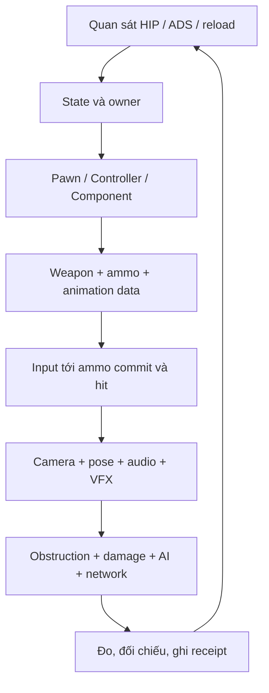

# Tám tầng kiến thức để hiểu và tái tạo ReadyOrNot

Một game lớn không chỉ là nhiều tính năng đặt cạnh nhau. Nó là nhiều **hợp đồng đang cùng có hiệu lực**: nhân vật được làm gì, súng đang ở trạng thái nào, server đã chấp nhận điều gì, animation đang trình diễn điều gì, AI đã nhận kích thích nào và người chơi được tính điểm ra sao.

Bạn có thể hiểu từng lớp một. Hãy bắt đầu từ một vòng nhỏ quan sát được, rồi đi xuống implementation theo nhu cầu. Bản đồ dưới đây cho phép chọn tầng để thấy câu hỏi, sản phẩm cần tạo và nơi đọc tiếp.

<KnowledgeMap />

## Tầng 1: ngôn ngữ của trải nghiệm

Mô tả điều người chơi **có thể nhận biết**: đang cầm súng gì, cò có bị khóa không, nghi phạm có nghe lệnh không, cửa có khóa không, tiếng súng phát từ đâu. Tách khỏi điều chỉ debugger mới biết. Đây là lớp UX/game design: mục tiêu, lựa chọn, thông tin, rủi ro, feedback và nhịp.

Ví dụ “bắn chính xác” chưa phải một yêu cầu đủ dùng. Người chơi hip hay ADS? Đứng yên hay di chuyển? Một viên hay giữ cò? Camera đang hồi giật hay vừa đổi tư thế? Mục tiêu là dấu đạn, điểm chạm, animation hay cảm giác ngắm? Mỗi câu trả lời tạo một ca khác nhau.

**Cần học:** state machine cơ bản, feedback loop, affordance, phân tích video theo timeline. **Bài làm:** một bảng 10 tình huống của cùng một khẩu, mỗi dòng có input, điều kiện trước, output và điều chưa rõ.

## Tầng 2: hợp đồng và quyền sở hữu

Hợp đồng nói rõ ai có quyền thay đổi state, lúc nào hành động bắt đầu và lúc nào hậu quả đã commit. Súng không nên tự đặt điểm nhiệm vụ; widget không nên tự quyết trừ đạn authoritative; montage bị dừng không được làm viên đạn đã gây damage “chưa từng tồn tại”.

Trong ReadyOrNot, cần đọc quan hệ của nhân vật, InventoryComponent, lớp weapon, bullet/ammo data, damage handler và game mode. Tên class không tự chứng minh ownership; tìm chỗ **ghi state**, không chỉ nơi đọc getter.

**Cần học:** invariant, precondition/postcondition, transaction, cancel versus rollback, state owner. **Bài làm:** một [feature dossier](03-hop-dong-feature.md) cho reload bị hủy bởi đổi súng.

## Tầng 3: nền tảng Unreal

Biết phân biệt UClass/CDO/instance; Actor/Component; GameMode/GameState/GameInstance/PlayerState; Controller/Pawn; constructor/BeginPlay/Tick/EndPlay; UObject reference và lifetime. Sau đó mới đọc UFUNCTION Server/Client/NetMulticast, OnRep và replication conditions.

Một giá trị trong constructor có thể bị Blueprint default thay. Một giá trị trong CDO có thể bị attachment hoặc runtime state đổi tiếp. Một actor tồn tại trên cả server và client không có nghĩa cả hai được phép gây damage. Dữ liệu sống qua travel không nên là một con trỏ world actor cũ.

**Cần học:** C++ đủ đọc inheritance, virtual dispatch, pointer/reference, Unreal reflection, container, delegate và timer. Không cần viết một engine trước khi làm bài lab.

## Tầng 4: dữ liệu và asset

Gun Gameplay là một tập hợp phụ thuộc: class súng, default values, ammo rows, skeletal mesh, skeleton, sockets, animation data, animation instance, montage/notify, camera, audio, VFX, material và attachments. Một file FBX hoặc một Blueprint riêng lẻ thường chưa đủ.

Phân biệt ba câu hỏi: asset **tồn tại**, asset **load được**, asset **được dùng đúng trong một hành động thực tế**. Catalog trả lời câu đầu và một phần câu thứ hai khi có CDO extraction. Runtime và đối chiếu trực tiếp mới trả lời câu thứ ba.

**Bài làm:** chọn một entry trong [catalog](../06-Catalogs/README.md), vẽ đồ thị phụ thuộc chỉ cho thao tác equip → ADS → fire → reload.

## Tầng 5: implementation của từng hành động

Đi theo đường thực thi, không đi theo alphabet của thư mục. Với bắn súng, bắt đầu từ binding, handler của nhân vật, kiểm tra trạng thái, weapon action, tiêu thụ đạn và xử lý hit. Với AI, bắt đầu từ stimulus, dữ liệu belief/đánh giá action và việc action thật sự chạy, không chỉ tên behavior.

Sách chỉ ra các điểm đọc trong [Gun Gameplay](../03-Gun-Gameplay/README.md) và [gameplay/AI](../02-Gameplay-Va-AI/README.md). Mỗi lần đọc một hàm, hỏi: đầu vào là gì, nó ghi gì, gọi ai, chạy ở máy nào, điều gì có thể ngắt nó?

## Tầng 6: thời gian và trình diễn

Hai implementation có cùng damage và fire interval vẫn có thể cho cảm giác khác. Thứ tự input, camera, recoil, pose evaluate, sound onset và muzzle flash quyết định độ trễ cảm nhận. Cảm giác sai có thể do sai additive base hoặc sai montage blend, không phải một “recoil multiplier” quá lớn.

Bài học từ Wardogs-Docs là phải kiểm tra **pose trong ngữ cảnh**. ReadyOrNot có lợi thế là native graph và assets còn ở project: trước tiên dùng chúng làm reference, sau đó tự thay một lớp để học. Không đổi cả camera, animation và spread cùng lúc.

## Tầng 7: tích hợp và đa người chơi

Đứng sát cửa, bị thương, bị chặn nòng, ra lệnh AI, đổi vũ khí lúc reload, mất kết nối và travel là các phép thử ranh giới. Đây là nơi một feature tưởng đã xong lộ ra state owner trùng lặp hoặc cancellation thiếu.

Tạo một lát nhiệm vụ nhỏ có mục tiêu, phản hồi, kết quả và retry. Multiplayer cần server/client riêng; một lần PIE một người không chứng minh replication/prediction. Lab thử súng là fixture để cô lập biến, không thay thế mission integration.

## Tầng 8: quy trình dự án và bằng chứng

Quản lý phiên bản, cấu hình build, dữ liệu lớn, quyền sửa asset, log, profiling, regression và milestone là kiến thức gameplay thực tế. Bạn không thể so cảm giác hôm nay với hôm qua nếu không biết đã đổi CDO, frame rate, attachment hay map.

Một receipt tốt ghi snapshot/hash, engine/target, map, weapon class, điều kiện, bước thực hiện, kết quả quan sát, artifact và giới hạn. **Build pass → equip pass → fire pass → feel accepted** là các tầng khác nhau.

## Dependency tối thiểu để tự tái tạo một phát đạn

Đây là lộ trình học đề xuất. Nó không yêu cầu tách game gốc thành tám module và cũng không khẳng định implementation native có kiến trúc sạch theo đúng tám hộp.
