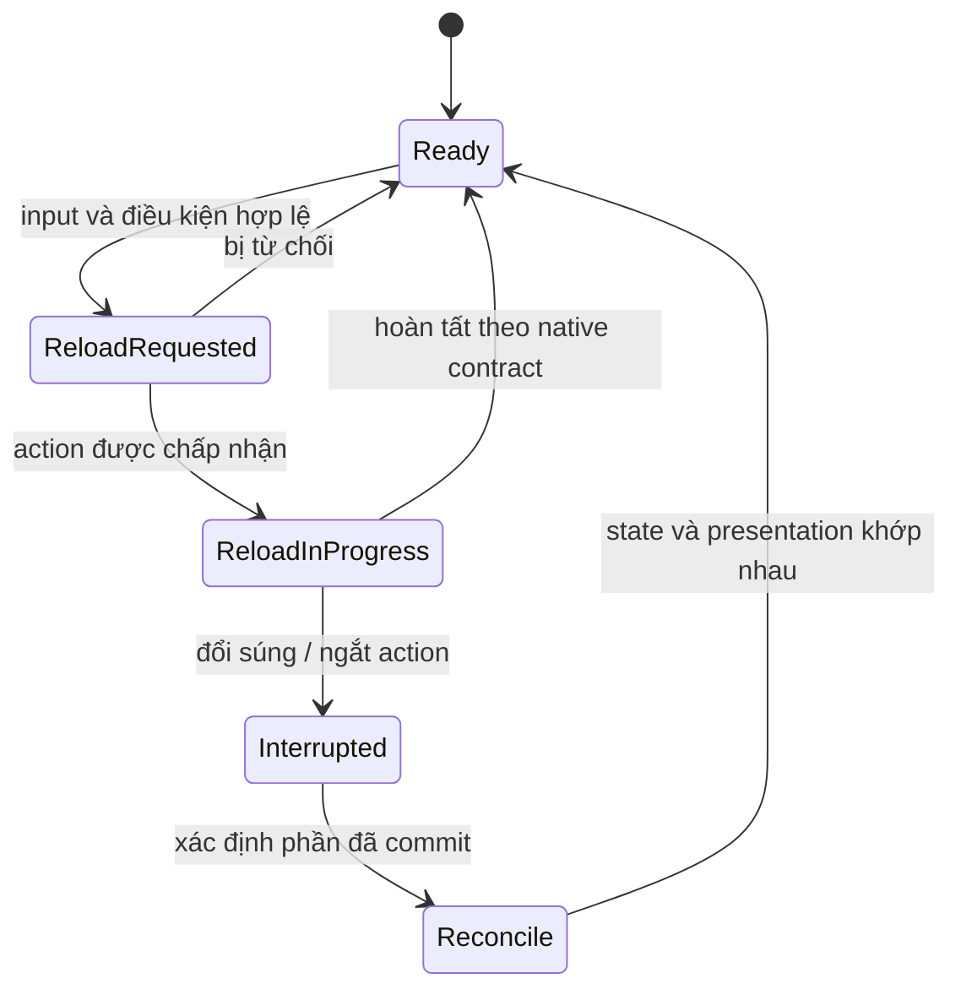

# Hợp đồng feature: từ yêu cầu mơ hồ đến một lát chơi được

Hợp đồng ở đây là công cụ học và triển khai, không phải quy tắc xin phép mới. Nó giúp một người hoặc AI hiểu cùng một mục tiêu, giới hạn thay đổi và cách chứng minh kết quả.

## Mẫu hồ sơ ngắn

| Trường | Nội dung cần điền |
|---|---|
| Feature / snapshot | ID, mục tiêu trải nghiệm, engine/source/CDO version |
| Tình huống | Map, pawn, weapon, attachment, posture, network mode |
| Input | Press/release/hold, console/UI/event, nguồn phát |
| Owner | Ai giữ state và ai có quyền commit |
| Preconditions | Những điều cần đúng để bắt đầu |
| State transition | Trạng thái trước → đang làm → hoàn tất / bị hủy |
| Commit | Điểm hậu quả được chấp nhận: ammo, damage, inventory, objective |
| Feedback | Camera, pose, sound, VFX, HUD, AI reaction |
| Cancellation | Đổi súng, bị thương, chết, travel, mất owner, server từ chối |
| Dependencies | Class, asset, data row, plugin và hệ thống cần có |
| Write-set | File mới/sửa, asset mới, cách quay lại baseline |
| Acceptance | Input và output quan sát được cho cả thành công và thất bại |
| Evidence | Trace/log/capture/receipt và giới hạn chưa kiểm chứng |

## Ví dụ đề xuất: reload bị hủy

Đây là **bài tập thiết kế** để đối chiếu native, không áp đặt một state machine mới lên game.

Mục tiêu: người chơi có thể bắt đầu reload khi còn đạn, đổi vũ khí ở một mốc đã chọn và quay lại khẩu cũ mà ammo không bị nhân đôi hoặc biến mất vô cớ. Người học phải đọc native reload để xác định lúc nào magazine tháo ra, khi nào đạn/các count thay đổi và animation notify đang làm gì.

Mũi tên “xác định phần đã commit” là nơi bài học nằm. Không dùng một luật chung “hủy thì trả lại toàn bộ ammo”. Nếu trong native đã bỏ băng đạn hoặc chuyển count, cần giữ đúng hậu quả đã xảy ra. Đọc chương reload trước khi viết implementation tái tạo.

## Acceptance phải có quan sát

“Reload mượt” là tiêu chí cảm nhận có ích nhưng chưa đủ. Tách thành:

1. Ammo/magazine trước và sau từng mốc phù hợp với native reference.
2. Đổi vũ khí ở trước/sau mốc commit không làm trùng item hoặc kẹt action.
3. Animation tay, magazine và camera khớp với state thật.
4. Âm thanh và HUD không tuyên bố reload xong khi logic chưa xong.
5. Server và owning client thống nhất; simulated proxy chỉ trình diễn phần nó được biết.
6. Cùng ca chạy ở frame rate thấp/cao không làm cadence phụ thuộc số frame.

Một receipt headless chỉ đọc state không chứng minh mục 3–4. Một video trên một client không chứng minh mục 5. Ghi từng tầng riêng.

## Dependency thay vì danh sách công việc phẳng

Một ticket “làm reload” thường ẩn nhiều việc: magazine model và socket, montage/notify, ammo ownership, sound event, input/cancel và replication. Xếp dependency để thứ đi trước tạo điều kiện kiểm thử thứ đi sau.

| Có trước | Cho phép kiểm tra |
|---|---|
| Một khẩu equip ổn và có ammo state | Empty/non-empty reload |
| Runtime log tại các state boundary | Hủy ở đúng thời điểm |
| Montage/notify đã gắn đúng skeleton | Tay, băng đạn và commit đồng bộ |
| Owning client/server cùng fixture | Duplicate consumption và replication |
| Một reference capture cố định | Đối chiếu cảm giác |

## Khi dùng với AI

Giao một hồ sơ, một write-set và một acceptance matrix. Yêu cầu AI giữ nguyên native reference, tạo nhánh học tập riêng và không báo pass cho ca chưa chạy. Nếu phát hiện dependency thiếu, nó cần nêu asset/class nào thiếu và ảnh hưởng ca nào; không âm thầm thay súng native bằng mô hình súng đơn giản.
