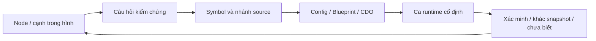

# Đọc hai sơ đồ flow như bản đồ câu hỏi

Hai ảnh người dùng cung cấp chứa dữ liệu draw.io nhúng, không chỉ pixel. Bộ công cụ đọc được **169 cell / 58 edge** ở trang A.I FLOW và **322 cell / 93 edge** ở trang TEST. Đây là số phần tử diagram, bao gồm khung/hình/nhãn, **không phải số feature hay số dòng thực thi**. [Metadata và nhãn đã trích](../06-Catalogs/flow-reference.json) lưu hash ảnh gốc để truy vết; ảnh nhị phân không được đưa vào repo công khai.

Sơ đồ rộng rất hữu ích để không bỏ quên các mặt của trải nghiệm. Nhưng một node như LADDER, BREECH TAPE hoặc SPRINTING có thể là ý tưởng, bản cũ, thuật ngữ của người vẽ hoặc chức năng có điều kiện. Chỉ source/CDO/runtime trong snapshot mới xác định trạng thái hiện tại.

## Chia sơ đồ thành bốn lớp

| Lớp trong hình | Các nhóm tiêu biểu | Câu hỏi khi đi vào source |
|---|---|---|
| Hành động của người chơi | di chuyển, lean/look, vũ khí, quick throw, healing | Input nào, pawn nào, gate/macro nào, action owner nào? |
| Giao tiếp với thế giới | cửa, breach, mirror, bắt giữ, mang người, vật chứng | Interface/trace tìm target ra sao, target giữ state gì, server commit ở đâu? |
| Quyết định của AI/đội | commands, red/blue/gold team, phản ứng nghi phạm | Action được chấm/chọn/commit/hủy thế nào, perception và morale tham gia ở đâu? |
| Hành trình phiên chơi | menu, session, loading, loadout, map, results | Ai sống qua travel, config chọn mode nào, nhánh thất bại/retry ở đâu? |

Một đường nét đứt trong sơ đồ không mặc định nghĩa là event delegate, RPC hoặc dependency module. Trước tiên ghi “quan hệ ảnh hưởng theo hình”; sau đó thay bằng quan hệ code khi đã tìm được source.

## Những điểm cần sửa cách hiểu

**Sprint:** snapshot bật `RON_NO_SPRINT` trong `Ready Or Not/Source/ReadyOrNot/ReadyOrNot.h:291`. Đường Sprint chuyển sang FastWalk, và nhánh IsSprinting bị gate. Vì vậy node SPRINTING trong hình không chứng minh sprint đang hoạt động như một game chạy nước rút thông thường. Xem [movement](../02-Gameplay-Va-AI/05-Player-Movement-Health-Inventory.md) để đọc điều kiện và nguồn cụ thể.

**AI state:** sơ đồ phản ứng nghi phạm là lớp hành vi quan sát. Không gán toàn bộ dự án nhãn GOAP chỉ vì có config tên GOAP. Phần [quyết định AI](../02-Gameplay-Va-AI/07-AI-Quyet-Dinh-Hanh-Vi.md) lần qua evaluator, gate, consideration, commit, cooldown và activity thực tế.

**Firearms:** một node gom nhiều cơ chế. Native source có lựa chọn hitscan/projectile, magazine/chamber, fire mode, ammunition, recoil, obstruction và presentation. Bảng vẽ súng không cho biết branch nào hoặc default nào được dùng. [Gun Gameplay](../03-Gun-Gameplay/README.md) tách từng lớp.

**Armor → damage → healing:** không được suy ra một công thức cộng/trừ chung từ ba mũi tên. Đọc damage type, hit location, armor và trạng thái injured/bleeding/heal. Bài tập phải kiểm tra nhánh cụ thể, không dùng thông số quân dụng ngoài đời thay cho giá trị trong game.

**Menu → game end:** nhìn như một đường thẳng, nhưng implementation còn có loading, ownership, input mode, server travel, failure và return-to-station. Đọc [vòng nhiệm vụ](../02-Gameplay-Va-AI/01-Vong-Nhiem-Vu.md) để thấy ranh giới.

## Từ hình tổng sang một feature dossier

Lấy “DOORS” ở giữa hình. Tách ít nhất năm câu hỏi: tìm cửa được tương tác; state mở/khóa/chặn; lựa chọn công cụ; thời gian và animation; hậu quả với navigation, AI và âm thanh. Sau đó chọn đúng **một** hành động, chẳng hạn tương tác với cửa đang khóa, và viết điều kiện/commit/feedback/cancel.

## Không bắt mọi nhãn phải có implementation

Nếu chưa tìm ra LADDER hoặc WEAPON GLIMMER với nghĩa đúng của người vẽ, giữ nó trong backlog nghiên cứu. Tìm không thấy tên chính xác cũng chưa chứng minh tính năng không tồn tại: nó có thể nằm trong Blueprint, dưới tên khác hoặc ở một nhánh macro. Ngược lại, thấy một asset tên tương tự cũng chưa chứng minh tính năng đang dùng.

Ma trận đối chiếu gameplay chi tiết nằm ở [chương flow của phần gameplay](../02-Gameplay-Va-AI/09-Doi-Chieu-Gameplay-Flow.md). Chương này đưa phương pháp đọc; chương kia gắn từng nhóm vào source và điều cần test.
