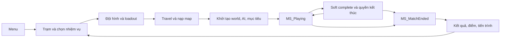

# Vòng nhiệm vụ: từ menu tới trở về trạm

Một game chiến thuật có thể có hàng nghìn actor, nhưng trải nghiệm của người chơi vẫn phải có một vòng khép kín. Bạn chọn nhiệm vụ, chuẩn bị, triển khai, xử lý hiện trường, nhận kết quả, rồi quay lại chuẩn bị. Nếu chỉ tái tạo được một khẩu súng bắn vào tường, bạn đã hoàn thành một thí nghiệm gunplay; bạn chưa có vòng nhiệm vụ Ready or Not.

## Phân biệt hành trình người chơi và state trong code

Sơ đồ sau là mô hình giải thích trải nghiệm, **không phải toàn bộ enum hay state machine nguyên văn của source**:

Một mũi tên giao diện có thể gồm nhiều thao tác kỹ thuật: server đổi map, client hiện loading screen, pawn cũ bị hủy, controller hoặc dữ liệu phiên được giữ lại, GameState mới được tạo, asset tải xong, rồi input mới mở. Cần debug theo từng ranh giới này thay vì coi mọi lỗi là “menu hỏng”.

## Những chủ thể nào chịu trách nhiệm?

| Đối tượng | Câu hỏi nó trả lời | Không nên nhầm với |
|---|---|---|
| `UReadyOrNotGameInstance` | Dữ liệu nào còn sống qua đổi map, profile nào đang dùng? | World hiện tại |
| `AReadyOrNotGameMode` và `ACoopGM` | Khi nào bắt đầu/kết thúc, ai spawn, điều kiện thắng thua? | HUD local |
| `AReadyOrNotGameState` và `ACoopGS` | Người tham gia cần biết phase, mục tiêu, vote nào? | Nơi tự quyết mọi luật client |
| `AReadyOrNotLevelScript` | Map này có dữ liệu nhiệm vụ gì? | Luật dùng chung cho tất cả map |
| PlayerController và widget | Người dùng nhập gì, thấy menu nào? | Kết quả nhiệm vụ có thẩm quyền |
| `ACommanderGM` | Hệ quả của nhiệm vụ trong chế độ Commander | Mọi mode COOP |

Trong source, `ACoopGM::CheckWinConditions` không chỉ kiểm tra “còn nghi phạm hay không”. Nó kiểm tra phase, cả đội chết, mục tiêu thất bại, điểm cần thiết, trạng thái soft complete và vote kết thúc. Đó là lý do tiêu diệt toàn bộ mục tiêu chưa đủ để giải thích một mission.

## Đường đọc source có thứ tự

| Điểm đọc | Bằng chứng ở snapshot | Ý nghĩa khi dựng lại |
|---|---|---|
| Điểm vào Editor | `Config/DefaultEngine.ini:638`, `EditorStartupMap` | Map khởi đầu đang cấu hình là `MainMenu_V2` |
| Lớp GameInstance | `Config/DefaultEngine.ini:646`, `GameInstanceClass` | Cấu hình trỏ tới Blueprint; C++ không cho biết hết defaults |
| Hub | `Source/ReadyOrNot/GameModes/LobbyGM.cpp:514`, `OpenMissionSelect` | Có đường riêng mở lựa chọn nhiệm vụ |
| Khởi tạo thế giới | `Source/ReadyOrNot/GameModes/CoopGM.cpp:394`, `InitWorld`; `:454`, `InitAI` | Khởi tạo có quan hệ với navigation, không chỉ spawn pawn |
| Bắt đầu | `Source/ReadyOrNot/GameModes/CoopGM.cpp:134`, `StartMatch` | Đăng ký vòng kiểm tra điều kiện kết thúc |
| Kiểm tra kết thúc | `Source/ReadyOrNot/GameModes/CoopGM.cpp:664`, `CheckWinConditions` | Tách soft completion, failure và full completion |
| Kết thúc thật | `Source/ReadyOrNot/GameModes/CoopGM.cpp:1715`, `MissionEnd` | Đổi match state, multicast, dừng AI, khóa hành động và đưa controller sang UI |
| Trở về | `Source/ReadyOrNot/GameModes/CoopGM.cpp:369`, `ReturnToStation` | Mang thông tin grade vào đường quay về |
| Commander | `Source/ReadyOrNot/Commander/CommanderGM.cpp:124`, `OnMissionCompleted` | Có lớp bổ sung hệ quả chiến dịch |

`Config/DefaultEngine.ini` trong snapshot có chuỗi `GameDefaultMap`/`ServerDefaultMap` cần kiểm tra lại ở Project Settings: tên được ghi khác hình thức của `EditorStartupMap`, và một dòng cấu hình có nội dung dính nhau trong bản text hiện có. Tài liệu không tự coi các chuỗi đó là đường travel đã chạy thành công. Việc Editor mở được menu cũng chưa chứng minh play/travel/return hoạt động.

## Tái tạo vòng nhỏ đầu tiên

Bắt đầu bằng ba màn: menu chọn một nhiệm vụ, map hai phòng, kết quả có nút thử lại. Cho mission có một đối tượng phải bắt giữ và một vật chứng. Dữ liệu kết quả tối thiểu gồm MissionId, số mục tiêu hoàn thành, reason kết thúc và tổng điểm. Dùng nguyên tắc server hoặc chế độ standalone làm chủ kết quả; widget chỉ hiển thị.

Hãy triển khai đường thất bại ngay cùng đường thành công. Khi pawn chết, mọi timer input và hoạt động đang làm phải kết thúc có lý do. Khi reset, không được giữ một objective đã complete từ lần chạy trước. Đổi map là bài kiểm tra tuổi thọ đối tượng rất tốt: nếu bạn giữ con trỏ actor trong GameInstance và dùng lại sau travel, đó thường là sai ranh giới.

**Bài tập:** vẽ một bảng gồm Phase, người ghi, điều kiện vào, điều kiện ra, widget được phép hiện. Sau đó ghi log một lượt từ menu đến kết quả rồi retry. Tiêu chí đạt: cùng một lần kết thúc không chốt kết quả hai lần; retry tạo dữ liệu mới; không còn input điều khiển pawn ở màn kết quả; hai người chơi thấy cùng lý do kết thúc khi thử multiplayer.

**Chưa xác minh:** toàn bộ Blueprint menu, mọi route từ hub, các mode lịch sử/PVP còn dùng được hay không, và khả năng đóng gói toàn bộ hành trình. Tên class trong `GameModes/` là bằng chứng tồn tại source, không phải danh sách feature đã phát hành.
