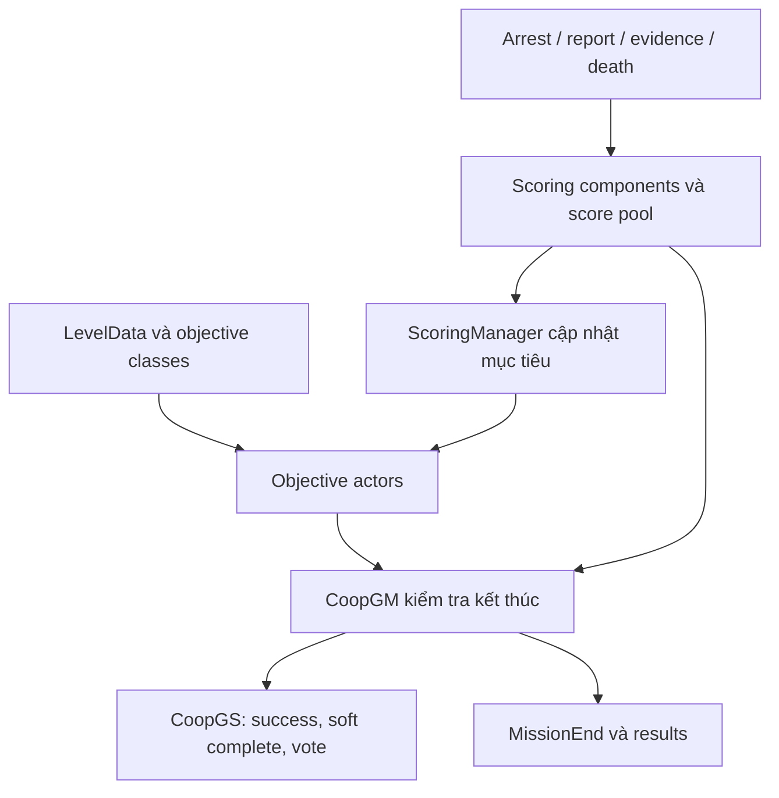

# Mục tiêu, ROE, điểm và kết quả

Gunplay đặt câu hỏi “viên đạn đi đâu?”. Luật nhiệm vụ đặt câu hỏi “hành động đó có giúp hoàn thành công việc không?”. Khi tái tạo Ready or Not, hai câu hỏi phải nối với nhau. Một mục tiêu bị bắn trúng có thể làm thay đổi health, trạng thái hành vi, vật chứng, quyền sử dụng vũ lực, điểm và kết quả mission.

Ở đây ROE là **luật mô phỏng trong game**, không phải hướng dẫn sử dụng vũ lực ngoài đời. Chương chỉ giải thích contract phần mềm và cách kiểm chứng.

## Objective là actor có trạng thái và điểm

`AObjective` khởi tạo với `Objective_InProgress`, có `UScoringComponent`, bật replication và chuyển trạng thái qua `ObjectiveCompleted`/`ObjectiveFailed`. Việc hoàn thành phát event và cho điểm; failure lấy điểm theo cơ chế component. Hidden objective có điều kiện mở riêng, vì vậy “không thấy trên HUD” không có nghĩa “không tồn tại trong nhiệm vụ”.

`AReadyOrNotGameState::CreateLevelObjectives` lấy soft class từ `LevelData.Objectives`, lọc theo mode, spawn actor, gán owner, đưa vào `MissionObjectives`, rồi thông báo sau khi tạo đủ. Nhánh có bomb còn có thể bổ sung objective gỡ bom. Từ đó rút ra quy trình: muốn hiểu một map, phải đọc LevelData và defaults của objective Blueprint, không chỉ tên map hay base class.

## Hoàn thành khác với hoàn thành đủ để rời hiện trường

`ACoopGM::CheckWinConditions` cho thấy ít nhất ba trục cần tách: primary objectives, score groups bắt buộc, và mission failure. `AScoringManager::CacheHasClearedMission` tính cache từ các nhóm yêu cầu full/soft clear; đồng thời kiểm tra civilian bị player giết và objective có failure chấm dứt mission. `HasClearedMission` trả cache, không tự tính lại từ đầu.

Vì vậy nếu debug thấy UI vẫn chưa cho kết thúc, hãy kiểm tra thứ tự cập nhật cache trước khi kết luận condition sai. Cũng đừng triển khai một biến `bWon` vừa mang ý nghĩa “mọi nghi phạm đã bị xử lý”, vừa mang ý nghĩa “đủ vật chứng”, vừa mang ý nghĩa “grade cao”. Những khái niệm này thay đổi độc lập.

## ROE là đánh giá ngữ cảnh theo thứ tự

Đọc `ACyberneticCharacter::IsUnjustifiedUseOfForce` như một dãy điều kiện có ưu tiên. Trong đoạn đã khảo sát, bị bắt/đang bị bắt/được mang, khoảng thời gian từ hành vi gây hấn, thời gian đầu hàng, incapacity, mode tắt ROE, lịch sử làm hại SWAT, và các hành vi vũ khí đều có vai trò. Source còn phân biệt fake surrender và từng giai đoạn phản ứng.

Điều này bác bỏ mô hình quá đơn giản “đã yell thì bắn hợp lệ”. Một history flag hoặc cửa sổ thời gian có thể làm đổi kết quả dù tư thế ở một frame nhìn giống nhau. Khi tái tạo, cần log **lý do** cùng verdict, và kiểm thử ở trước/sau ranh giới thời gian. Không được lấy một hàm đọc dở rồi chuyển thành tuyên bố toàn bộ luật.

## Bản đồ bằng chứng

| Symbol và vị trí | Điều đã xác nhận bằng đọc source |
|---|---|
| `Source/ReadyOrNot/Objectives/Objective.cpp:6`, constructor | Objective có scoring component và được replicate |
| Cùng file `:32`, `ObjectiveCompleted`; `:56`, `ObjectiveFailed` | Thay state, cập nhật score, phát callback |
| `Source/ReadyOrNot/ReadyOrNotGameState.cpp:785`, `CreateLevelObjectives` | Lấy objective từ LevelData và xử lý bomb objective |
| `Source/ReadyOrNot/Objectives/BringOrderToChaos.cpp:13`, `TickObjective` | Hoàn thành khi scoring manager xác nhận nghi phạm đã bị giết hoặc bắt |
| `Source/ReadyOrNot/Info/ScoringManager.cpp:25` | Có nhóm evidence, báo cáo suspect/civilian, officer và trap |
| Cùng file `:47` | Có penalty cho unauthorized force, deadly force và friendly fire |
| Cùng file `:1254`, `CacheHasClearedMission` | Cache full/soft clear và failure |
| Cùng file `:1395`, `GetFinalGradePercentage` | Có đường riêng tính tỷ lệ grade cuối |
| `Source/ReadyOrNot/Characters/CyberneticCharacter.cpp:1299`, `IsUnjustifiedUseOfForce` | Luật có ngữ cảnh và lịch sử |
| `Source/ReadyOrNot/Components/ScoringComponent.cpp:23`, `ApplyScoreTableValues` | Giá trị điểm còn phụ thuộc bảng dữ liệu |

## Bài tập dựng lại có thể kiểm tra

Tạo fixture gồm một suspect, một civilian, một evidence, một objective. Đặt tên rõ cho event `SuspectArrested`, `CivilianReported`, `EvidenceSecured`, `MissionEnded`. Mỗi event có TargetId, InstigatorId và thời gian. Thử gửi cùng event evidence hai lần; tổng điểm phải không nhân đôi.

Lập ma trận test: suspect đầu hàng rồi bị bắt; suspect mất khả năng chiến đấu rồi được report; vật chứng chưa thu; civilian bị hại; objective phụ thất bại; tất cả primary hoàn thành nhưng còn việc thu dọn. Với mỗi case ghi state kỳ vọng, score reason, quyền kết thúc mission. Đó là bài tập thiết kế state và idempotency, không cần clone toàn bộ bảng điểm ngay.

**Tiêu chí đạt:** HUD, mission result và score ledger cùng giải thích được một outcome; replay log không sinh điểm mới; end mission gọi lặp không lưu hai kết quả; timeout/hủy hành động không cấp thưởng hoàn thành.

**Khoảng trống:** chương chưa trích bảng điểm trong asset thành dữ liệu chuẩn hóa, chưa xác minh mọi nhánh ROE ở runtime, không tuyên bố các con số retail. Muốn tái tạo grade chính xác cần asset table, Blueprint defaults và một bộ phiên chơi tham chiếu cùng snapshot.
