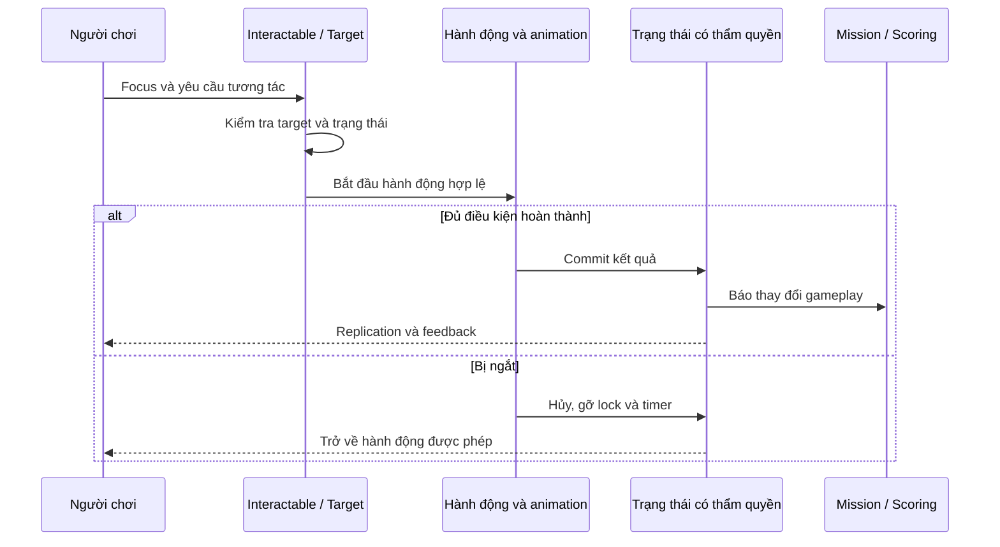

# Tương tác, bắt giữ, báo cáo và vật chứng

Một phím tương tác trong game lớn không tương ứng một hàm “Use” duy nhất. Nó là chuỗi: xác định đối tượng đang nhìn, kiểm tra khoảng cách và điều kiện, chọn action prompt, yêu cầu thực thi, chờ animation hoặc timer, cập nhật trạng thái, thông báo cho hệ thống khác. Cửa, vật chứng và người đều dùng trải nghiệm nhập tương tự nhưng có contract hoàn thành khác nhau.

## Tách khả năng tương tác khỏi hiển thị gợi ý

`UInteractableComponent` chứa kiểm tra `CanInteract`, enable/disable theo player hoặc controller, quản lý prompt và icon. Source còn kiểm tra vật dụng đang cầm có bị cấm tương tác không. Điều này giúp giải thích một lỗi thường gặp: icon xuất hiện không đảm bảo hành động có thể hoàn thành lúc nhấn, vì trạng thái có thể đổi giữa hai thời điểm.

Khi dựng lại, hãy có ba câu hỏi riêng: target có thể được chọn không, action hiện tại có hợp lệ không, và ai có quyền chốt kết quả. Tương tác bị ngắt vì đi xa, đổi item, chết hoặc mất target phải có đường cancel rõ ràng.

Sơ đồ là contract để học; đường RPC/notify cụ thể khác nhau theo target.

## Đầu hàng, bắt giữ và báo cáo là các trạng thái khác nhau

`AReadyOrNotCharacter::CanArrest` loại SWAT, người đang trong death transition, đã bị bắt/đang bị bắt, và kiểm tra một số điều kiện cơ thể. Surrender cho phép bắt; dead/unconscious hoặc incapacitated cần điều kiện report ở nhánh tương ứng, còn ragdoll có nhánh riêng. `IsArrested` có điều kiện sống, trong khi `IsArrestedAndDead` là predicate khác. Chỉ nhìn một `bArrestComplete` chưa đủ giải thích tất cả kết quả.

`DoArrestWithZipcuffs` tìm zipcuffs trong inventory và gọi đường server. `Arrest` làm rơi vũ khí, khóa hành động và ghi quan hệ giữa người bắt với target. `CancelArrest` gỡ quan hệ và lock. `ArrestComplete` đặt completion và tiếp tục xử lý physics/pose, người bắt và sự kiện liên quan. Đây là một giao dịch dài nhiều frame, không phải đổi Boolean ngay khi nhấn F.

Report là một hành vi riêng với TOC; carry lại có paired interaction driver/slave và callback riêng. Nếu clone chỉ có animation cuff đẹp nhưng không có report, evidence và score, bạn đã bỏ mất phần thu dọn hiện trường tạo nên nhịp Ready or Not.

## Vật chứng cũng có vòng đời

`AEvidenceActor` có các hàm `StartEvidenceCollection_COOP`, `StopEvidenceCollection_COOP`, `CompleteEvidenceCollection_COOP`, cập nhật theo thời gian và `OnRep_EvidenceStateChanged`. Cùng class còn có nhánh pickup/drop/extract; không nên gộp mọi tên hàm đó thành một flow COOP duy nhất. Cần đọc mode và caller trước khi kết luận.

Ở prototype, dùng một evidence actor với Id ổn định và trạng thái Available → Collecting → Secured. Chỉ Secured được tăng mission progress. Nếu hai player cùng tương tác, target phải chốt một lần; người đến sau nhận “đã được thu” thay vì tạo hai túi vật chứng.

## Điểm mở source

| Chủ đề | File, dòng và symbol |
|---|---|
| Điều kiện chung | `Source/ReadyOrNot/Components/InteractableComponent.cpp:271`, `CanInteract` |
| Item cấm tương tác | Cùng file `:129`, `IsDisallowedItemEquipped` |
| UI của tương tác | Cùng file `:711`, `ShowActionPrompts`; `:801`, `HideActionPrompts` |
| Target người | `Source/ReadyOrNot/ReadyOrNotCharacter.cpp:1810`, `Interact_Implementation` |
| Điều kiện bắt giữ | Cùng file `:3393`, `CanArrest` |
| Đường zipcuffs | Cùng file `:3466`, `DoArrestWithZipcuffs` |
| Start/cancel/complete | Cùng file `:3487`, `Arrest`; `:3502`, `CancelArrest`; `:3520`, `ArrestComplete` |
| Report | Cùng file `:4882`, `ReportToTOC_Implementation` |
| Carry | Cùng file `:4923`, `OnCarryPickupComplete`; `:4959`, `OnCarryDropComplete` |
| Collect evidence | `Source/ReadyOrNot/Actors/Gameplay/EvidenceActor.cpp:281`, `StartEvidenceCollection_COOP`; `:314`, `CompleteEvidenceCollection_COOP` |
| Evidence replication | Cùng file `:346`, `OnRep_EvidenceStateChanged` |

## Bài tập và nghiệm thu

Kiến thức cần trước: interface, component, timer, multicast delegate, montage notify, RPC căn bản. Không cần biết AI planner để làm một target surrender cố định.

Làm một phòng với target đầu hàng và một vật chứng. Thử: bắt giữ thành công; rời khoảng cách giữa animation; đổi item; target bị hủy; player chết; nhấn lặp; hai player cùng bắt; report trước/sau completion. Ghi rõ ownership của `CurrentlyArresting`, target state và score event.

**Tiêu chí đạt:** hủy không giữ action lock, không để con trỏ target hết hiệu lực; điểm chỉ tăng khi commit; mọi player nhìn thấy target đã bị bắt; carry/drop trả collision và animation về trạng thái hợp lệ; một evidence không thể được tính hai lần.

**Chưa xác minh:** các montage và notify đang gắn trong từng Blueprint, mọi animation bắt giữ/ragdoll/carry, và các tình huống network interruption. Có C++ callback chưa chứng minh asset thật gọi đúng callback.
