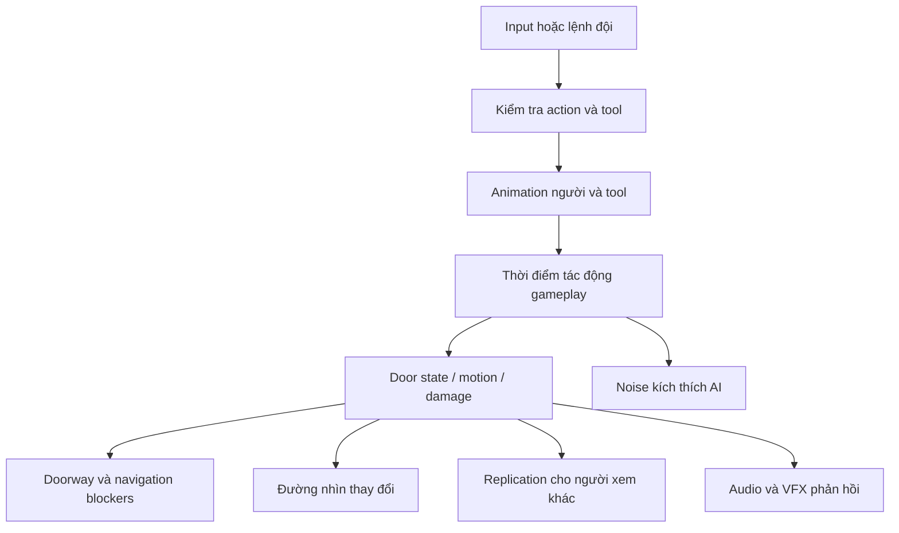

# Cửa và breaching: một hệ thống giao nhau của nhiều nghề

Cửa trong Ready or Not là ví dụ tốt nhất để hiểu vì sao một dự án lớn khó. Mô hình cửa nhìn rất đơn giản, nhưng quyết định quanh nó nối input, animation, collision, navmesh, âm thanh, trạng thái khóa/bẫy, vị trí đứng của SWAT, visibility và mission reset. Dựng một cánh cửa quay được mới hoàn thành phần hình học chuyển động.

## Cửa không chỉ có open và closed

Source `ADoor` có truy vấn hướng mở, độ mở theo phần trăm và góc, lock state, wedge, trap knowledge, subdoor, breach blockers và điểm stack/clear. Với người mới, nên bắt đầu bằng các trục state độc lập:

| Trục | Ví dụ câu hỏi |
|---|---|
| Hình học | Đang mở bao nhiêu, về phía nào, đang chuyển động không? |
| Khả năng truy cập | Khóa cơ/điện, wedge, phá hỏng hay đã mở? |
| Hiểu biết của đội | Đã biết khóa/bẫy chưa, nhìn qua mirror chưa? |
| Điều khiển | Player, AI hay một animation đang thao tác? |
| Navigation | Agent có thể đi qua không, đang chặn đường ai? |
| Presentation | Tay chạm đúng vị trí, âm thanh và rung phản hồi đúng lúc? |

Mỗi trục có chủ ghi và điều kiện reset. Việc cánh cửa nhìn mở nhưng nav còn blocked là lỗi liên kết giữa hai trục, không nhất thiết là animation sai.

## Đường nhân quả cần tái tạo

Đây là mô hình học về triển khai game. Không cần đưa các thông số breaching ngoài đời vào prototype; giữ các phép thử trong world mô phỏng và defaults của project.

## Đường đọc và bằng chứng

| Source | Điều cần quan sát |
|---|---|
| `Source/ReadyOrNot/Actors/Door.cpp:944`, `GetLifetimeReplicatedProps` | Các state nào được truyền qua network |
| Cùng file `:2002`, `Reset` | Vì sao reset mission cần hơn đặt rotation bằng 0 |
| Cùng file `:2216`, `Interact_Implementation` | Tương tác theo player và component |
| Cùng file `:2706`, `BlockAllDoorways`; `:2711`, `UnblockAllDoorways` | Ranh giới hình học/nav |
| Cùng file `:2788`, `ActivateBreachBlockers` | Tránh agent đi vào vùng hành động đang diễn ra |
| Cùng file `:3359`, `SetupTrap` | Cửa có lifecycle trap |
| Cùng file `:3582`, `Server_SetLockKnowledgeState_Implementation`; `:3587`, `Server_SetTrapKnowledgeState_Implementation` | Kiến thức về state tách khỏi state vật lý |
| Cùng file `:3834`, `GetOpenAmountAsPercentage` | Độ mở liên tục, không chỉ Boolean |
| Cùng file `:4512`, `CanKickDoor`; `:4534`, `CanOpenDoor`; `:4652`, `CanLockpickDoor`; `:4662`, `CanDeployWedge` | Mỗi hành động có guard riêng |
| `Source/ReadyOrNot/Characters/AI/SWATController.cpp:80` | Tạo activity cho kick/C2/shotgun/ram trong game |
| `Source/ReadyOrNot/Info/Activities/Team/TeamStackUpActivity.cpp:1461`, `CalculateStackUpPosition` | Cửa cung cấp ngữ cảnh cho đội hình |

Đừng đọc 8.000 dòng `Door.cpp` tuần tự ngay lần đầu. Chọn một case “mở cửa đang không khóa”, tìm caller, theo đến state commit và kiểm tra effect. Sau đó thêm locked case, cancel case, replicated case. Khi đã có bản đồ, các chi tiết còn lại có nơi để gắn vào.

## Phòng thí nghiệm cửa

Tạo fixture bốn cửa bằng instance hoặc Blueprint con để không đổi asset gốc: một bình thường, một khóa, một có wedge, một dùng preset trap của game. Chừa đủ hành lang cho capsule và điểm stack. Bật hiển thị collision/nav trong Editor khi kiểm tra. Cho một AI đi từ phòng A sang B trước và sau mỗi thao tác.

Hồ sơ test nên có DoorId, state trước, action, result, state sau, nav pass/fail, góc nhìn client 1/client 2. Nếu action thất bại, ghi vì guard, animation, tool thiếu, path hay replication. Thêm case reset khi cửa đang chuyển động; đây là nơi timer và ownership dễ lộ lỗi.

**Tiêu chí đạt:** mesh, collision và navigation cùng phản ánh state; agent không đi xuyên cửa đóng; operation đang làm bị hủy sạch khi owner mất; client tham gia nhìn đúng trạng thái cuối; mission reset dọn wedge/trap/damage đúng thiết kế fixture.

**Prerequisite:** transform, local/world space, collision channels, timeline/montage, navigation modifier, server authority. **Chưa xác minh:** mọi preset cửa và room metadata trong asset, lựa chọn Blueprint tool mặc định, mọi variant animation. Không được kết luận có feature “breach tape” chỉ từ hình tham khảo của người dùng; phải tìm class/asset/caller riêng.
