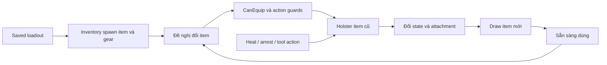

# Cơ thể người chơi: di chuyển, máu và inventory

Cảm giác bắn bắt đầu trước khi nhấn cò. Camera di chuyển ra sao, vũ khí đang được giữ thế nào, việc đổi item mất bao lâu, người chơi có bị thương hay đang heal không đều làm đổi trải nghiệm. Để tái tạo gunplay, cần tái tạo **trạng thái cơ thể chứa khẩu súng** cùng với khẩu súng.

## Một phát hiện cần giữ đúng với snapshot

`Source/ReadyOrNot/ReadyOrNot.h:290` định nghĩa `RON_NO_JUMP`; `:291` định nghĩa `RON_NO_SPRINT`; `:292` định nghĩa `RON_NO_INCREMENTAL_SPEED`. Trong `APlayerCharacter::Sprint` ở `Characters/PlayerCharacter.cpp:7272`, nhánh compile `RON_NO_SPRINT` gọi `FastWalk`. `IsSprinting` ở `:7417` trả false ở nhánh đó.

Vì vậy node **SPRINTING** trong hình flow không chứng minh snapshot này có sprint hoạt động. Code còn giữ các nhánh sprint không được chọn bởi macro hiện tại. Input `Walk` lại bind vào hàm tên `Sprint` (`:439`), cho thấy tên hàm không đủ để suy ra trải nghiệm. Đây là bài học về tiền xử lý C++ và code lịch sử, không chỉ về movement.

## Di chuyển là một phép hợp thành nhiều yếu tố

`PlayerCharacter.cpp:1621` tính `MaxWalkSpeed` từ run speed và nhiều multiplier như hit, slowdown, stun, bleed và mode. Free look có cache và replication; free lean có input riêng. Animation, camera và collision cần đọc cùng nhau để biết lean làm thay đổi phần nào của cơ thể và đường bắn.

Khi đo feel, cố định speed, stance, FOV, sensitivity, tình trạng health, item/attachment và thời gian frame. Nếu đổi cả armor, camera và movement trong một lượt thử, bạn sẽ không biết điều gì làm khác kết quả.

## Máu, limb và bleed không phải một thanh HP

`UCharacterHealthComponent` có dữ liệu limb, tickets, trạng thái health và các hàm server cập nhật. `UBleedComponent` có bleeding, chuẩn bị heal, animation, tạm dừng bleed và hoàn tất. Đáng chú ý, `CompleteHeal` trong snapshot có nhánh lần heal đầu reset resource; nhánh lần sau có thể nâng lên half health nếu đang thấp hơn. Đây là **hành vi đọc được từ source hiện có**; không nên thay bằng ký ức rằng băng bó trong bản game khác “chỉ cầm máu”. Cần runtime và asset để xác minh flow nào thực sự gọi tới nhánh đó.

`PrepareHeal` còn phối hợp holster item và thời gian từ animation; có xử lý riêng cho shield. Vì vậy chữa thương có thể tác động trực tiếp đến thời gian không thể bắn, presentation và phục hồi item đang cầm.

## Inventory là máy chuyển trạng thái của vật dụng

`UInventoryComponent` không chỉ là array các item. Nó xử lý request đổi item, local/third-person draw và holster, attach lên tay/cơ thể, replication, loadout và item category. Dùng `ManuallySetEquippedItem` bỏ qua quy trình có thể làm một lab “có súng trong biến” nhưng tay, camera hoặc anim graph chưa ở trạng thái đúng.

Sơ đồ mô tả các trách nhiệm, không cam kết tất cả tình huống đều chạy đúng một thứ tự timer. Khi debug cần xem `FItemChangeRequest`, local owner và third-person observer riêng.

## Các điểm source nên mở

| Chủ đề | Vị trí |
|---|---|
| Free look | `Source/ReadyOrNot/Characters/PlayerCharacter.cpp:3509`, `StartFreeLook`; `:3515`, `StopFreeLook` |
| Input lean/look | Cùng file `:451`, binding FreeLean; `:465`, binding FreeLook |
| Speed | Cùng file `:1621`, phép tính `MaxWalkSpeed` trong Tick |
| Limb health | `Source/ReadyOrNot/Components/CharacterHealthComponent.cpp:57`, replication; `:877`, `Server_DecreaseLimbHealth_Implementation` |
| Heal | `Source/ReadyOrNot/Components/BleedComponent.cpp:141`, `CompleteHeal`; `:177`, `CanHeal`; `:193`, `PrepareHeal`; `:224`, `DoHeal` |
| Inventory replication | `Source/ReadyOrNot/Components/InventoryComponent.cpp:36`, `GetLifetimeReplicatedProps` |
| Request đổi item | Cùng file `:698`, `OnRep_ItemChangeRequest`; `:906`, `Server_ChangeEquippedItem_Implementation` |
| Điều kiện equip | Cùng file `:925`, `CanEquip` |
| Loadout | Cùng file `:748`, `Server_AttemptEquipNewLoadout_Implementation` |

## Bài tập trước khi chỉnh recoil

Tạo một đường đi 10 m và marker vị trí đứng. Đo thời gian di chuyển khi bình thường, crouch, fast walk, bị bleed; ghi config và gear. Tạo test đổi primary → secondary → tool → primary; bắt đầu heal khi cầm từng item. Quay camera ở first person và quan sát từ client thứ hai.

**Tiêu chí đạt:** item logic, item trên tay và animation khớp nhau; không bắn trong action đang khóa; cancel không để item biến mất; heal kết thúc với state thống nhất giữa owner/server; đo movement lặp lại được. Không bật lại sprint chỉ để “khớp sơ đồ” nếu mục tiêu là bám snapshot.

**Chưa xác minh:** các defaults Blueprint về speed/armor, mọi pose lean, camera collision, hiệu ứng injury lên từng khẩu súng và runtime heal hiện tại. Những điểm này là bài thực hành tiếp theo, không phải kết luận hoàn tất parity.
