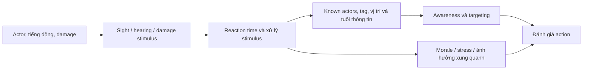

# AI nhìn, nghe, ghi nhớ và thay đổi morale

Một AI có hành động thông minh nhưng cảm nhận sai vẫn tạo cảm giác gian lận. Một AI cảm nhận đúng nhưng không có độ trễ phản ứng có thể trông như máy. Để đọc Ready or Not, cần tách **thế giới thật**, **thông tin AI đã biết**, **đánh giá tình huống** và **hành động được chọn**.

## Chuỗi dữ liệu trước khi AI quyết định

Một sound stimulus cho AI biết có tiếng động ở vị trí nào không nhất thiết đồng nghĩa nó biết chính xác target hiện đang đứng đâu. Source controller có các tập thông tin về actor đã nghe/nhìn, tag stimulus, thời gian và truy vấn exposure. Khi dựng prototype, đừng truyền thẳng vị trí player mỗi frame vào mọi AI rồi gọi đó là perception.

## Những cơ chế đọc được trong source

`ACyberneticController::OnPerceptionUpdated` phân phối thông tin cảm nhận; các đường sight, hearing, damage có hàm riêng. `ProcessStimuli`, `OnSeenActor`, `OnHeardActor` và `OnDamagedByActor` là những trạm để debug “AI biết gì, từ đâu”. `InvestigateStimulus` và `MoveToCover` nằm phía phản ứng, không phải hệ thống cảm nhận gốc.

Project có `UReadyOrNotAISense_Sight` tùy biến. `Update` của nó xử lý query, đồng thời có giới hạn công việc theo tick. Khi nhiều AI và target xuất hiện, cần đo cả chi phí lẫn độ trễ query. Việc giảm tick có thể cải thiện CPU nhưng làm thay đổi thời gian phát hiện, nên performance và game feel phải được xem cùng nhau.

`ASuspectController::GetReactionTime` dùng loại sense và awareness, đọc giá trị qua `AI_CONFIG_GET_FLOAT`; civilian có bộ tham số riêng. Các số fallback trong C++ **không được trình bày như thông số đang chạy chắc chắn**, vì cấu hình và archetype có thể thay. Comment cũ về giới hạn thời gian trong hàm cũng không thay thế biểu thức thực thi; hãy đọc phép clamp thực tế.

## Morale là resource có lịch sử

`UMoraleComponent` giữ resource và các lịch sử tăng/giảm theo `Reason` cùng thời gian từ lần thay đổi. Nó có thao tác theo một character và theo bán kính, có tham số kiểm tra LOS. Điều này cho phép nhiều hành động tạo áp lực lên AI, nhưng không chứng minh chỉ một ngưỡng morale là đủ mô tả mọi surrender.

Cũng cần phân biệt morale, stress, awareness và compliance. `SuspectController::OnHeardActor` thay stress theo tag tiếng súng và xử lý một số tiếng động gây hấn. Morale debug lại hiển thị cả resource lẫn thông tin compliance liên quan mức nhìn thấy SWAT. Bốn khái niệm liên quan nhau nhưng không nên nén thành biến `Fear` duy nhất khi đọc source.

## Bằng chứng và đường lần tiếp

| File và symbol | Vị trí |
|---|---|
| `Source/ReadyOrNot/Characters/CyberneticController.cpp`, `OnPerceptionUpdated` | `:1497` |
| Cùng file, `ProcessActorSightStimulus` / `ProcessActorHearingStimulus` / `ProcessActorDamageStimulus` | `:1577`, `:1612`, `:1647` |
| Cùng file, `ProcessStimuli` | `:1682` |
| Cùng file, `OnSeenActor` / `OnHeardActor` | `:3156`, `:3209` |
| Cùng file, `AddExposedToStimulusTag` | `:3584` |
| Cùng file, `InvestigateStimulus` / `MoveToCover` | `:3915`, `:4203` |
| `Source/ReadyOrNot/Senses/ReadyOrNotAISense_Sight.cpp`, `Update` | `:169` |
| `Source/ReadyOrNot/Characters/AI/SuspectController.cpp`, `GetReactionTime` / `OnHeardActor` | `:9`, `:31` |
| `Source/ReadyOrNot/Characters/AI/CivilianController.cpp`, `GetReactionTime` | `:8` |
| `Source/ReadyOrNot/Components/MoraleComponent.cpp`, `LowerMoraleOnCharacter` / radial damage | `:84`, `:126`, `:188` |

## Thực hành quan sát một AI

Trước khi làm combat, đặt một AI không di chuyển trong phòng kín. Cho player xuất hiện, khuất tường, tạo tiếng động trong game, rồi đợi thông tin hết hạn. Ghi thời điểm stimulus, thời điểm perception callback, awareness trước/sau, target đang track và reason morale. Thêm AI thứ hai để quan sát việc thông tin xã hội thay đổi hành vi, chỉ sau khi case một AI đã giải thích được.

**Tiêu chí đạt:** AI không nhìn xuyên collider ngoài thiết kế; log phân biệt nhìn thấy với nghe thấy; phản ứng có thời gian có thể đo; thay đổi morale có reason; thử cùng kịch bản nhiều lần và ghi seed/khác biệt. Đừng ép kết quả lần nào cũng y hệt nếu hệ thống có randomness; hãy kiểm soát seed hoặc ghi phân bố.

**Kiến thức cần:** vector, cone/FOV, trace channels, AI Perception, timer, resource component, debug draw. **Chưa xác minh:** toàn bộ sight bone sampling, tuning từng map/archetype, stimulus phát bởi mọi item và độ trễ trên tải AI lớn. Hai flow ảnh là gợi ý câu hỏi quan sát; chúng không thay thế các phép thử này.
