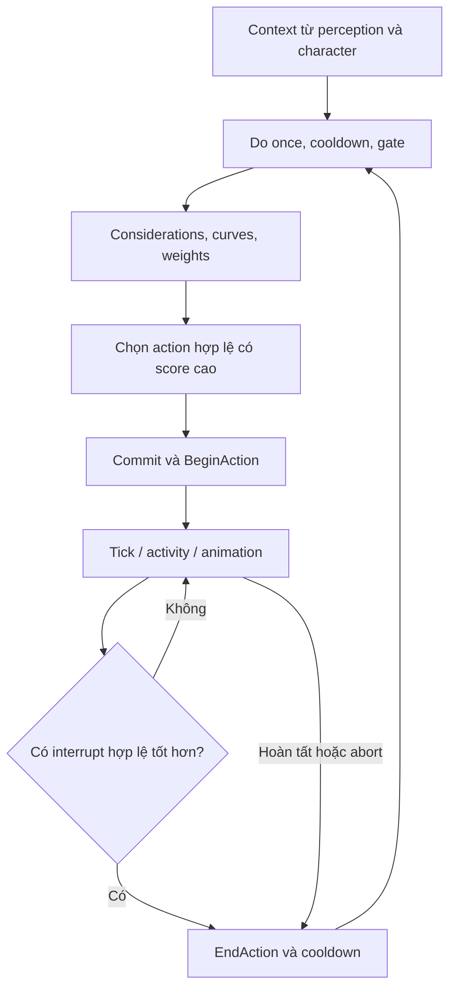

# AI chọn hành động: từ gate tới activity

Đừng bắt đầu bằng câu “Ready or Not dùng GOAP hay Behavior Tree?”. Câu hữu ích hơn là: **trong snapshot này, ai chọn hành động tiếp theo, dùng dữ liệu gì, và điều kiện nào cho phép ngắt hành động đang chạy?** Code đã khảo sát cho thấy một bộ chấm điểm action và hệ thống activity, với các điểm mở rộng bằng Blueprint.

Sự tồn tại của `DefaultGOAPer.ini` không đủ để kết luận toàn bộ AI hiện hành là GOAP. Chương này mô tả đường thực thi đã đọc, không gán một nhãn kiến trúc duy nhất cho tất cả lịch sử dự án.

## Gate, consideration, action và activity khác nhau thế nào?

| Khái niệm | Câu hỏi trả lời | Ví dụ học tập tự thiết kế |
|---|---|---|
| Gate | Hành động có được xét không? | Target còn tồn tại, không bị khóa action |
| Consideration | Hành động đáng chọn đến mức nào? | Khoảng cách, mức áp lực, vị trí cover |
| Action data | Tham số, weight, cooldown, commit của lựa chọn | Một action “di chuyển tới điểm an toàn” |
| Action thực thi | Làm gì khi bắt đầu/tick/kết thúc? | Yêu cầu path và chờ hoàn tất |
| Activity | Công việc được controller tổ chức và chạy | Di chuyển, tương tác, hoạt động đội |
| Character state | Cơ thể hiện ở trạng thái nào? | Surrender, đang equip, bị bắt |

Các ví dụ ở cột cuối là bài tập mô hình hóa, không phải tên preset được xác nhận trong asset game.

`FAIActionData` có gates, considerations, score/cooldown/commit time theo controller và custom action. `AIActionDecisionEvaluator::DetermineBestActionFor` gọi xét từng action, sắp xếp theo score và trả action đứng đầu. `ConsiderAction` loại trường hợp do-once, cooldown, last-alive, nhiều lần fail, gate không mở; sau đó tổng hợp consideration qua response curve, weight và phương thức cộng/trừ/nhân. Action có score bằng không có thể bị loại.

## Chọn tốt nhất chưa đủ: phải giữ hành động ổn định

Nếu mỗi frame action điểm cao nhất đổi qua lại, AI sẽ giật hoặc đổi ý liên tục. Source có commit time, cooldown và danh sách action có thể interrupt. `DetermineBestInterruptAction` so sánh action được phép ngắt với action đang giữ, kết thúc action cũ, bắt đầu cooldown rồi commit action mới. Đó là phần quan trọng để học: ổn định hành vi là một luật riêng, không phải tác dụng tự nhiên của hàm chấm điểm.

## Nghi phạm và dân thường không chỉ khác team enum

Hai controller có reaction parameters và phản ứng đối với character/âm thanh riêng. Character còn có các hàm `Surrender`, `FakeSurrender`, `SurrenderExit` và các history flag dùng trong ROE. Vì vậy icon “sợ hãi → đầu hàng → bắt giữ” trong ảnh tham khảo chưa đủ biểu diễn AI thật: hành vi đang chạy, history và khoảng thời gian có thể ảnh hưởng quyết định sau đó.

`UAIData` trỏ tới archetype, override theo COOP mode, lựa chọn weapon, class character/controller. Đây là chỗ thiết kế dữ liệu gặp code. Một controller base cùng code có thể hành xử khác khi asset archetype và preset khác; kiểm kê class không thay thế kiểm kê instance/defaults.

## Điểm đọc chính

| Vị trí | Nội dung |
|---|---|
| `Source/ReadyOrNot/AI/AIActionData.h:209` | Gate và consideration trong data |
| Cùng file `:224` | State đánh giá theo controller |
| `Source/ReadyOrNot/AI/AIActionData.cpp:156`, `DetermineBestActionFor` | Xét, sort, chọn action |
| Cùng file `:241`, `ConsiderAction` | Guard, gate và score aggregation |
| `Source/ReadyOrNot/AI/AIAction.h:29`, `BeginAction` | Lifecycle action có Blueprint hooks |
| `Source/ReadyOrNot/Characters/CyberneticController.cpp:2315`, `PerformActivity`; `:2421`, `AddActivity`; `:2578`, `FinishActivity` | Lifecycle activity |
| Cùng file `:3327`, `DetermineBestInterruptAction`; `:3433`, `ForceEndAllActions` | Ngắt và cleanup |
| `Source/ReadyOrNot/Characters/CyberneticCharacter.cpp:1721`, `Surrender`; `:1815`, `FakeSurrender`; `:1637`, `SurrenderExit` | State và phản ứng cơ thể |
| `Source/ReadyOrNot/Data/AIData.h:253`, `Archetype`; `:257`, mode override; `:307`, character class | Nguồn khác biệt từ data |

## Bài tập xây AI nhỏ trước

Tạo ba action học tập: đứng quan sát, di chuyển tới điểm đã chọn, surrender. Cho gate loại action khi đang bị bắt; cho consideration đọc khoảng cách hoặc resource; ghi bảng score của cả ba. Thêm commit time rồi cố ý tạo input khiến hai score cắt nhau liên tục. Quan sát cách commit làm hành vi bớt dao động.

**Tiêu chí đạt:** chọn action có log reason; gate fail không bị score cao “vượt qua”; cancel gọi cleanup đúng một lần; reset xóa cooldown/history cần xóa; AI không giữ actor target đã bị hủy. Với Blueprint action, kiểm tra asset thật có chạy `BeginAction`/`EndAction`, không chỉ compile thành công.

**Chưa xác minh:** toàn bộ action preset trong content, mọi action Blueprint và trọng số runtime. Đây chưa phải mô hình hành vi đầy đủ của mỗi nghi phạm. Muốn đạt tương đồng, cần một ma trận quan sát theo map, archetype, seed và trạng thái người chơi.
