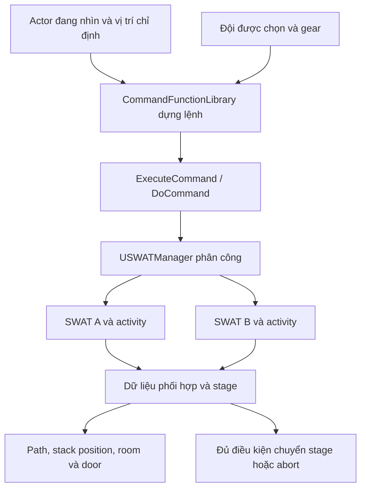

# SWAT: biến mệnh lệnh thành công việc phối hợp

“Ra lệnh cho đội đi tới cửa” nghe giống một `MoveTo`. Thực tế phải xác định đội nào, cửa nào, phía nào, ai có tool, ai đứng đâu, lúc nào mọi người đã sẵn sàng, khi nào được tiếp tục, và làm gì nếu đường đi không có. Đây là bài học về phối hợp nhiều actor, không chỉ AI cá nhân.

## Chuỗi từ menu lệnh tới activity

`UReadyOrNotCommandFunctionLibrary` dựng trang lệnh theo context, đọc tình trạng cửa/đội/tool và chuyển lệnh thành thao tác trên `USWATManager`. Manager có các hàm như `GiveStackUpCommand`, `GiveBreachAndClearCommand`. Mỗi SWATController tạo các activity chuyên biệt lúc BeginPlay: stack, fall in, hold, mirror, lockpick, collect evidence, arrest và các biến thể hành động ở cửa.

Đây là bản đồ trách nhiệm. Đường RPC cụ thể cần lần từ caller của command ở PlayerController/widget khi kiểm tra multiplayer; việc thấy một hàm tên `ExecuteCommand` chưa chứng minh quyền thực thi của client.

## Stack up là một tiến trình

`UTeamStackUpActivity` có các stage stackup, check, stacked, path async và phép tính vị trí. `AllStacked`/`AllStackUpPathsReady` cho thấy điều kiện đồng bộ nhiều người. Nếu một thành viên không có path, cả đội cần biết đó là failure hoặc chờ có giới hạn, thay vì mãi đứng im mà UI báo lệnh thành công.

Làm lại hệ thống này, trước hết cho hai AI tới hai marker ổn định. Sau đó mới tính marker dựa vào hình học căn phòng, phía cửa và số thành viên. Nếu vừa phát triển navigation, tạo marker tự động, giao tiếp đội và animation cùng lúc, bạn khó phân biệt lỗi thuộc phần nào.

## Navmesh cần mang ý nghĩa gameplay

`ReadyOrNotNavQueries.cpp` có các filter cho door test, SWAT và SWAT breach-and-clear. Closed door, locked door, trapped door và cửa từng mở có cách đối xử khác theo query. Một tuyến đường ngắn nhất theo hình học không nhất thiết đúng với mệnh lệnh đang làm: đội được yêu cầu vào một cửa không nên vòng qua cửa khác chỉ vì path rẻ hơn.

Plugin `DynamicCoverSystem` cung cấp world subsystem, cover octree và khởi tạo theo world/level. Core project phụ thuộc plugin này trong Build.cs. Nhìn thấy một mesh có vẻ là cover không tự làm AI biết đó là vị trí chiến thuật; cần dữ liệu/query và kiểm tra thực tế.

## Nơi đọc source

| File, dòng, symbol | Vai trò |
|---|---|
| `Source/ReadyOrNot/lib/ReadyOrNotCommandFunctionLibrary.cpp:510`, `BuildDoorPageData` | Lệnh phụ thuộc cửa |
| Cùng file `:1258`, `DoCommand`; `:2303`, `ExecuteCommand` | Điều phối lệnh được chọn |
| `Source/ReadyOrNot/Info/SWATManager.cpp:3064`, `GiveBreachAndClearCommand` | Phân công chuỗi hành động ở cửa |
| Cùng file `:3801`, `GiveStackUpCommand` | Lệnh stack up |
| `Source/ReadyOrNot/Characters/AI/SWATController.cpp:55`, `BeginPlay` | Tạo activity cho từng controller |
| `Source/ReadyOrNot/Info/Activities/Team/TeamStackUpActivity.cpp:515`, `EnterStackupStage`; `:817`, `EnterCheckStage`; `:922`, `EnterStackedStage` | Vòng đời phối hợp |
| Cùng file `:1410`, `OnAsyncPathFound`; `:1461`, `CalculateStackUpPosition`; `:2320`, `AllStacked` | Path, vị trí và điều kiện sẵn sàng |
| `Source/ReadyOrNot/Info/Activities/Team/TeamBreachAndClearActivity.cpp:110`, `StartActivity`; `:153`, `PerformActivity`; `:322`, `FinishedActivity` | Lifecycle breaching trong game |
| `Source/ReadyOrNot/Navigation/ReadyOrNotNavQueries.cpp:29`, `UNavQuery_Swat`; `:91`, `UNavQuery_SwatBreachAndClear` | Filter theo mục đích |
| `Plugins/DynamicCoverSystem/Source/DynamicCoverSystem/Private/CoverSystem.cpp:20`, `Initialize`; `:76`, `InitializeCoverSystem` | Cover gắn với tuổi thọ world |

## Bài tập tích hợp đội

Dùng map hai phòng có cửa, hai SWAT và hai đội chọn được. Cho lệnh di chuyển, giữ vị trí, stack và hủy. Ghi CommandId, team, mỗi member, stage, destination, path result và reason abort. Chặn một điểm đến, hủy một actor, hoặc ra lệnh khác khi hoạt động chưa hoàn thành.

**Tiêu chí đạt:** đúng đội nhận lệnh; tool thiếu khiến lệnh bị loại hoặc phản hồi rõ; path thất bại không treo chuỗi; cancel không để door blocker/animation lock tồn tại; team đổi lệnh không thực thi cả lệnh cũ và mới. Đo thời gian hoàn tất và số lần stuck trước khi mở rộng lên toàn đội.

**Kiến thức cần:** array/map, ownership, asynchronous callbacks, navigation filters, finite state machine, shared state. **Chưa xác minh:** mọi combination lệnh/tool, tính đúng của marker trên từng map và behavior under load. Có hàng loạt class activity không đồng nghĩa mọi tổ hợp đã được runtime kiểm thử.
