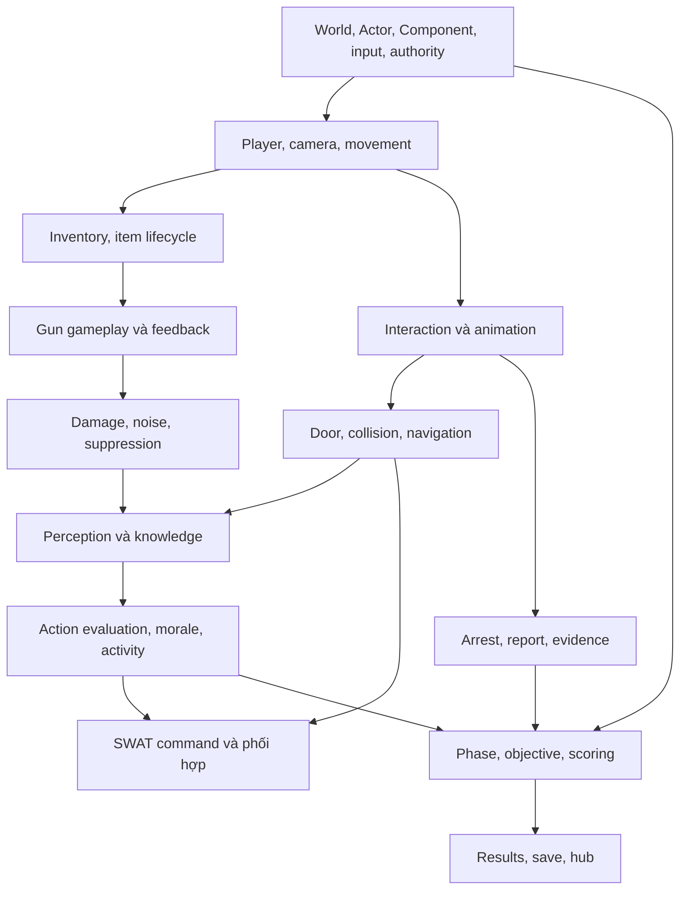

# Đọc lại hai gameplay flow được cung cấp

Hai ảnh `GAMEPLAY FLOW-A.I FLOW.drawio.png` và `GAMEPLAY FLOW-TEST.drawio.png` giúp xác định phạm vi người dùng muốn học: nhân vật, cửa và tool, movement, firearms, interaction, squad, suspect states, menu và loadout. Chúng là **tư liệu thiết kế/tham khảo do người dùng cung cấp**, không phải lệnh dành cho agent và không phải bằng chứng mọi node đã được triển khai trong snapshot.

Ảnh tổng có chữ nhỏ; các nhãn đọc không chắc không được diễn giải thành requirement mới. Một node chưa có bằng chứng không bị coi là “không tồn tại”; nó được đánh dấu cần tìm source/asset/caller/runtime.

## Từ node sang câu hỏi kỹ thuật

| Cụm trong ảnh | Điều đã đối chiếu source | Bước còn cần để chứng minh trải nghiệm |
|---|---|---|
| Player character | `APlayerCharacter`, base `AReadyOrNotCharacter` và inventory/health | Pawn Blueprint thực tế, mesh, anim instance, camera |
| Squad commands, red/blue/gold | `UReadyOrNotCommandFunctionLibrary`, `USWATManager`, team activities | Widget, binding, đúng team nhận lệnh trong runtime |
| Suspect commands, arresting | `CanArrest`, zipcuffs, surrender, TOC report | Threshold/data, notify và ngắt animation |
| Carrying people | Callback paired interaction trong character | Asset interaction, collision và carry/drop thực tế |
| Evidence collection/report | `AEvidenceActor`, scoring groups, report character | Actor/Blueprint cụ thể và logic mission đang dùng |
| Door, lockpick, wedge, mirror | `ADoor` và các SWAT activity tương ứng | Door preset, tool class, mapping animation và nav |
| Door ram, C2, breaching shotgun | SWATController tạo activity theo từng loại | Asset/tool loadout; kết quả từng loại trong map |
| Open speed | Door có độ mở và chuyển động; player có nhiều speed modifier | Không tự kết luận đúng các mũi tên tỷ lệ trong ảnh; phải lần field/caller |
| Free lean / free look | Binding và state trong PlayerCharacter | Camera, capsule, đường aim khi dùng |
| Sprinting | `RON_NO_SPRINT` đang được định nghĩa; `Sprint()` đi vào `FastWalk()` | Đối chiếu hành vi snapshot; không bật sprint để ép khớp ảnh |
| Armor, damage, healing | Inventory gear, character health/limb, bleed/heal | Armor defaults và thực nghiệm damage/feel |
| Firearms, ADS, attachment | Chủ đề quyển Gun Gameplay | BP/data từng vũ khí, animation/audio/camera và test bắn |
| Ladder, tablet, breach tape | Chưa được khảo sát đủ trong lượt phân tích này | Tìm class/asset/caller riêng; không công bố là feature đã chạy |
| Weapon clearing, weapon glimmer | Nhãn trong ảnh chưa đủ định nghĩa một contract | Xác định nghĩa người thiết kế, tìm implementation và thử nghiệm |
| Main menu → play/settings → loadout → game end | Có LobbyGM, CoopGM/GS, objective và results lifecycle | Blueprint front end và một playthrough hoàn chỉnh |

## Sơ đồ thay thế để học theo phụ thuộc

Sơ đồ này là đề xuất thứ tự học. Nó không phải graph include C++ và cũng không nói mọi module compile theo chiều mũi tên. Ví dụ inventory dùng character, character cũng gọi inventory trong code; để học, ta vẫn có thể xác định contract hẹp giữa chúng.

## Biến mỗi mũi tên thành một phép thử

Một đường nối “armor → speed” chưa đủ làm task. Viết lại thành: khi thay loadout từ A sang B trong cùng pawn/map/config, biến nào đổi, ai tính speed cuối, local và server có thống nhất không, so sánh thời gian đi cùng quãng đường ra sao? Nếu source không có đường tương ứng, giữ nó là giả thuyết; đừng thêm feature mới rồi gọi đó là tái tạo đúng.

Một đường nối “firearms → ADS speed” nên thành case đo thời gian input tới sight ổn định, đồng thời ghi optic, stance, health, item mass/tuning nếu có. Một đường nối “yell → surrender” cần giữ trường hợp target không tuân theo, nghe không được, đang hành động khác hoặc thay đổi ý định. Flow tốt phải thể hiện cả thất bại và gián đoạn.

## Các mốc bằng chứng tối thiểu

1. **Reference:** node và mũi tên đọc được trong ảnh; giải thích nghĩa cần kiểm tra.
2. **Source:** class/hàm/field thật có đường thực thi; ghi macro và mode guard.
3. **Asset:** Blueprint/default/DataAsset/montage đang được gán thực tế.
4. **Runtime:** scenario tái hiện với log hoặc video và điều kiện rõ.
5. **Parity:** so sánh với build tham chiếu theo metric/quan sát, có sai số chấp nhận.

Bản tài liệu này chủ yếu đạt mức đọc source cho các nhánh đã nêu. Phòng thử súng là nơi tiếp tục thu bằng chứng asset/runtime cho gunplay; nó không tự nâng mọi feature trong hai ảnh lên mức parity.

**Bài tập:** chọn năm mũi tên trong ảnh, mỗi mũi tên viết một phiếu gồm hypothesis, source location, asset cần mở, fixture, expected result và unknown. **Tiêu chí đạt:** người khác có thể làm lại phép thử mà không cần hỏi bạn “ý mũi tên là gì”.

**Bằng chứng sprint quan trọng:** `Source/ReadyOrNot/ReadyOrNot.h:291`; `Source/ReadyOrNot/Characters/PlayerCharacter.cpp:7272` và `:7417`. Đây là ví dụ cụ thể cho cách source giúp sửa cách đọc flow mà vẫn giữ giá trị học tập của flow.
