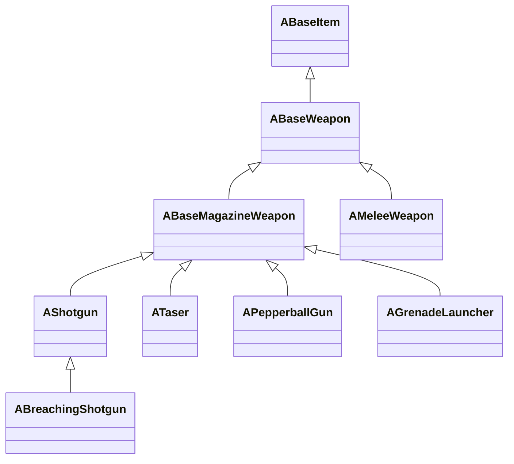

# 01 — Một khẩu súng là một bộ hợp đồng dữ liệu

[Mục lục Gun Gameplay](README.md) · [Tiếp: Input và equip](02-Input-inventory-equip.md)

Bạn không cần hiểu hàng nghìn file trước khi hiểu một phát bắn. Bắt đầu bằng ba câu hỏi: đối tượng nào nhận hành động, đối tượng nào giữ trạng thái, và dữ liệu nào làm hai khẩu súng khác nhau. Chương này trả lời ở tầng cấu trúc; các chương sau đi vào thời gian chạy.

## Từ item đến weapon

**Đã thấy trong source:** `ABaseMagazineWeapon` kế thừa `ABaseWeapon`; shotgun, taser, pepperball và grenade launcher tiếp tục chuyên biệt hóa magazine weapon. Breaching shotgun kế thừa shotgun. `AMeleeWeapon` cũng kế thừa base weapon, nên tìm mọi lớp con của `ABaseWeapon` sẽ thu cả vũ khí cận chiến. [S01, S01a, S01b, S01c]

| Loại native | Trách nhiệm cần học | Không được suy từ tên lớp |
|---|---|---|
| `ABaseWeapon` | Fire mode, loại ammo, recoil/spread, các điểm attachment | Số lượng model súng có trong game |
| `ABaseMagazineWeapon` | Danh sách magazine, local/server fire, hitscan/projectile, reload | Mọi lớp con đều dùng băng rời |
| `AShotgun` | Kho đạn dự trữ và danh sách `Shells`, chuỗi nạp | Mọi shotgun bắn cùng số pellet |
| `ATaser` | Override fire, trạng thái giữ cò, probe/cable và stun | Một dạng rifle giảm damage |
| `APepperballGun` | Override lưu/trừ ammo và phản hồi riêng | Mọi đạn ít sát thương đều đi cùng đường |
| `AGrenadeLauncher` | Tính/mô phỏng đường grenade chuyên biệt | Hành vi projectile của đạn thường |
| `ABreachingShotgun` | Nhánh shotgun chuyên dụng | Là một súng player loadout thông thường |

Bảng mô tả các điểm mở rộng đọc được, không phải danh sách thương mại. Shotgun thật sự trả `Shells.Num()` ở `GetAmmo`; taser thật sự override `Server_OnFire`; launcher có `FullySimulateGrenadePath`. [S02–S04]

Với pepperball, `GetAmmo` đọc `BallsInHopper`; `SetMagazineCount` của lớp này chỉ đổ đầy hopper và không dùng hai đối số theo cách của base class. Đây là ví dụ cụ thể về đa hình: harness gọi cùng tên API vẫn phải xác nhận state thực tế của từng subclass trước khi kết luận đã chuẩn bị đủ ammo hoặc đã test reload. [S03]

## Ai sở hữu phần nào?

| Tầng | Chủ sở hữu trong source | Ví dụ đầu vào | Kết quả |
|---|---|---|---|
| Ý định | `APlayerCharacter` | Fire pressed/released, reload | Cho phép/chặn thao tác, lập lịch auto/burst |
| Cầm và chuyển đồ | `UInventoryComponent` | Item instance, `FItemChangeRequest` | Owner, vật đang cầm, holster/draw |
| Quy tắc súng | `ABaseWeapon`, `ABaseMagazineWeapon` | Fire mode, ammo, cooldown | Phát bắn, trừ đạn, callback |
| Đặc tính đạn | `FAmmoTypeData` qua DataTable | Tên row trong `AmmunitionTypes` | Damage/range curve, pellet, spread, penetration |
| Trình diễn | `AnimationData`, `SoundData`, camera/player | Cùng sự kiện fire/reload | Montage, âm thanh, recoil, effects |
| Trúng đích | Weapon và character/armour | `FHitResult`, bone, physical material | Damage, phản ứng, trạng thái |

Các mối nối quan trọng có thể kiểm tra ở `AddInventoryItem`, `PrimaryUse`, `SetAmmunitionType`, khai báo `AnimationData`/`SoundData` và `ApplyHitscanDamage`. [S05–S08]

**Suy luận:** cấu trúc này cho phép nhiều Blueprint dùng chung cơ chế native nhưng khác nội dung. Muốn tạo một súng mới trong dự án học, thường cần một cấu hình hoàn chỉnh; thêm một lớp C++ rỗng chưa giải quyết animation, socket, ammo và sound.

## C++ định nghĩa ý nghĩa; asset quyết định cấu hình cụ thể

`FAmmoTypeData` có damage, curve theo khoảng cách, projectile count, spread theo yaw/pitch, penetration level/distance, ricochet và các multiplier theo vùng cơ thể. `SetAmmunitionType` tìm row rồi **chép** dữ liệu vào `CurrentAmmoType`; đồng thời đặt `SpawnProjectileCount` bằng projectile count của row. Vì có cache runtime, chỉ nhìn tên row hiện ra trên UI chưa đủ để biết dữ liệu đang dùng. [S06]

`ABaseItem` giữ tham chiếu `AnimationData`, các bộ animation thay thế cho grip/shield và `SoundData`. `ABaseWeapon` có các component attachment riêng; đường recoil nhân multiplier của các attachment hiện tồn tại. [S07, S09]

| Dữ liệu cần kiểm tra cho mỗi generated class | Vì sao bắt buộc |
|---|---|
| Parent native, generated class path, CDO path | Phân biệt biến thể và abstract/template class |
| `ItemClass`, category, tên hiển thị, lookup row | Phân biệt taxonomy runtime với tên file |
| `FireRate`, `AvailableFireModes`, `BurstBulletCount`, `RefireDelay` | Nhịp bắn và mode không suy được từ model |
| `AmmoMax`, `AmmunitionTypes`, `AmmoDataTable`, magazine count | Xây được trạng thái ban đầu hợp lệ |
| `bHitScan`, projectile class, bullet spawn socket/transform | Xác định nhánh mô phỏng và gốc đường đạn |
| Recoil pattern, spread, ADS modifiers, proc recoil flags | Lấy đủ các thành phần cảm giác bắn |
| FP/TP meshes, animation data, sound data | Đảm bảo player cầm được và có phản hồi |
| Attachments mặc định và tương thích | Tránh so sánh hai cấu hình khác nhau |

Đây là **hợp đồng xuất dữ liệu đề xuất**. Header chỉ xác nhận trường tồn tại và kiểu dữ liệu; cần CDO và runtime snapshot để điền giá trị từng súng. Ví dụ giá trị `Damage = 30` trong `FAmmoTypeData` là initializer của struct, không có nghĩa mọi ammo gây 30 damage. [S06]

## Tìm asset đúng cách

Trong workspace có các vùng `Content/Blueprints/Items/WeaponsRevised`, `WeaponsSuspect`, `Content/Blueprints/Animation/Revised/Graphs_Weapon`. Chẳng hạn tìm thấy tên file `Primary_AKM.uasset`, `Secondary_Tec9.uasset`, `SoundData_M4A1.uasset`, `ANIMBP_W870LL.uasset`. **Bằng chứng này chỉ xác nhận sự tồn tại của file**, không xác nhận quan hệ tham chiếu, CDO hay khả năng chơi. [S10]

Game cũng có một đường catalog native: `ULoadoutManager::LoadLoadoutItems` tìm Blueprint classes kế thừa `ABaseItem` trên `/Game`, load class/CDO, xây lookup map trong build phát triển rồi mới lọc `bShowInLoadout` và điều kiện DLC. Vì vậy “mọi weapon có trong tài nguyên” và “những món UI loadout hiện cho chọn” là hai tập khác nhau. Một level phục vụ nghiên cứu nên giữ metadata của cả hai, ghi rõ lớp nào được xác nhận playable. [S11]

Bài thực hành để có catalog đáng tin:

1. Asset Registry lấy ứng viên Blueprint trong vùng items.
2. Load generated class và kiểm tra có kế thừa native weapon cần thiết.
3. Loại abstract/deprecated/skeleton class bằng metadata và class flags.
4. Đọc CDO, xuất property cùng class path và parent path.
5. Spawn trong bản sao level thử, cấp inventory và equip qua đường native.
6. Ghi riêng `discovered`, `class_loaded`, `equipped`, `fired`, `reload_verified`.

Không thay cột cuối bằng một chữ “đã hỗ trợ” ngay sau bước 1. Vũ khí AI có thể hợp lệ để bắn bằng AI nhưng chưa đủ nội dung góc nhìn thứ nhất; đây là một điều cần đo, không nên đoán.

## Bài học kiến trúc

Một thiết kế thực hành tối thiểu có thể tách `WeaponDefinition` bất biến khỏi `WeaponRuntimeState`. Definition chứa mesh, mode, ammo type và tuning; runtime chứa băng đang dùng, cooldown, reload phase và seed. Đây là **đề xuất giảng dạy**, không phải yêu cầu sửa các lớp gốc. Lợi ích là người mới thấy rõ: thay definition là đổi cấu hình, còn trừ đạn là đổi state.

Bạn hiểu chương này khi chỉ ra được một property nằm ở C++ schema, giá trị override trong Blueprint và giá trị thay đổi khi chơi; đồng thời giải thích được vì sao ba thứ đó không đồng nghĩa.

## Bằng chứng

| ID | Đường dẫn và symbol | Dòng |
|---|---|---|
| S01 | `Ready Or Not/Source/ReadyOrNot/Actors/BaseWeapon.h` — `ABaseWeapon`; `Ready Or Not/Source/ReadyOrNot/Actors/BaseMagazineWeapon.h` — `ABaseMagazineWeapon` | 164; 115 |
| S01a | `Ready Or Not/Source/ReadyOrNot/Actors/Items/Shotgun.h` — `AShotgun`; `Ready Or Not/Source/ReadyOrNot/Actors/Items/BreachingShotgun.h` — `ABreachingShotgun` | 22; 13 |
| S01b | `Ready Or Not/Source/ReadyOrNot/Actors/Items/Taser.h` — `ATaser`; `Ready Or Not/Source/ReadyOrNot/Actors/Items/PepperballGun.h` — `APepperballGun` | 12; 12 |
| S01c | `Ready Or Not/Source/ReadyOrNot/Actors/Items/GrenadeLauncher.h` — `AGrenadeLauncher`; `Ready Or Not/Source/ReadyOrNot/Actors/Items/MeleeWeapon.h` — `AMeleeWeapon` | 9; 13 |
| S02 | `Ready Or Not/Source/ReadyOrNot/Actors/Items/Shotgun.cpp` — `GetAmmo`, `RemoveAmmo`, `ReplenishAmmo` | 138–184 |
| S03 | `Ready Or Not/Source/ReadyOrNot/Actors/Items/Taser.cpp` — `Server_OnFire_Implementation`, `OnFire`, `OnItemPrimaryUseEnd`; `Ready Or Not/Source/ReadyOrNot/Actors/Items/PepperballGun.cpp` — `SetMagazineCount`, `GetAmmo`, `RemoveAmmo` | 311–488, 499–503; 25–28, 56–65 |
| S04 | `Ready Or Not/Source/ReadyOrNot/Actors/Items/GrenadeLauncher.cpp` — `FullySimulateGrenadePath` | 106–138 |
| S05 | `Ready Or Not/Source/ReadyOrNot/Components/InventoryComponent.cpp` — `AddInventoryItem`, `PutItemInHands`; `Ready Or Not/Source/ReadyOrNot/Characters/PlayerCharacter.cpp` — `PrimaryUse` | 1294–1321, 853–903; 5354–5515 |
| S06 | `Ready Or Not/Source/ReadyOrNot/Actors/BaseWeapon.h` — `FAmmoTypeData`; `Ready Or Not/Source/ReadyOrNot/Actors/BaseWeapon.cpp` — `SetAmmunitionType` | 25–142; 618–653 |
| S07 | `Ready Or Not/Source/ReadyOrNot/Actors/BaseItem.h` — `AnimationData`, `GripAnimationData`, shield animation data, `SoundData` | 1642–1659, 1728 |
| S08 | `Ready Or Not/Source/ReadyOrNot/Actors/BaseMagazineWeapon.cpp` — `ApplyHitscanDamage` | 2337–2402 |
| S09 | `Ready Or Not/Source/ReadyOrNot/Actors/BaseWeapon.h` — attachment components; `Ready Or Not/Source/ReadyOrNot/Actors/BaseMagazineWeapon.cpp` — `CalculateRecoil` | 217–239; 834–868 |
| S10 | Danh sách file trực tiếp từ `Ready Or Not/Content/Blueprints/Items` và `Ready Or Not/Content/Blueprints/Animation/Revised/Graphs_Weapon` | Phát hiện tên file ngày 07/10/2026, chưa dùng làm bằng chứng CDO |
| S11 | `Ready Or Not/Source/ReadyOrNot/Info/LoadoutManager.cpp` — `LoadLoadoutItems` | 87–149 |
