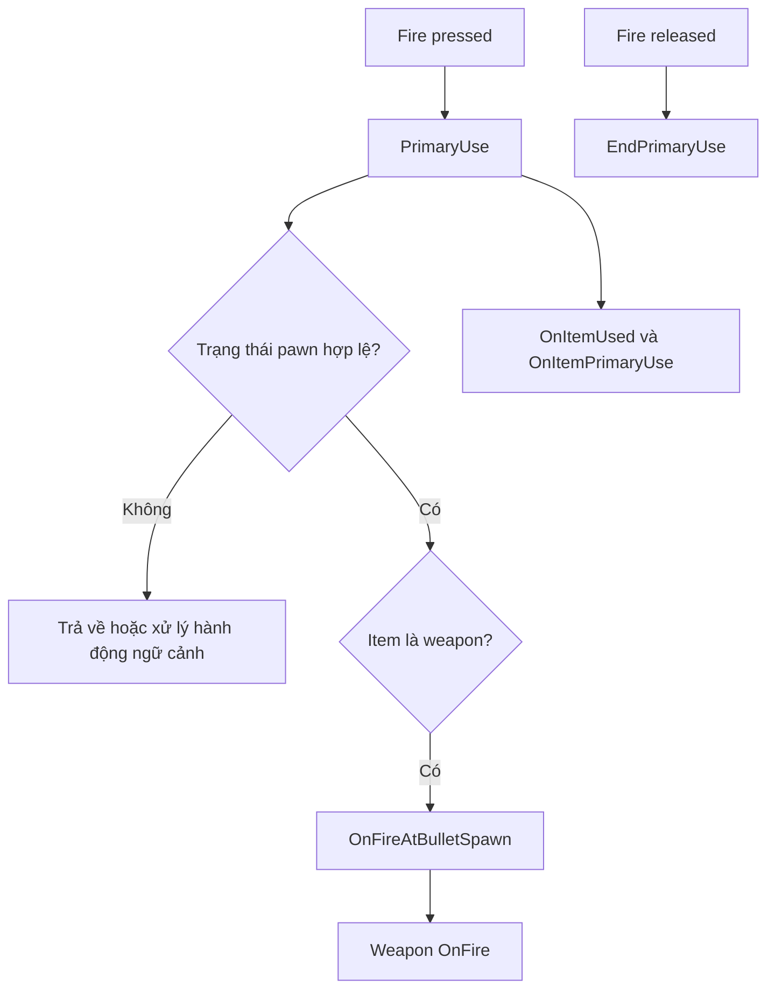
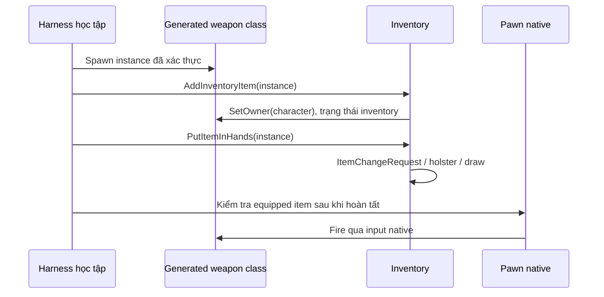

# 02 — Input, inventory và equip

[Trước: Bản đồ dữ liệu](01-Ban-do-he-thong-va-du-lieu.md) · [Mục lục](README.md) · [Tiếp: Fire và ammo](03-Fire-ammo-chamber.md)

Để tái tạo cảm giác bắn trong chính project hiện có, điều quan trọng đầu tiên là giữ nguyên đường đi của thao tác người chơi. Một actor súng đứng trong level có mesh đúng chưa phải một súng đã được pawn sở hữu và cầm hợp lệ.

## Nhấn chuột chưa chắc tạo phát bắn

**Đã thấy trong source:** input action `Fire` được bind vào `PrimaryUse` lúc pressed và `EndPrimaryUse` lúc released. Đây là tên action logic; phím vật lý cuối cùng còn phụ thuộc cấu hình và setting người chơi. Không nên hardcode sơ đồ bàn phím dựa riêng vào hàm bind. [I01]

`PrimaryUse` kiểm tra các hoàn cảnh khác nhau trước khi gọi weapon: bị mang, đang mang người khác, không có item, chết/bất tỉnh, animation đang chặn, bị còng, khóa hành động và low-ready. Nếu đang mang người, thao tác này có thể thả người. Với shotgun đang reload, hàm đề nghị cancel trước khi kiểm tra animation blocker. Hàm còn giữ nhánh gọi `Walk()` khi `IsSprinting()` hoặc `IsHoldingSprint()` đúng. Tuy nhiên snapshot định nghĩa `RON_NO_SPRINT`: `Sprint()` chuyển sang `FastWalk()` và `IsSprinting()` trả false. Nhánh tồn tại không chứng minh sprint đang hoạt động; xem [movement và các cờ biên dịch](../02-Gameplay-Va-AI/05-Player-Movement-Health-Inventory.md). [I02, I09]

Sơ đồ rút gọn nhánh chính; `PrimaryUse` còn truyền sự kiện use cho item và interaction. Vì vậy “bắn súng” và “primary use” không phải cùng một khái niệm ở tầng input. [I02]

**Bài thực hành:** đặt log ở entry `PrimaryUse`, trước `OnFireAtBulletSpawn` và trong `OnFire`. Khi bấm mà không bắn, so sánh ba điểm: không vào input là vấn đề focus/binding; vào pawn nhưng không tới weapon là vấn đề trạng thái; tới weapon nhưng không sinh phát bắn là vấn đề cooldown/animation/ammo. Đây là cách thu hẹp lỗi thay vì sửa random property.

## Inventory vừa chứa danh sách vừa quản lý vòng đời

`AddInventoryItem` thêm item vào inventory, đặt owner là character, bật query collision của mesh, đánh dấu `bInInventory`, thêm các ignore collision và phát thông báo inventory thay đổi. Đây không chỉ là `Array.Add`. [I03]

`PutItemInHands` tạo `FItemChangeRequest` gồm item cũ, item mới, tùy chọn instant. Nó có điều kiện riêng cho armour, carry, ragdoll và khả năng equip. Khi animation đang chặn và không instant/force, hàm có thể **xếp hàng** đổi item rồi trả về `true`; điều đó không có nghĩa item đã cầm ngay trong frame này. Client có bước dự đoán `OnRep_ItemChangeRequest`, sau đó gửi RPC thay item. Server cũng đi qua `OnRep_ItemChangeRequest`. [I04]

| API | Dùng để làm gì | Điểm cần nhớ |
|---|---|---|
| `AddInventoryItem` | Nhận một actor vào inventory | Có thiết lập owner và collision |
| `EquipItemOfClass` | Tìm item đã có trong inventory rồi đưa lên tay | Không phải API tạo instance |
| `PutItemInHands` | Yêu cầu chuyển item bằng luồng equip | Có thể queue; đọc trạng thái sau đó |
| `ManuallySetEquippedItem` | Gán trực tiếp trường request | Không thể xem là tương đương toàn bộ equip pipeline |
| `RemoveInventoryItem` | Gỡ inventory, có tùy chọn null owner | Cập nhật các tham chiếu request và thông báo |
| `DestroyInventoryItem` | Gỡ trạng thái inventory/spawned gear rồi destroy | Kiểm tra authority cho item replicated |

Các API và các khác biệt trên được đọc trực tiếp tại inventory component. Đặc biệt `ManuallySetEquippedItem` chỉ gán `ToItem` và `bIsComplete`; dùng nó để “sửa nhanh” lab có thể bỏ qua logic cần thiết. [I03–I06]

## Đường cấp súng native đã có sẵn

Trong build phát triển, controller có `Equip(ItemName)`. Hàm server tìm item qua `ULoadoutManager::GetItemByLookupIdx`, spawn class, gọi `AddInventoryItem`, rồi `PutItemInHands`. Entry `Equip` thoát ngay ở shipping build. [I07]

Đây là một bằng chứng mạnh hơn việc tự đoán quy trình spawn từ tên hàm. Một harness học tập có thể dùng cùng chuỗi thao tác cho generated class đã xác thực, nhưng vẫn phải chuẩn bị ammo/loadout theo trạng thái muốn thử và kiểm tra kết quả equip. Không được hiểu rằng console path tự xác minh mọi asset là player-ready.

Sơ đồ là cách tích hợp **đề xuất** dựa trên đường console native; chưa thay cho kết quả PIE. Khi chuyển súng, kết thúc primary use trước, chờ/kiểm tra đổi item, rồi mới gỡ instance cũ bằng API inventory. Điều này giảm nguy cơ để timer hoặc animation cũ còn tham chiếu một actor bị destroy.

## Không gian đầu nòng

`OnFireAtBulletSpawn` lấy location/rotation từ `BulletSpawn`; nếu có `AimAssistRotation` khác zero thì dùng rotation đó nhưng vẫn dùng location đầu nòng. Khi có scope với socket `CenterPoint` và đang ADS, `ABaseMagazineWeapon::OnFire` có nhánh hiệu chỉnh hướng từ spawn location tới điểm theo scope. [I08]

**Suy luận:** thay bằng trace từ giữa camera màn hình có thể làm bia trúng khác bản gốc, đặc biệt ở khoảng cách gần và khi muzzle bị vật cản che. Bài thử nên có một bia gần, một bia xa và một cạnh tường; quan sát muzzle, sight và điểm trúng riêng. Không đánh đồng “reticle nằm giữa” với “ray bắt đầu ở camera”.

## Tiêu chí hoàn thành bài học

Bạn có thể lấy một generated weapon class, tạo instance bằng đường native, xác nhận owner/inventory/equipped item, bắn bằng input và đổi sang súng khác mà không để item treo. Bạn cũng có thể giải thích một lần bấm không bắn do pawn chặn hay weapon chặn. Đó là nền trước khi đo recoil hoặc ballistics.

## Bằng chứng

| ID | Đường dẫn và symbol | Dòng |
|---|---|---|
| I01 | `Ready Or Not/Source/ReadyOrNot/Characters/PlayerCharacter.cpp` — input binding `Fire` | 382–383 |
| I02 | `Ready Or Not/Source/ReadyOrNot/Characters/PlayerCharacter.cpp` — `PrimaryUse`, `EndPrimaryUse` | 5354–5515, 5566–5595 |
| I03 | `Ready Or Not/Source/ReadyOrNot/Components/InventoryComponent.cpp` — `AddInventoryItem`, `RemoveInventoryItem` | 1294–1371 |
| I04 | `Ready Or Not/Source/ReadyOrNot/Components/InventoryComponent.cpp` — `PutItemInHands`, `Server_ChangeEquippedItem_Implementation` | 853–918 |
| I05 | `Ready Or Not/Source/ReadyOrNot/Components/InventoryComponent.cpp` — `EquipItemOfClass`, `ManuallySetEquippedItem` | 1515–1529, 1399–1403 |
| I06 | `Ready Or Not/Source/ReadyOrNot/Components/InventoryComponent.cpp` — `DestroyInventoryItem` | 1373–1397 |
| I07 | `Ready Or Not/Source/ReadyOrNot/Characters/ReadyOrNotPlayerController.cpp` — `Equip`, `Server_Equip_Implementation` | 4609–4633 |
| I08 | `Ready Or Not/Source/ReadyOrNot/Actors/BaseWeapon.cpp` — `OnFireAtBulletSpawn`; `Ready Or Not/Source/ReadyOrNot/Actors/BaseMagazineWeapon.cpp` — `OnFire` | 290–300; 639–663 |
| I09 | `Ready Or Not/Source/ReadyOrNot/ReadyOrNot.h` — `RON_NO_SPRINT`; `Ready Or Not/Source/ReadyOrNot/Characters/PlayerCharacter.cpp` — `Sprint`, `IsSprinting` | 291; 7272–7276, 7417–7421 |
