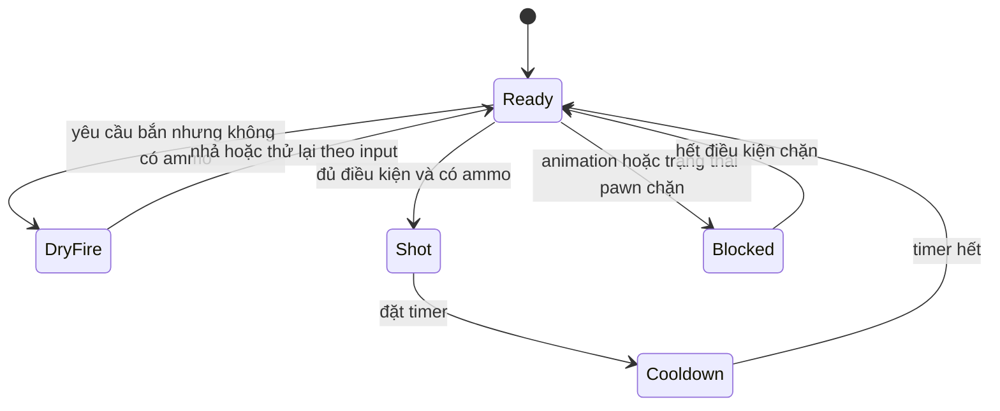

# 03 — Fire, ammo và chamber: học trạng thái trước thông số

[Trước: Input và equip](02-Input-inventory-equip.md) · [Mục lục](README.md) · [Tiếp: Ballistics](04-Ballistics-penetration.md)

Một phát bắn có ít nhất ba câu hỏi độc lập: hiện giờ có được phép bắn không, viên đạn sẽ dùng loại ammo nào, và sau khi bắn state phải đổi thành gì. Tách ba câu hỏi này giúp tránh những lỗi như bắn sai loại viên đang ở chamber, auto phát ra hai lần, hoặc reload tạo thêm đạn.

## Nhịp bắn nằm ở cả pawn và weapon

**Đã thấy trong source:** pawn gọi `OnFireAtBulletSpawn`, sau đó tự quản lý lặp. Auto dùng `bIsFullAutoFiring` và `TimeUntilNextFullAutoFiring`; tick giảm thời gian và gọi lại `PrimaryUse`. Burst dùng `BurstLoop_Handle` với timer manager và đếm `burstFireCount`. Single đi qua nhánh kết thúc primary use. [F01]

Ở weapon, `OnFire` trả về nếu animation đang chặn hoặc `RefireDelayTimer > 0`. Local simulation và server fire đều đặt timer bằng `FireRate + RefireDelay`; tick weapon giảm nó về zero. [F02]

**Đơn vị quan trọng:** `FireRate` được truyền làm thời gian chờ trong các timer này, nên trên đường này nó là khoảng thời gian giữa các lần thử bắn, không phải trực tiếp số viên/phút. Công thức `RPM lý thuyết = 60 / khoảng thời gian` chỉ là phép đổi đơn vị. Nhịp thực tế còn chịu `RefireDelay`, frame scheduling, blocker và đường mode đang dùng; phải đo khoảng cách timestamp giữa các phát bắn được chấp nhận. [F01–F02]

Đây là mô hình giảng dạy được rút từ các guard/timer, **không phải enum state machine duy nhất có sẵn trong source**. Trong code thực tế các điều kiện phân bố giữa pawn và weapon. Khi debug, ghi cả hai tầng; đừng chỉ nhìn `bReloading`.

## Một yêu cầu bắn đi qua hai đường

`OnFire` tạo seed, tránh trùng seed trong bảng projectile đang hoạt động của client, rồi gọi `LocallySimulateFire` và `Server_OnFire`. Local path phản hồi ngay khi còn ammo: heat, cooldown, local projectile/hitscan, shell, particle, callback player, delegate, first-shot và proc recoil. Nếu hết ammo, nó phát dry-fire sound và callback tương ứng. [F03]

Server path kiểm tra ammo, tạo các projectile theo `SpawnProjectileCount`, gửi kết quả validation cho client, rồi mới `RemoveAmmo(1)` ở authority. Comment và thứ tự thực thi đều làm rõ: trừ ammo có thể đổi `CurrentAmmoType`, nên đổi quá sớm sẽ khiến phát hiện tại dùng ammo của viên tiếp theo. [F04]

| Thời điểm | State/hiệu ứng cần quan sát | Vì sao |
|---|---|---|
| Trước fire | Ammo hiện tại, current ammo type, queued ammo type | Chốt loại viên đang bắn |
| Local callback | Timestamp, camera/animation onset | Đo độ phản hồi |
| Server spawn/trace | Seed, pellet count, mode | Biết server xử lý phát nào |
| Sau `RemoveAmmo` | Count mới, ammo type mới | Kiểm chứng chuyển chamber |
| Nhả cò | Auto flag/timer và âm thanh kết thúc | Không để phát bắn/loop âm dư |

Bảng là **instrumentation đề xuất**. Việc local và server đều có callback nghĩa là người viết logger phải ghi vai trò hoặc `bServer`, tránh đếm một phát thành hai. [F03–F04]

## Magazine là một danh sách đối tượng dữ liệu

`FMagazine` chứa `uint16 Ammo` và `uint16 AmmoType`. `ABaseMagazineWeapon` giữ `Magazines`, `MagIndex`, `NextMagIndex`, `DesiredAmmoType`, `QueuedAmmoType`. `GetAmmo()` đọc băng hiện tại; `HasAnyAmmo()` duyệt các băng. `FindNextMagIndex` ưu tiên băng khác có nhiều đạn nhất khớp desired type, rồi fallback sang băng khác nhiều đạn nhất. [F05]

Đó là lý do một mô hình chỉ có `CurrentAmmo + ReserveAmmo` không mô tả đầy đủ cơ chế đổi các băng chưa hết. Người học nên dựng ví dụ ba băng có lượng khác nhau, reload nhiều lần và theo dõi identity của từng băng, không chỉ tổng đạn.

### Chamber được mô hình hóa bằng phép chuyển count và ammo type

Trong `Server_NextMagazine_Implementation`, code kiểm tra băng hiện tại còn ammo để suy ra có viên trong chamber. Nó lấy loại ammo của băng kế tiếp vào `QueuedAmmoType`. Nếu chamber rỗng, đổi loại ammo ngay. Nếu tùy chọn `bBulletInChamberOnReload` bật và cả hai index hợp lệ, nó giảm một viên ở băng cũ và tăng một viên ở băng mới. Sau đó xử lý bỏ/giữ băng cũ và đổi `MagIndex`. [F06]

**Đã thấy:** đường này không sử dụng một actor chamber riêng hay một biến boolean chamber bền vững; boolean được tính cục bộ khi reload. **Suy luận:** count của băng đang dùng có thể bao gồm viên chamber trong mô hình gameplay này. Vì vậy không vội gọi lượng `AmmoMax + 1` là lỗi mà chưa xét nhánh reload.

Ví dụ thực hành giả định, không phải thông số súng gốc: băng A đang có 6, băng B có 10, chuyển băng với chamber retention bật. Phép chuyển của nhánh này làm A còn 5 và B thành 11 trước xử lý drop/retain. Phát tiếp theo dùng loại chamber cũ; `RemoveAmmo` đặt ammo type sang queued type cho các phát sau. [F06–F07]

## Fire mode và những tên trường có thể gây hiểu nhầm

`NextFireMode` duyệt `AvailableFireModes`; danh sách rỗng fallback single, rồi phát animation và lưu mode khi có thay đổi. Tuy nhiên `SafeModeToggle` trả về ngay với ghi chú deprecated. Vì thế enum hoặc property “safe” tồn tại không đủ để viết rằng thao tác safety đang được hỗ trợ ở snapshot này. [F08]

Tương tự, `TriggerFirstShot` có biểu thức đặt `bFirstShot` theo việc `FirstShotResetTime > 0`, sau đó lập timer reset. Đọc tên “first shot” rồi tự diễn giải “false sau phát đầu” sẽ không trung thành với thân hàm hiện có. Cần log cờ trên instance thật khi đo first-shot multiplier. Đây là điểm cần kiểm chứng, không phải kết luận bug đã được tái hiện. [F09]

## Tự tái tạo theo hai mức

**Bài thực hành mức 1:** một súng single, một loại ammo, cooldown, dry fire, một băng; viết invariant “một phát hợp lệ tiêu thụ đúng một viên”.

**Mức 2:** danh sách magazine, giữ chamber khi đổi băng, nhiều ammo type, auto/burst. Chạy trường hợp đổi loại khi còn viên chamber và khi rỗng, bỏ băng/giữ băng, nhả cò ngay giữa burst, bấm fire sát thời điểm cooldown hết. Ghi sự kiện để giải thích mọi thay đổi state; không giải thích chỉ bằng video.

## Bằng chứng

| ID | Đường dẫn và symbol | Dòng |
|---|---|---|
| F01 | `Ready Or Not/Source/ReadyOrNot/Characters/PlayerCharacter.cpp` — `PrimaryUse`, `PlayerControlledOnlyTick` | 5441–5487, 990–1018 |
| F02 | `Ready Or Not/Source/ReadyOrNot/Actors/BaseMagazineWeapon.cpp` — `OnFire`, `Tick`, `LocallySimulateFire`, `Server_OnFire_Implementation` | 639–644, 399–403, 712, 892 |
| F03 | `Ready Or Not/Source/ReadyOrNot/Actors/BaseMagazineWeapon.cpp` — `OnFire`, `LocallySimulateFire` | 667–781 |
| F04 | `Ready Or Not/Source/ReadyOrNot/Actors/BaseMagazineWeapon.cpp` — `Server_OnFire_Implementation` | 884–961 |
| F05 | `Ready Or Not/Source/ReadyOrNot/Actors/BaseMagazineWeapon.h` — `FMagazine`, magazine fields, `GetAmmo`; `Ready Or Not/Source/ReadyOrNot/Actors/BaseMagazineWeapon.cpp` — `FindNextMagIndex` | 28–50, 334–358, 432; 1418–1454 |
| F06 | `Ready Or Not/Source/ReadyOrNot/Actors/BaseMagazineWeapon.cpp` — `Server_NextMagazine_Implementation` | 1318–1391 |
| F07 | `Ready Or Not/Source/ReadyOrNot/Actors/BaseMagazineWeapon.cpp` — `RemoveAmmo` | 1222–1243 |
| F08 | `Ready Or Not/Source/ReadyOrNot/Actors/BaseWeapon.cpp` — `NextFireMode`, `SafeModeToggle` | 395–445 |
| F09 | `Ready Or Not/Source/ReadyOrNot/Actors/BaseWeapon.cpp` — `TriggerFirstShot`, `ResetFirstShot` | 1047–1052, 1021–1024 |
