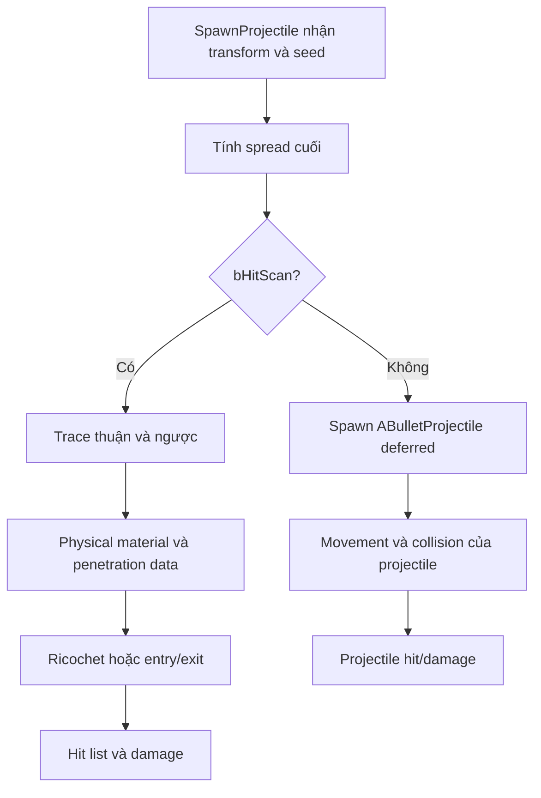

# 04 — Ballistics: hướng bắn, spread, trace và xuyên vật liệu

[Trước: Fire và ammo](03-Fire-ammo-chamber.md) · [Mục lục](README.md) · [Tiếp: Damage](05-Damage-armour-reaction.md)

Trong dự án game, “ballistics” có thể chỉ một tập quy tắc tạo đường đạn, collision, xuyên và phản xạ. Không mặc định đó là mô phỏng vật lý đầy đủ. Snapshot này có **hai nhánh thực thi rõ ràng**, được chọn trong cùng hàm `SpawnProjectile`.

## Đầu vào của đường đạn

Trên đường fire của player đã mô tả, gốc ban đầu là `BulletSpawn`. Với scope, `OnFire` có nhánh chỉnh hướng về một điểm theo `CenterPoint`; aim assist cũng có thể cung cấp hướng. `SpawnProjectile` tính spread, nhưng còn một ngoại lệ cho AI: nếu owner là `ACyberneticCharacter` và `bAIFireAtBulletSpawn` tắt, nó thay cả location và rotation bằng dữ liệu `CachedHitScanResult` trước khi cộng spread cuối. Vì vậy không khái quát muzzle origin của player thành quy tắc cho mọi phát bắn AI. [B01–B02]

| Thành phần hướng | Source làm gì | Dữ liệu cần giữ khi so sánh |
|---|---|---|
| Muzzle transform | Lấy từ bullet spawn | Weapon mesh, socket, posture, animation |
| Scope/aim assist | Có nhánh override hướng | Scope và trạng thái ADS/aim assist |
| Pending/base spread | Random theo yaw/pitch | Pending spread, spread pattern, seed |
| Ammo spread | Cộng yaw/pitch từ row, trừ khi ignore | Current ammo row |
| Attachment spread | Nhân các multiplier | Danh sách component attachment |
| Movement spread | Cộng random theo tốc độ ngang | Velocity và velocity multiplier |
| ADS | Nhân ADS spread khi player aiming | `bAiming`, ADS multiplier |
| Gốc/hướng riêng của AI | Có thể thay transform bằng cached hitscan khi không dùng bullet spawn | Loại owner, `bAIFireAtBulletSpawn`, cached trace start/end |
| First shot | Nhân thêm ở góc spawn cuối | First-shot flag và multiplier |

Đây là thứ tự đọc trong thân `SpawnProjectile`, không phải các nguồn nhiễu có thể đổi thứ tự tùy ý. Nhân sau khi cộng có thể làm kết quả khác với nhân một thành phần riêng. Random stream được khởi tạo từ seed ở entry hàm. [B02]

**Bài thực hành:** vẽ hai vector: hướng muzzle trước spread và hướng ray cuối. Khi đổi từ hip sang ADS, đo chênh lệch điểm trúng và độ phân tán riêng. Một “crosshair spread” UI chỉ hữu ích nếu có quan hệ đã xác thực với ray thật.

## Hitscan hay projectile?

Nếu `bHitScan` bật ở nhánh bình thường, hàm dựng `FHitscanShot` gồm location, direction, seed rồi gọi hitscan local hoặc multicast. Nếu không, nó spawn deferred `ABulletProjectile`, gán weapon/player owner, damage, initial speed, damage type, impact/exit/ricochet effects, penetration và các tham số khác. [B03]

Không suy ra nhánh đang hoạt động từ tên súng hoặc từ việc nhìn thấy tracer. Cần đọc `bHitScan` của instance/CDO và log nhánh. Tốc độ `ProjectileMovementSpeed` không điều khiển thời gian bay của một ray hitscan chỉ vì property vẫn tồn tại. [B03]

## Trace thuận và ngược dùng để làm gì?

Hitscan tạo trace đến điểm cách gốc `100000` Unreal units theo direction. Code yêu cầu complex trace, physical material, bỏ qua weapon/owner/các item inventory, rồi thực hiện multi trace theo kênh `ECC_PROJECTILE` cả thuận lẫn ngược với response overlap. [B04]

Nhánh xuyên ghép entry/exit từ các kết quả, tính chiều sâu hình học và nhân penetration density của mặt vào/mặt ra. Khoảng xuyên tối đa của ammo được chuyển từ millimetre sang centimetre bằng hệ số `0.1`. Khi vượt budget hoặc không có đường xuyên hợp lệ, các hit phía sau bị loại hoặc budget được đặt rất lớn để kết thúc khả năng xuyên. [B04–B05]

Theo cách tính đọc được ở nhánh xuyên hợp lệ:

`chi phí xuyên = độ dày × (density_mặt_vào + density_mặt_ra) / 2`

Đây là viết lại bằng lời và toán của phép cộng hai nửa depth trong source, không phải công thức vật lý vật liệu ngoài đời. Một vật thể dày gấp đôi với cùng density tiêu thụ gấp đôi budget trong nhánh này. Kết quả thực tế vẫn phụ thuộc collision mesh và cặp entry/exit có hợp lệ hay không. [B05]

| Điều cần kiểm tra ở bia test | Lỗi học thường gặp |
|---|---|
| Collision trả về hit trên `ECC_PROJECTILE` | Bia nhìn thấy được nhưng không nằm trong kênh đạn |
| Physical material và surface type | Chỉ đổi material hình ảnh rồi nghĩ đã đổi khả năng xuyên |
| Có entry và exit đúng chiều | Dùng một plane hoặc collision một mặt để kết luận về độ dày |
| Độ dày ghi theo Unreal units | Trộn mm, cm và m |
| Target phía sau và hit history | Nhìn decal rồi kết luận damage đã tới mục tiêu |

Đây là checklist thực hành, dựa trên dữ liệu mà hàm thật sự đọc. Một bia cube mặc định hữu ích để xác nhận trace, nhưng chưa phải bộ thử penetration chuẩn cho game.

## Giáp và ricochet là những nhánh riêng

Khi hit character, code lấy armour theo bone rồi gọi `CheckPenetration`; với vật thể khác, nó dùng `bIsPenetrable` và so sánh ammo penetration level với armour level của vật liệu. Ricochet xem material có cho ricochet hay không, dùng random stream, ammo chance và giới hạn số bounce là ba trong hàm này. [B06]

Đọc source còn thấy các TODO ngay trong nhánh ricochet về damage modifier sau ricochet và damage của impact. **Kết luận đúng:** có thuật toán ricochet trong code; không đủ căn cứ để mô tả nó như mô hình năng lượng hoàn chỉnh. [B06]

## Một viên không nên gây nhiều damage vì trúng nhiều collider cùng vùng

Sau khi ghép hit entry/exit, code có `CharacterHitScanMemoryMap`: kiểm tra actor, component và nhóm bone tương tự để tránh áp damage lặp cho cùng vùng trong danh sách xử lý. Nó vẫn phát hit event cho component và xử lý entry hit phù hợp. [B07]

**Suy luận:** khi dựng target thực hành, cần phân biệt “số hit result” với “số sự kiện damage”. Counting tất cả collision callback như số viên bắn trúng có thể sai, đặc biệt khi penetration hoặc skeletal mesh có nhiều vùng.

## Đường projectile cần bài thử riêng

`ABulletProjectile` có `ApplyDamage`, `OnHit`, các RPC respawn/attach và validation. Component movement chuyên biệt vẫn gọi superclass; override `HandleImpact` có điều chỉnh friction sau bounce khi bật cờ tương ứng. Không có căn cứ từ riêng component này để khẳng định tất cả đạn dùng mô phỏng drag/gravity giống nhau. [B08]

Bài thực hành đề xuất gồm hai target scene: ray test không đo thời gian bay; projectile test ghi vị trí theo thời gian, lần collision và server validation. Nếu một class dùng nhiều pellet, ghi pellet index cùng shot ID. Tổng số phát bắn và tổng số projectile là hai số khác nhau.

## Bằng chứng

| ID | Đường dẫn và symbol | Dòng |
|---|---|---|
| B01 | `Ready Or Not/Source/ReadyOrNot/Actors/BaseWeapon.cpp` — `OnFireAtBulletSpawn`; `Ready Or Not/Source/ReadyOrNot/Actors/BaseMagazineWeapon.cpp` — `OnFire` | 290–300; 639–663 |
| B02 | `Ready Or Not/Source/ReadyOrNot/Actors/BaseMagazineWeapon.cpp` — `SpawnProjectile`, spread | 2621–2688 |
| B03 | `Ready Or Not/Source/ReadyOrNot/Actors/BaseMagazineWeapon.cpp` — `SpawnProjectile`, chọn hitscan/actor | 2690–2740 |
| B04 | `Ready Or Not/Source/ReadyOrNot/Actors/BaseMagazineWeapon.cpp` — `Multicast_PerformHitscan_Implementation`, trace setup | 1763–1815 |
| B05 | `Ready Or Not/Source/ReadyOrNot/Actors/BaseMagazineWeapon.cpp` — cùng hàm, penetration | 1820–1840, 1934–2000 |
| B06 | `Ready Or Not/Source/ReadyOrNot/Actors/BaseMagazineWeapon.cpp` — ricochet và armour decision | 1812–1815, 1852–1931, 1940–1953 |
| B07 | `Ready Or Not/Source/ReadyOrNot/Actors/BaseMagazineWeapon.cpp` — hit memory map | 2018–2061 |
| B08 | `Ready Or Not/Source/ReadyOrNot/Actors/Projectiles/DamageProjectiles/BulletProjectile.cpp` — `ApplyDamage`, đầu `OnHit`, `OnProjectileValidated`; `Ready Or Not/Source/ReadyOrNot/Components/BulletProjectileMovementComponent.cpp` — `HandleImpact` | 81–122, 278–327, 464–467; 26–35 |
