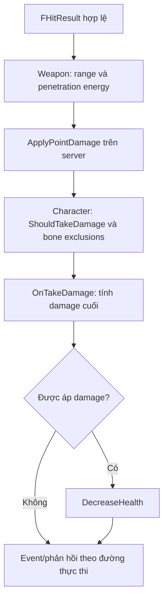

# 05 — Từ hit result đến damage, giáp và phản ứng

[Trước: Ballistics](04-Ballistics-penetration.md) · [Mục lục](README.md) · [Tiếp: Recoil và ADS](06-Recoil-ADS-camera.md)

Khi một tia cắt collider, bạn mới biết có giao cắt hình học. Để giải thích một mục tiêu mất bao nhiêu máu cần biết đường damage nào chạy, ammo nào dùng, khoảng cách, lượng xuyên đã tiêu thụ, bone, armour và quy tắc của character. Khi người học nói “damage của súng này sai”, hãy yêu cầu một bản ghi chứa đủ những đầu vào đó.

## Weapon tính damage đầu vào

`ApplyHitscanDamage` yêu cầu authority, actor hợp lệ và có thể nhận damage. Nó bắt đầu từ damage của weapon, ưu tiên curve theo khoảng cách nếu curve có key. Khi có `ShotAmmoType`, damage từ ammo thay thế giá trị đó; nhánh này còn đánh giá curve trong `CurrentAmmoType`, tính energy theo penetration đã tiêu thụ, rồi nhân vào damage. [D01]

Mô hình năng lượng tương đối đọc được ở nhánh này là:

`energy = clamp(maxPenetration - usedPenetration, 0, maxPenetration) / maxPenetration`

`maxPenetration` được chuyển mm sang cm và không nhỏ hơn 1 trong phép chia này; energy dưới `0.1` bị đặt về zero. Với weapon do suspect sở hữu hoặc không có owner character, nếu đang làm damage lên character và energy không quá `0.9`, code giới hạn damage trước nhân energy ở mức `5`. Đó là điều kiện cụ thể của implementation, không phải quy luật cho mọi súng/mọi tình huống. [D01]

**Điểm cần kiểm chứng:** hàm nhận `ShotAmmoType` nhưng một số phép đọc curve/penetration dùng `CurrentAmmoType`. Khi thử chuyển ammo type rất sát thời điểm hit request, cần log cả hai để xem chúng có trùng. Chương network mô tả vì sao delayed client hit request làm chủ đề này đáng chú ý. Đây là giả thuyết kiểm thử; chưa kết luận lỗi runtime. [D01, D02]

## Character có quyền biến đổi hoặc từ chối damage

`AReadyOrNotCharacter::TakeDamage` kiểm tra `ShouldTakeDamage`, loại bone bị loại trừ, xây bản ghi damage, gọi `OnTakeDamage` để nhận `FinalDamage` và boolean có áp dụng hay không, rồi mới giảm health. Sau đó phát event và multicast phản hồi. Chỉ đọc `ABaseWeapon::Damage` không dự đoán được kết quả cuối. [D03]

Sơ đồ rút gọn trách nhiệm, không gộp mọi override của các loại character. Source base có cơ chế dispatch để lớp con bổ sung hành vi. Khi kiểm tra player, suspect hoặc target lab, phải ghi rõ loại actor nhận damage. [D03]

## Bone groups và armour là tầng dữ liệu riêng

`ApplyDamageToBone` lấy các multiplier head/upper body/lower body/arm/hand/leg/foot từ ammo hiện tại nếu damage causer cast được thành weapon; sau đó chọn nhánh bằng các nhóm bone. Đây không phải phép nhân cố định “headshot luôn ×2” áp cho tất cả trường hợp. Initializer trong header và giá trị trên ammo asset là hai tầng khác nhau. [D04]

`GetArmourForBone` là cầu nối tới armour. Hitscan gọi `CheckPenetration` trên armour nhận được; base implementation trả true nhưng các lớp SWAT, suspect và headwear có override. Không nên đọc base class rồi kết luận mọi giáp bị xuyên. [D05]

Một chi tiết cần đọc nguyên logic: `ASWATArmour::CheckPenetration` ở snapshot này trả về conjunction của điều kiện durability không còn, so sánh armour level và cờ ignores-armour phủ định, sau các early return khi thiếu ammo/material/durability. Không tự thay nó trong tài liệu bằng mô tả quen thuộc “đạn đủ cấp là xuyên”. Phép thử trên instance giáp thật mới phân biệt được ý nghĩa runtime của kết quả và các đường damage đi kèm. [D06]

| Trường hợp test | Những thứ phải ghi |
|---|---|
| Bia geometry đơn giản | Raw point damage, khoảng cách, material |
| Character không giáp | Bone name, nhóm bone, raw/final damage |
| Character có giáp | Armour class, material, coverage, durability trước/sau |
| Bắn xuyên tường rồi trúng | Penetration đã dùng, energy, loại owner |
| Shotgun nhiều pellet | Shot ID, pellet ID, từng hit/damage event |
| Ammo chuyển giữa reload | Shot ammo type và current ammo type tại xử lý damage |

Bảng là **ma trận đo đề xuất**. Không dùng một cube nhận damage để tuyên bố đã tái tạo đủ wound, bleed, limb và AI reaction.

## Phản hồi nhìn thấy có thể được dự đoán

Ở client hitscan trúng character, code có thể yêu cầu server xác nhận hit đồng thời gọi `PredictHitEffects`. Hàm này chọn blood nếu không có armour, hoặc nhánh armour effect cho player có giáp. Multicast blood của character có điều kiện bỏ qua máy instigator local client vì phản hồi đã được dự đoán. [D07]

**Suy luận:** nhìn thấy máu hoặc impact không đủ chứng minh server đã trừ health. Khi kiểm thử network, đối chiếu effect với authoritative health/event. Ngược lại, một effect thiếu không tự động có nghĩa damage thiếu; có thể đó là đường asset hoặc suppression duplicate.

## Gun gameplay còn tác động AI

Server fire báo noise cho `UAISense_Hearing` với tag gunshot hoặc suppressed gunshot. Hitscan gọi tính suppression cho AI và báo noise tại impact. Nghĩa là sound nghe bằng tai người chơi và “âm thanh” dùng để AI nhận biết là hai đường có liên hệ nhưng khác đối tượng dữ liệu. Tắt âm lượng playback không phải phép thử hợp lệ cho AI hearing. [D08]

Để giữ lab sạch cho đo cơ khí, bài thực hành có thể dùng bia đứng yên không AI. Để học đầy đủ gameplay, tạo ca riêng có AI đã kiểm soát khoảng cách, vật cản và state; ghi perception, morale/reaction và kết quả hit. Hai bài phục vụ hai câu hỏi khác nhau.

## Bài tập tái tạo có thể tự kiểm tra

Xây target component thực hành nhận point damage, giữ event log và health. Giai đoạn đầu chỉ cần một damage rule theo range. Giai đoạn sau thêm bone grouping, armour material và durability. Mỗi bước phải có input đã khóa để tính trước expected result. Khi mô hình này ổn, mới gắn animation/hit effects. Đây là lộ trình dạy học, không đề nghị thay hệ thống damage gốc.

Bạn hiểu chương này khi giải thích được một phát trúng đi qua ít nhất ba mức: intersection, damage input, final health change; đồng thời chỉ ra được hiện tượng nào là local prediction.

## Bằng chứng

| ID | Đường dẫn và symbol | Dòng |
|---|---|---|
| D01 | `Ready Or Not/Source/ReadyOrNot/Actors/BaseMagazineWeapon.cpp` — `ApplyHitscanDamage` | 2337–2402 |
| D02 | `Ready Or Not/Source/ReadyOrNot/Actors/BaseMagazineWeapon.cpp` — `Server_HitscanHit_Implementation`, ammo resolve | 2220–2245 |
| D03 | `Ready Or Not/Source/ReadyOrNot/ReadyOrNotCharacter.cpp` — `TakeDamage` | 6195–6279 |
| D04 | `Ready Or Not/Source/ReadyOrNot/ReadyOrNotCharacter.cpp` — `ApplyDamageToBone`; `Ready Or Not/Source/ReadyOrNot/Actors/BaseWeapon.h` — `FAmmoTypeData` | 6562–6637; 25–142 |
| D05 | `Ready Or Not/Source/ReadyOrNot/Actors/BaseArmour.h` — `CheckPenetration`; `Ready Or Not/Source/ReadyOrNot/Actors/BaseMagazineWeapon.cpp` — armour hit branch | 24; 1940–1953 |
| D06 | `Ready Or Not/Source/ReadyOrNot/Actors/SWATArmour.cpp` — `CheckPenetration`, `SetArmourMaterial`; `Ready Or Not/Source/ReadyOrNot/Actors/SuspectArmour.cpp` và `Ready Or Not/Source/ReadyOrNot/Actors/Items/Headwear.cpp` — override entry | 151–203; 85 và 93 |
| D07 | `Ready Or Not/Source/ReadyOrNot/Actors/BaseMagazineWeapon.cpp` — client hit branch; `Ready Or Not/Source/ReadyOrNot/ReadyOrNotCharacter.cpp` — `PredictHitEffects`, `Multicast_SpawnBloodEffects_Implementation` | 2087–2105; 6797–6818 |
| D08 | `Ready Or Not/Source/ReadyOrNot/Actors/BaseMagazineWeapon.cpp` — `Server_OnFire_Implementation`, hitscan hearing/suppression entry | 946, 1784, 2083, 2404–2440 |
