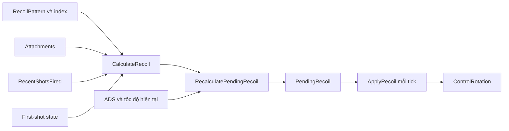

# 06 — Recoil, ADS và camera: chia cảm giác bắn thành các phần đo được

[Trước: Damage](05-Damage-armour-reaction.md) · [Mục lục](README.md) · [Tiếp: Animation, audio và VFX](07-Animation-audio-VFX.md)

“Recoil giống Ready or Not” không phải một con số. Người chơi đồng thời nhìn thấy góc camera thay đổi, súng giật trong tay, sight lệch, animation chuyển động và điểm trúng phân tán. Nếu chỉ tăng pitch camera để làm súng mạnh hơn, bạn có thể làm aim lệch nhiều mà vẫn không có độ nặng hình ảnh cần tìm.

## Bốn đường cần tách khi đọc source

| Đường | State và hàm đọc được | Điều nó tác động trực tiếp |
|---|---|---|
| Camera/control recoil | `CalculateRecoil` → `PendingRecoil` → `ApplyRecoil` | Control rotation của pawn/controller |
| Spread | `PendingSpread`, `GetSpread`, `SpawnProjectile` | Hướng ray/projectile |
| Procedural recoil | `TriggerProcRecoil`, `ComputeProcRecoil` | Các giá trị translation/rotation procedural được tính |
| Presentation khác | Fire montage, camera shake, weapon/free-aim offsets | Trình diễn và dữ liệu cấp cho animation |

Đây là phân chia để học, được rút từ các hàm riêng biệt. Việc proc recoil có mặt trong C++ xác nhận khả năng tạo dữ liệu; **chưa xác nhận mọi Blueprint/AnimGraph của mọi khẩu súng tiêu thụ dữ liệu đó giống nhau**. Muốn nói về một súng cụ thể cần mở graph và instance. [R01–R06]

## Camera recoil bắt đầu từ pattern và multiplier

`GetRecoil` đọc mảng `RecoilPattern` theo index và quay về đầu khi index không hợp lệ. Với `ItemClass` assault rifle, giá trị trả về ở hàm này giữ pitch/roll nhưng đặt yaw bằng zero. Điều đó chỉ mô tả thành phần pattern trả về, không có nghĩa ảnh trên màn hình hoặc tất cả nguồn spread không lệch ngang. [R01]

`CalculateRecoil` duyệt attachment, nhân multiplier ngang/dọc/spread; cộng vào pending spread; tính multiplier theo số phát gần đây; lấy recoil pattern và first-shot multiplier, rồi nhân thành phần pitch/yaw. Player tiếp tục nhân ADS recoil multiplier và một hệ số từ run-speed percent được clamp. [R02]

**Một bẫy thực tế:** `RecalculatePendingRecoil` gán `RecoilSpeed = Weapon->RecoilInterpSpeed`, nhưng nhánh áp recoil không-return đang gọi `REase` với hằng `7.0 × DeltaSeconds`; biểu thức dùng `RecoilSpeed` nằm trong comment ở dòng kế bên. Vì vậy không viết rằng chỉnh `RecoilInterpSpeed` chắc chắn tăng tốc camera kick ở nhánh này chỉ dựa vào tên property. [R03]

## Recovery không chỉ là quay về góc ban đầu

`IncrementShotsFired` tăng bộ đếm và lên lịch `ResetShotsFired`; thời gian reset tùy mode. Khi reset, code chuyển `PendingRecoil` thành giá trị ngược của `AccumulatedPendingRecoil` nhân `RecoilReturnPercentage`, xóa accumulated và đặt `bReturnRecoil`. Trong `ApplyRecoil`, nhánh return dùng `RecoilReturnInterpSpeed`; đồng thời accumulated được điều chỉnh bằng mouse delta. [R03–R04]

**Suy luận:** một bài đo để người chơi tự kéo chuột xuống không thể so trực tiếp với bài không động chuột. Recovery tương tác với input người chơi; muốn đo response gốc phải khóa input hoặc ghi input cùng frame. Cũng không nên giả định mọi phát bắn tự trở lại chính xác vị trí aim trước loạt.

| Đại lượng đo | Cách ghi đề xuất |
|---|---|
| Kick onset | Thời gian từ input/shot accepted tới control rotation đổi |
| Peak pitch/yaw | Cực trị sau một phát, đã trừ mouse input |
| Recovery curve | Góc theo thời gian từ lúc ngừng bắn |
| Sustained climb | Góc sau từng phát trong cùng một loạt |
| Dispersion | Điểm trúng sau khi loại ảnh hưởng camera/mouse |
| Viewmodel motion | Transform súng tương đối camera hoặc marker trên video |

Bảng là **hợp đồng đo đề xuất**. Camera shake nên được đo riêng với control recoil; không cộng pixel shake vào góc ray rồi gọi chung “recoil”.

## Procedural recoil có kích và tắt dần

`TriggerProcRecoil` đặt thời gian fire, tạo hướng translation và rotation ngẫu nhiên theo randomness. `ComputeProcRecoil` nội suy các giá trị về zero, chọn modifier ADS, giảm fire time và tích lũy translation/rotation theo delta time; có nhánh buildup riêng. `ABaseWeapon::Tick` cũng nội suy `PendingSpread` về zero bằng `SpreadReturnRate`. [R05]

Đây là những tham số hình thành đường đáp ứng theo thời gian. Chỉ chụp một frame ở peak sẽ không cho biết tốc độ vào, damping và thời gian settle. Khi học lại bằng một spring tự viết, hãy ghi rõ spring đó là **thiết kế thực hành**, vì đoạn source đang đọc dùng các hàm nội suy và tích lũy cụ thể, không đủ bằng chứng để khẳng định toàn bộ hệ gốc là một spring vật lý duy nhất.

## ADS gồm pose, FOV và đường đạn

`ApplyFoV` bắt đầu từ `DefaultFoV`; khi đang aiming và không animation-blocking, nó đọc setting zoom ADS. Có scope thì dùng `PlayerCameraFOVMultiplier` của scope; không scope thì nhánh này nhân `0.75`. Sau đó `FInterpTo` dùng ADS zoom-in speed. Hàm còn có nhánh FOV riêng dựa trên `IsSprinting`, nhưng snapshot định nghĩa `RON_NO_SPRINT` nên `IsSprinting()` trả false: không được mô tả nhánh này là hiệu ứng sprint đang hoạt động. Xem [movement và các cờ biên dịch](../02-Gameplay-Va-AI/05-Player-Movement-Health-Inventory.md). [R06, R09]

Đó là một phần của ADS. Muzzle/scope alignment thuộc chương ballistics; recoil/spread có ADS multiplier riêng; animation FP đọc movement weight và lazy-spring strength từ item tùy `bAiming`. Source cũng có đường cập nhật tham số material `WeaponFov`, tức FOV của weapon presentation không thể đơn giản suy từ camera FOV. [R02, R06–R07]

**Suy luận:** hai ảnh cùng số camera FOV vẫn có thể cho tỷ lệ súng khác nhau nếu cấu hình weapon FOV, animation pose hoặc scope khác. Muốn tái tạo sight picture phải ghi resolution/aspect, camera FOV, weapon FOV, scope, pose và khoảng cách target.

## Low-ready và free aim liên quan cảm giác điều khiển

Player có trace low-ready tới vật cản và logic đặt trạng thái; `PrimaryUse` đọc low-ready để chặn hoặc kết thúc bắn. Animation FP lấy các offset/rotation của weapon, free aim và lean từ player. Đây là lý do nên đo bắn gần tường, bắn khi lean và bắn sau đổi stance bằng pawn gốc. [R07–R08]

## Thứ tự chỉnh cho bản thực hành

1. Khóa camera FOV và xác nhận muzzle/sight alignment.
2. Khóa nhịp bắn, loại ammo và attachment.
3. Đo/control camera recoil của một phát không mouse input.
4. Thêm recovery rồi đo loạt nhiều phát.
5. Thêm viewmodel recoil/animation, giữ điểm trúng để biết presentation có làm ray đổi không.
6. Thêm ADS, movement, lean và wall proximity từng biến một.
7. Cuối cùng mới chấm điểm cảm nhận tổng thể bằng video và người chơi.

Đây là lộ trình hiệu chuẩn đề xuất. Bạn hoàn thành chương khi có thể nói “sai ở góc control, spread hay viewmodel” thay vì chỉ nói “cảm giác chưa giống”.

## Bằng chứng

| ID | Đường dẫn và symbol | Dòng |
|---|---|---|
| R01 | `Ready Or Not/Source/ReadyOrNot/Actors/BaseWeapon.cpp` — `GetRecoil` | 573–598 |
| R02 | `Ready Or Not/Source/ReadyOrNot/Actors/BaseMagazineWeapon.cpp` — `CalculateRecoil`; `Ready Or Not/Source/ReadyOrNot/Characters/PlayerCharacter.cpp` — `RecalculatePendingRecoil` | 834–868; 3443–3459 |
| R03 | `Ready Or Not/Source/ReadyOrNot/Characters/PlayerCharacter.cpp` — `ApplyRecoil` | 3666–3702 |
| R04 | `Ready Or Not/Source/ReadyOrNot/Actors/BaseWeapon.cpp` — `IncrementShotsFired`, `ResetShotsFired` | 1065–1087 |
| R05 | `Ready Or Not/Source/ReadyOrNot/Actors/BaseWeapon.cpp` — `Tick`, `ComputeProcRecoil`, `TriggerProcRecoil` | 139–160, 1212–1279 |
| R06 | `Ready Or Not/Source/ReadyOrNot/Characters/PlayerCharacter.cpp` — `OnEquippedWeaponFire`, `ApplyFoV` | 3355–3397, 3721–3763 |
| R07 | `Ready Or Not/Source/ReadyOrNot/Characters/PlayerCharacter.cpp` — weapon FOV material updates; `Ready Or Not/Source/ReadyOrNot/Animation/RoNAnimInstance_PlayerFP.cpp` — FP property update | 1245–1344; 45–85 |
| R08 | `Ready Or Not/Source/ReadyOrNot/Characters/PlayerCharacter.cpp` — `DoLowReadyTrace`, `PrimaryUse` | 4261–4375, 5424–5438 |
| R09 | `Ready Or Not/Source/ReadyOrNot/ReadyOrNot.h` — `RON_NO_SPRINT`; `Ready Or Not/Source/ReadyOrNot/Characters/PlayerCharacter.cpp` — `Sprint`, `IsSprinting` | 291; 7272–7276, 7417–7421 |
