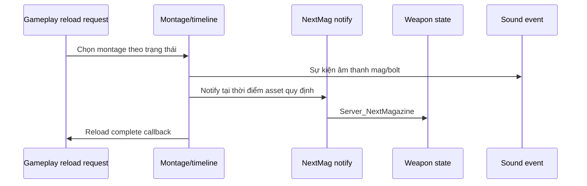

# 07 — Animation, audio và VFX: cùng một phát bắn, nhiều đồng hồ

[Trước: Recoil và ADS](06-Recoil-ADS-camera.md) · [Mục lục](README.md) · [Tiếp: Reload](08-Reload-interruption.md)

Độ “chắc” của một phát bắn thường xuất hiện khi nhiều phản hồi khớp thời điểm: click, muzzle, kick, tiếng nổ, shell và hit. Chép đúng giá trị damage nhưng bỏ mất timing hoặc một lớp âm thanh sẽ không giữ được trải nghiệm. Trong source hiện tại, các lớp này có owner và đường gọi riêng.

## Một sự kiện fire cấp dữ liệu cho nhiều phía

Local fire spawn shell, phát particle, gọi `OnEquippedWeaponFire(this, false)` và broadcast weapon event. Trong server fire, `Multicast_OnFire` được gọi trước callback character `OnEquippedWeaponFire(this, true)`. `OnEquippedWeaponFire` của player gọi animation; ở nhánh local còn chạy postprocess, camera shake và tính recoil pending. [A01]

| Hệ thống | Entry đã thấy | Tại sao lab cần giữ nó |
|---|---|---|
| Weapon animation | `PlayFireAnimation` và animation data | Slide/bolt/motion của súng |
| Player animation | `PlayWeaponFireAnimation` | Tay/body FP/TP đồng bộ weapon |
| Camera | `OnEquippedWeaponFire` | Kick/shake và postprocess đúng luồng |
| Muzzle/smoke | `Multicast_SpawnParticleEffects_Implementation` | Muzzle feedback và suppression flags |
| Audio | `SoundData` và FMOD/SoundManager | 1P/3P, môi trường, suppressor |
| Shell | `SpawnShell` local và multicast path | Ejection và presentation |

Các entry nằm trong nguồn dẫn ở A01–A04. Bảng không khẳng định mọi weapon asset đều gán đủ asset tương ứng; việc đó thuộc audit CDO/PIE.

## Animation data không chỉ có một montage fire

Player có nhánh chọn animation khi grip yêu cầu override. Nó phân biệt aiming, ammo còn tối đa một viên để chọn last-shot variant, và grip AFG/VFG. Nếu không vào override, nó gọi superclass. Vì vậy chỉ thay mesh hoặc chỉ gán một montage fire có thể mất các nhánh này. [A02]

`ABaseItem` còn có `AnimationData`, `DefaultAnimationData`, `GripAnimationData`, `ShieldRaisedAnimationData`, `ShieldLoweredAnimationData`. Đây là schema của các bộ presentation thay theo cấu hình; cần mở các asset thực tế để xác nhận montage nào đang gán. [A03]

**Bài thực hành:** với một khẩu súng, lập ma trận idle/ADS × standing/crouch × normal/last shot × attachment. Ghi montage active và frame onset. Đánh dấu ô “không áp dụng” bằng điều kiện class/config, không lấp ô bằng đoán.

## Notify là cầu nối giữa timeline và gameplay

`UAnimNotify_NextMag::Notify` lấy owning character và equipped magazine weapon rồi gọi `Server_NextMagazine`. Đây là sự kiện timeline có thể làm thay đổi dữ liệu ammo. `URoNAnimInstance_PlayerFP::OnReloadComplete` gọi server completion và có nhánh client prediction. [A05]

Điều cần phân biệt: enum `EReloadAnimEvent` và `OnReloadAnimEvent` đọc ở magazine weapon xử lý các tiếng mag-in/mag-out/bolt với fallback sound; nó không phải chính hàm đổi magazine state. Hai loại sự kiện cùng mang tên reload có nhiệm vụ khác nhau. [A04–A05]

Sơ đồ diễn đạt các cơ chế C++ đã thấy, **không xác nhận thời điểm cụ thể của notify trên mọi montage**. Muốn biết viên đạn sẵn sàng ở frame nào, phải kiểm tra asset timeline và ghi runtime event.

## Audio 1P/3P và âm thanh không gian

`Multicast_SpawnParticleEffects_Implementation` có nhánh SoundManager tạo sound first person cho owner local và third person cho người khác. Cả hai đặt parameter `FireMode`, `IsSupressed`, `IsOutside`; third-person path còn truyền các lựa chọn angular occlusion/portal propagation khi tạo sound source. Nếu không có SoundManager, hàm đi qua nhánh FMOD component dự phòng. [A06]

`OnItemPrimaryUseEnd` đặt parameter `FireMode` về zero cho firing audio component đang giữ, rồi bỏ tham chiếu; cũng có đường fire-loop ending animation. Một loạt auto phải được đo cả attack, phần duy trì và tail khi nhả cò. [A07]

**Suy luận:** thay playback bằng một sound cue đơn phát ở mọi nơi có thể làm nhịp và tiếng đuôi khác ngay cả khi mẫu âm tương tự. Muốn giữ bản gốc trong Gun Lab, ưu tiên native SoundData, FMOD banks và môi trường được dựng đúng, rồi xác nhận logs không báo missing event/bank. Tài liệu này chưa chứng nhận nội dung audio của từng weapon đã load thành công.

## Muzzle flash không phải mọi phát đều giống nhau

Trong source, flash có một nhánh xác suất; attachment có thể đánh dấu suppress, hide flash hoặc override particle templates. Smoke được kích hoạt theo đường riêng. Local simulation còn tăng heat và quản lý heat effect. [A08]

Không dùng tiêu chí “mọi frame bắn phải thấy flash” để kết luận effect bị hỏng. Bài test nên ghi shot timestamp, trạng thái attachment, particle activation và nhiều phát liên tục. Với video, tốc độ ghi hình và exposure có thể làm một flash ngắn không xuất hiện trong frame được chọn.

## Checklist nội dung cho một weapon tái tạo

| Nhóm | Cần có trong bản thực hành | Cách xác minh |
|---|---|---|
| Skeleton/socket | Muzzle, shell, grip, magazine đúng transform | Hiển thị socket và trace origin |
| FP/TP | Weapon và body animation tương thích | Chơi local rồi quan sát từ client khác |
| Montage | Draw, holster, fire, last shot, reload, ADS variants cần thiết | Kiểm tra active montage theo ca |
| Notify | Commit ammo, completion, sự kiện presentation | Timeline + event log |
| Audio | Fire/dry/reload/tail và môi trường | Capture âm cùng timestamp, missing asset log |
| VFX | Muzzle/smoke/impact/shell | Camera cố định và shot log |

Đây là yêu cầu học tập đề xuất, không phải bảng xác nhận asset đã hoàn thiện. Một weapon được “spawn thành công” mới đi qua phần rất nhỏ của checklist.

## Bằng chứng

| ID | Đường dẫn và symbol | Dòng |
|---|---|---|
| A01 | `Ready Or Not/Source/ReadyOrNot/Actors/BaseMagazineWeapon.cpp` — `LocallySimulateFire`, `Server_OnFire_Implementation`, `Multicast_OnFire_Implementation`; `Ready Or Not/Source/ReadyOrNot/Characters/PlayerCharacter.cpp` — `OnEquippedWeaponFire` | 691–764, 884–970; 3355–3397 |
| A02 | `Ready Or Not/Source/ReadyOrNot/Characters/PlayerCharacter.cpp` — `PlayWeaponFireAnimation`; `Ready Or Not/Source/ReadyOrNot/Actors/BaseMagazineWeapon.cpp` — `PlayFireAnimation` | 3406–3436; 784–825 |
| A03 | `Ready Or Not/Source/ReadyOrNot/Actors/BaseItem.h` — animation data fields | 1642–1659 |
| A04 | `Ready Or Not/Source/ReadyOrNot/Actors/BaseMagazineWeapon.cpp` — `OnReloadAnimEvent` | 3462–3577 |
| A05 | `Ready Or Not/Source/ReadyOrNot/Animation/Notifies/AnimNotify_NextMag.cpp` — `Notify`; `Ready Or Not/Source/ReadyOrNot/Animation/RoNAnimInstance_PlayerFP.cpp` — `OnReloadComplete` | 6–17; 210–230 |
| A06 | `Ready Or Not/Source/ReadyOrNot/Actors/BaseMagazineWeapon.cpp` — `Multicast_SpawnParticleEffects_Implementation`, sound routing | 3013–3138 |
| A07 | `Ready Or Not/Source/ReadyOrNot/Actors/BaseMagazineWeapon.cpp` — `OnItemPrimaryUseEnd` | 973–1005 |
| A08 | `Ready Or Not/Source/ReadyOrNot/Actors/BaseMagazineWeapon.cpp` — muzzle flags, local heat | 2974–3011, 704–712 |
