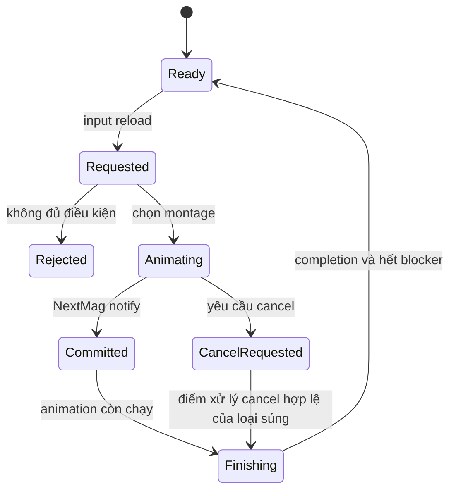

# 08 — Reload là một giao dịch có timeline

[Trước: Animation và audio](07-Animation-audio-VFX.md) · [Mục lục](README.md) · [Tiếp: Network](09-Network-authority.md)

Reload vừa là hành động nhìn thấy, vừa là thay đổi inventory/ammo. Muốn học sâu, luôn hỏi ba thời điểm: bắt đầu animation, commit dữ liệu magazine/shell và có thể bắn trở lại. Ba thời điểm đó không nhất thiết trùng nhau.

## Tầng input chọn hành động

Player có `Reload`, `TacticalReload`, `ReloadOrMagCheck`, `MagCheck` và switch ammo type. `ReloadOrMagCheck` đặt timer gọi tactical reload sau `0.25` giây và cờ giữ phím; release chỉ cập nhật cờ trong hàm tương ứng. Vì còn logic tick/input khác, không suy toàn bộ tap/hold UX chỉ từ một timer. [L01]

Cả `Reload` và `TacticalReload` kiểm tra carry/arrest, xử lý cancel nếu item đang reload, kiểm tra animation blocking và gọi weapon tương ứng. Switch ammo type chỉ kích tactical reload nếu `IncrementAmmoType` báo có thay đổi, đồng thời bật cờ hiển thị mag-check sau reload. [L01–L02]

## Magazine reload có nhánh thường, tactical, empty và ADS

`OnWeaponReload` đặt tactical false, kiểm tra khả năng reload, tìm băng tiếp theo rồi chọn nhánh empty/nonempty. Nhánh này dùng quick-reload sound sequence. `OnWeaponTacticalReload` đặt tactical true và dùng tactical montage/sound; có các variant khi aiming. Một số nhánh quick/empty thoát ADS bằng update state và gọi `OnEndAimDownSights`. [L03]

| Câu hỏi | Điều cần xem |
|---|---|
| Có băng khác để đổi không? | `CanReload`, `FindNextMagIndex` |
| Băng kế tiếp có đúng ammo type mong muốn? | `DesiredAmmoType`, `NextMagIndex` |
| Giữ hay bỏ băng cũ? | Tactical flag, lose-mag flags ở commit |
| Có viên chamber giữ lại? | `bBulletInChamberOnReload`, count trước đổi |
| Chơi montage nào? | Empty/nonempty, tactical/quick, ADS, FP/TP |
| Khi nào count đổi? | `AnimNotify_NextMag` và `Server_NextMagazine` |
| Khi nào trạng thái reload hết? | Completion callback, animation blockers |

Mỗi hàng có owner khác nhau trong code; tập trung tất cả vào một duration duy nhất sẽ che mất những điều cần học. [L03–L05]

## Commit và presentation phải phân biệt

`CanReload` của magazine weapon thông thường yêu cầu nhiều hơn một magazine rồi gọi superclass. `Server_NextMagazine` xử lý chamber transfer, queued ammo type, bỏ/giữ magazine và đổi index. Notify `NextMag` gọi vào hàm đó từ owning character. Completion player gọi `OnWeaponReloadComplete` của weapon. [L04–L05]

Một state diagram thực hành hữu ích:

Đây là **state machine đề xuất để suy nghĩ và instrument**, không phải cam kết mọi đường cancel ở native đều rollback trước commit. Code magazine base `CancelCurrentReloadAction` chủ yếu đặt cờ local và gửi cờ lên server; phải đọc nơi cờ được tiêu thụ và asset timeline trước khi khẳng định đã ngắt animation. [L06]

## Shotgun có mô hình nạp riêng

`AShotgun` giữ danh sách `Shells`; `GetAmmo` trả số shell, còn `Magazines` được dùng như kho shell dự trữ. `RemoveAmmo(1)` pop shell và cập nhật ammo type theo shell tiếp theo. Giá trị remove khác một bị bỏ qua ở nhánh này. `CanReload` kiểm tra số shell trong súng so với max và còn ammo dự trữ. [L07]

`OnWeaponReload` chuyển sang `OnWeaponTacticalReload`. `PlayReloadLoop` kiểm tra sắp đầy, cancel, dự trữ gần hết hoặc chế độ tap; khi cần dừng nó chơi `Reload_End`, nếu tiếp tục thì gọi `Server_NextMagazine` rồi chơi loop. Comment trong source lưu ý montage end có nạp một shell; phải xác nhận notify timeline của asset cụ thể trước khi đếm timing. [L08]

**Hệ quả học tập:** cancel shotgun không đồng nghĩa “ngừng mọi thứ ngay frame bấm”. Có nhánh đi qua ending montage. Khi nhấn fire trong reload, player đặt cờ cancel trước khi kiểm tra blocker; do đó fire request có thể là ý định ngắt nạp, chưa phải phát bắn xảy ra ngay. [L01, L08]

## Dự đoán reload trên client

FP animation instance completion có đoạn dành cho client: nếu `bClientPredictReload`, nó gọi `RemoveAmmo(-AmmoMax)` để tạm tăng count trong magazine weapon trước khi dữ liệu server tới; sau đó gửi `Server_OnReloadComplete`. Shotgun override remove chỉ chấp nhận một viên nên hành vi hàm cơ sở và subclass không giống nhau. [L07, L09]

Đọc được cơ chế này giúp giải thích vì sao UI/count local trong một thời điểm ngắn không phải authoritative state. Không nên instrument chỉ một giá trị count ở client rồi gọi tất cả lệch số là “ammo duplication”. Ghi client/server và thời điểm replication trước khi kết luận.

## Ma trận kiểm thử interruption

Đây là kế hoạch thực hành; tài liệu không ghi các ô dưới đây đã pass.

| Ca | Điểm tác động | Kết quả cần quan sát |
|---|---|---|
| Fire khi vừa bắt đầu reload | Trước notify commit | Bị chặn, cancel hay bắn; ammo có đổi không |
| Fire sau commit nhưng trước end | Giữa timeline | Không bắn sớm ngoài rule của weapon |
| Đổi weapon trong reload | Từng pha | Queue/holster, trạng thái súng cũ khi quay lại |
| Tactical reload còn chamber | Giữa hai ammo type | Phát đầu sau reload dùng type nào |
| Reload rỗng | Không chamber | Type mới được dùng ngay đúng lúc |
| Shotgun tap/continuous | Sau mỗi shell | Số shell và montage end khớp |
| Client latency | Cùng ca với host | Prediction không gây damage/ammo server sai |

Một bản tái tạo học tập nên ghi event `reload_requested`, `ammo_committed`, `reload_cancel_requested`, `reload_finished`, `shot_accepted`. Đây là các event đề xuất của bạn, giúp chia nhỏ thử nghiệm và không cần chép toàn bộ hệ thống gốc ngay từ đầu.

## Bằng chứng

| ID | Đường dẫn và symbol | Dòng |
|---|---|---|
| L01 | `Ready Or Not/Source/ReadyOrNot/Characters/PlayerCharacter.cpp` — `Reload`, `ReloadOrMagCheck`, `TacticalReload`, `PrimaryUse` | 6271–6359, 6392–6439, 5368–5389 |
| L02 | `Ready Or Not/Source/ReadyOrNot/Characters/PlayerCharacter.cpp` — `SwitchAmmoType` overloads | 6195–6225 |
| L03 | `Ready Or Not/Source/ReadyOrNot/Actors/BaseMagazineWeapon.cpp` — `OnWeaponReload`, `OnWeaponTacticalReload` | 1462–1642 |
| L04 | `Ready Or Not/Source/ReadyOrNot/Actors/BaseMagazineWeapon.cpp` — `CanReload`, `FindNextMagIndex`, `Server_NextMagazine_Implementation` | 1153–1159, 1418–1454, 1318–1391 |
| L05 | `Ready Or Not/Source/ReadyOrNot/Animation/Notifies/AnimNotify_NextMag.cpp` — `Notify`; `Ready Or Not/Source/ReadyOrNot/Characters/PlayerCharacter.cpp` — `Server_OnReloadComplete_Implementation` | 6–17; 6314–6330 |
| L06 | `Ready Or Not/Source/ReadyOrNot/Actors/BaseMagazineWeapon.cpp` — `CancelCurrentReloadAction_Implementation`, `IsBlockingAnimationPlaying` | 1456–1460, 2818–2895 |
| L07 | `Ready Or Not/Source/ReadyOrNot/Actors/Items/Shotgun.cpp` — `GetAmmo`, `RemoveAmmo`, `CanReload`, `Server_NextMagazine_Implementation` | 138–203, 54–115 |
| L08 | `Ready Or Not/Source/ReadyOrNot/Actors/Items/Shotgun.cpp` — `OnWeaponReload`, `CheckReloadSettings`, `PlayReloadLoop` | 270–285, 421–459 |
| L09 | `Ready Or Not/Source/ReadyOrNot/Animation/RoNAnimInstance_PlayerFP.cpp` — `OnReloadComplete` | 210–230 |
