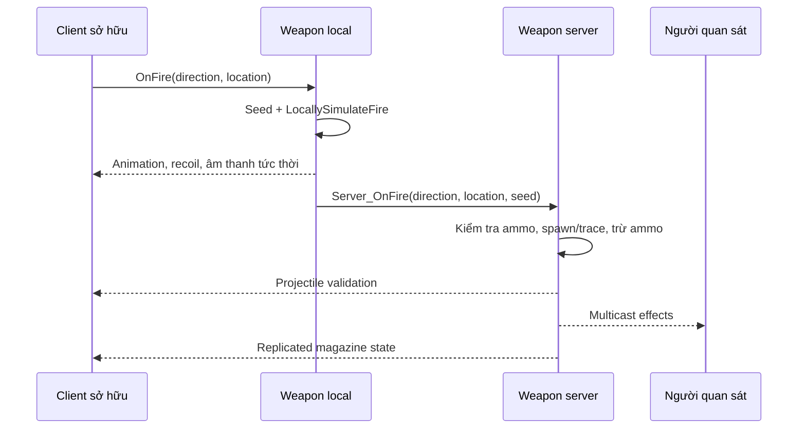
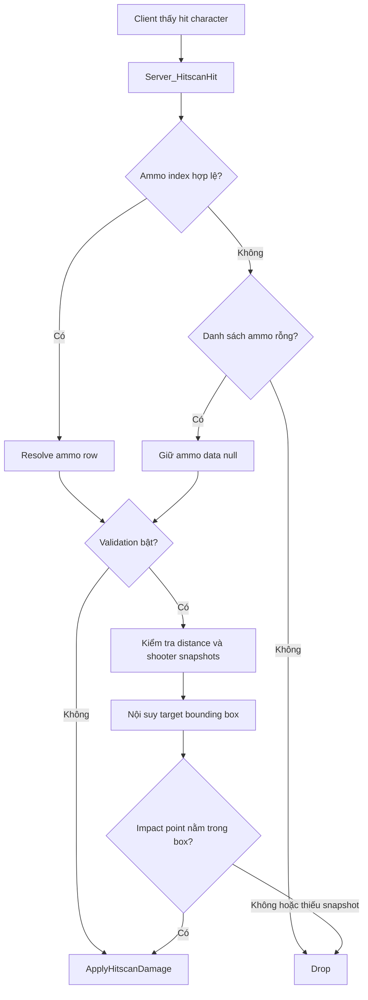

# 09 — Network: phản hồi ngay, state có chủ sở hữu

[Trước: Reload](08-Reload-interruption.md) · [Mục lục](README.md) · [Tiếp: Tái tạo và hiệu chuẩn](10-Tai-tao-va-hieu-chuan.md)

Học gunplay qua một cửa sổ PIE rất dễ bỏ sót nửa hệ thống. Network đòi hỏi trả lời hai câu hỏi khác nhau: người cầm súng nhìn thấy gì ngay lúc bấm, và bên nào có quyền quyết định kết quả gameplay. Trong source này có local simulation, server fire, replicated ammo, multicast effects và một đường xác nhận hit character theo lịch sử vị trí.

## Một phát bắn có nhận dạng chung

`ABaseMagazineWeapon::OnFire` tạo seed rồi chạy local simulation và RPC server fire. Client có kiểm tra tránh dùng seed đang có trong `ActiveProjectiles`. Cả local/server tạo `FRandomStream` từ seed để sinh seed cho các projectile/pellet. Server phản hồi `Validated` hoặc `Invalid` cho controller tùy nhánh fire có ammo hay không. [N01]

**Giới hạn diễn giải:** seed giúp liên kết các bản dự đoán với kết quả server; nó không tự chứng minh mọi trạng thái đều deterministic. Pending spread, animation state, ammo type và các random call khác có thể là dữ liệu cần đồng bộ hoặc đối chiếu riêng. Không nên viết “cùng seed nên chắc chắn cùng kết quả” mà chưa replay thử.

Sơ đồ rút gọn đường magazine fire chính. Taser và các subclass có override; không gán nguyên sơ đồ này cho mọi item chỉ vì có nút fire. [N01]

## Quyền ghi và quyền nhìn

| Dữ liệu/hành động | Bằng chứng owner trong code | Cách hiểu khi đo |
|---|---|---|
| Animation/recoil phản hồi bắn của owner | `LocallySimulateFire` gọi player callback `false` | Có thể xuất hiện trước kết quả server |
| Ammo tiêu thụ | `Server_OnFire` gọi `RemoveAmmo` ở authority | Giá trị đáng tin để chấm gameplay nằm ở server |
| Magazine/index | `DOREPLIFETIME` trên weapon | Client nhận bản sao state |
| `bReloading` | Replicate `COND_SkipOwner` | Owner có state/prediction riêng cần đối chiếu |
| Effects người khác thấy | Multicast, có skip local owner | Tránh phát lại effect dự đoán |
| Damage hitscan | `ApplyHitscanDamage` yêu cầu authority | Không dùng local blood để chứng minh health change |

Các hàng này có bằng chứng tại N01–N03. “Authority” không có nghĩa mọi request được kiểm chứng hoàn hảo; nó mô tả nơi áp state/damage. Không nên biến một lần đọc code thành chứng nhận an toàn mạng.

## Hit character có đường báo cáo riêng

Trong hitscan, server áp damage cho non-character và một số trường hợp owner local theo điều kiện trong code. Khi client thấy hit character, nó lấy synchronized world time và gửi `Server_HitscanHit` kèm hit result, trace begin, distance, penetration và ammo-type index; đồng thời dự đoán hit effects. [N04]

Server resolve ammo type từ danh sách ammo server biết của weapon. Index không hợp lệ chỉ bị drop ở nhánh này khi `AmmunitionTypes` có phần tử; nếu danh sách rỗng, `AmmoTypeData` giữ null và hàm tiếp tục. Nếu settings/cvar tắt validation thì áp damage ngay qua nhánh đó. Khi validation bật, nó kiểm tra khoảng cách, vị trí shooter dựa trên snapshots/bounding box với forgiveness, rồi nội suy bounding box mục tiêu giữa hai snapshots quanh thời điểm báo cáo và xem impact point có nằm trong box hay không. Không có snapshot phù hợp thì log drop. [N05]

**Điểm kiến thức quan trọng:** đây là xác nhận theo lịch sử bounding box đọc được trong hàm này, không phải bằng chứng của việc rewind toàn bộ skeletal pose, từng bone và toàn bộ geometry thế giới. Dùng thuật ngữ “lag compensation” quá rộng sẽ làm người mới hiểu sai mức mô phỏng. [N05]

## Hai tầng xác nhận không giống nhau

`Client_OnProjectileValidation` trong server fire gắn với việc chấp nhận projectile/fire branch. `Server_HitscanHit` là bước tiếp theo cho hit character được client báo. Nhận `Validated` ở tầng đầu không tự động có nghĩa mọi client-reported hit đã gây damage. [N01, N05]

Tương tự, local reload prediction có thể tạm thay ammo count; replicated magazine state sẽ đưa thông tin server về. Khi viết telemetry, phân biệt `shot_requested`, `server_shot_accepted`, `client_hit_predicted`, `server_hit_accepted`, `health_changed`. Đây là tên event đề xuất cho lab, không khẳng định source có sẵn các event trùng tên.

## Ma trận kiểm thử mạng tối thiểu

| Ca | Câu hỏi chính | Dữ liệu cần chụp |
|---|---|---|
| Standalone | Pipeline và content có đúng không? | Input, shot, animation, damage |
| Listen host bắn | Authority và local presentation có trùng effect? | Callback role, shell/audio count |
| Remote client bắn bia tĩnh | Prediction và authoritative result có khớp? | Seed, ammo, hit/damage timestamps |
| Remote client bắn target chuyển động | Snapshot validation xử lý thời điểm thế nào? | Synchronized time, target snapshot, accepted/drop |
| Reload rồi bắn ngay | Prediction có gây lệch thứ tự? | Ammo trước/sau, queued type, server shot |
| Spectator xem người bắn | Local view-target simulation có lặp effect? | View target, role, effect count |
| Giả lập latency/loss trong môi trường học | Chất lượng cảm nhận giảm ở phần nào? | Input response, correction, rejected hit, duration |

Bảng là bài test được đề xuất; không có ô nào tự động pass vì game có RPC. Cấu hình impairment, số client và độ trễ phải được ghi trong báo cáo, không lấy một con số ping để đại diện cho mọi ca mạng.

## Lộ trình học network mà không bị ngợp

Trước tiên xây offline invariant về ammo và shot. Tiếp theo tạo server-authoritative state và replicated snapshot. Sau đó thêm local animation/recoil prediction; cuối cùng mới thêm hit prediction và snapshot validation. Mỗi bước phải giữ được event identity để đếm cùng một phát ở nhiều máy.

Bạn hiểu chương này khi giải thích được vì sao client có thể thấy một phát bắn đẹp, nghe âm thanh, thấy blood nhưng server chưa chắc thay health; và chỉ ra được log nào cần để kết luận nguyên nhân.

## Bằng chứng

| ID | Đường dẫn và symbol | Dòng |
|---|---|---|
| N01 | `Ready Or Not/Source/ReadyOrNot/Actors/BaseMagazineWeapon.cpp` — `OnFire`, `LocallySimulateFire`, `Server_OnFire_Implementation` | 639–781, 884–961 |
| N02 | `Ready Or Not/Source/ReadyOrNot/Actors/BaseMagazineWeapon.cpp` — `GetLifetimeReplicatedProps`, `Multicast_OnFire_Implementation`, `Multicast_SimulateFireForViewTargets_Implementation` | 65–75, 964–970, 871–881 |
| N03 | `Ready Or Not/Source/ReadyOrNot/Actors/BaseMagazineWeapon.cpp` — `Multicast_SpawnParticleEffects_Implementation`, `ApplyHitscanDamage` | 2974–2983, 2337–2344 |
| N04 | `Ready Or Not/Source/ReadyOrNot/Actors/BaseMagazineWeapon.cpp` — `Multicast_PerformHitscan_Implementation`, damage ownership branch | 2087–2105 |
| N05 | `Ready Or Not/Source/ReadyOrNot/Actors/BaseMagazineWeapon.cpp` — `Server_HitscanHit_Implementation` | 2220–2319 |
| N06 | `Ready Or Not/Source/ReadyOrNot/Animation/RoNAnimInstance_PlayerFP.cpp` — `OnReloadComplete` | 210–230 |
