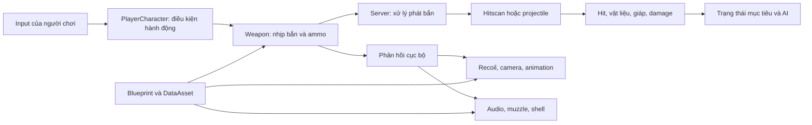

# Gun Gameplay: từ thao tác đến cảm giác bắn

Mục tiêu của phần này là giúp bạn giải thích một phát bắn của bản source đang có, tìm đúng nơi cần đọc khi hành vi khác mong đợi, rồi xây một bản thực hành có thể đo và đối chiếu. Đọc tuần tự một lần; sau đó dùng bảng câu hỏi để đi thẳng tới hệ thống cần sửa.

**Phạm vi bằng chứng:** phân tích tĩnh source tại workspace ngày 07/10/2026. `Ready Or Not/…` trong các bảng là đường dẫn tương đối với `D:\Zone9Dev_RON`. Số dòng giúp mở đúng vị trí trong snapshot này; khi source thay đổi, tìm lại bằng tên symbol. Nội dung tự viết để học kiến trúc, không sao chép phần thân mã nguồn hay phân phối asset game. Những giá trị khai báo trong header là mặc định của lớp, không phải bằng chứng về thông số cuối cùng của một khẩu súng Blueprint.

Ba nhãn được dùng xuyên suốt:

- **Đã thấy trong source:** có hàm, điều kiện hoặc dữ liệu khai báo ở vị trí dẫn nguồn.
- **Suy luận:** hệ quả kiến trúc hợp lý, còn cần kiểm chứng bằng Editor/PIE.
- **Bài thực hành:** thiết kế đề xuất cho người học; không khẳng định Ready or Not đã làm theo cách đó.

[Evidence manifest](evidence.json) ghi 46 điểm vào hàm/lớp hoặc cờ biên dịch đã kiểm tra bằng script, hash của 18 file source trọng tâm và phạm vi kiểm chứng. Manifest chứa metadata; không chứa phần thân source game.

## Đọc theo câu hỏi

| Bạn đang hỏi | Chương |
|---|---|
| Một khẩu súng gồm những phần nào, có phải mỗi súng là một lớp C++? | [01 — Bản đồ hệ thống và dữ liệu](01-Ban-do-he-thong-va-du-lieu.md) |
| Nhấn chuột đi đâu, cầm một súng bằng cách nào? | [02 — Input, inventory và equip](02-Input-inventory-equip.md) |
| Semi/auto, tốc độ bắn, băng đạn và chamber hoạt động thế nào? | [03 — Fire, ammo và chamber](03-Fire-ammo-chamber.md) |
| Đạn bắt đầu ở camera hay đầu nòng; hitscan hay projectile? | [04 — Đường đạn và xuyên vật liệu](04-Ballistics-penetration.md) |
| Vì sao trúng hình học chưa có nghĩa mất cùng lượng máu? | [05 — Damage, giáp và phản ứng](05-Damage-armour-reaction.md) |
| Tại sao chỉ chỉnh một con số recoil không ra cảm giác gốc? | [06 — Recoil, ADS và camera](06-Recoil-ADS-camera.md) |
| Animation, âm thanh và VFX phối hợp ra sao? | [07 — Animation, audio và VFX](07-Animation-audio-VFX.md) |
| Reload thay dữ liệu lúc nào, có thể ngắt ở đâu? | [08 — Reload và interruption](08-Reload-interruption.md) |
| Client thấy bắn ngay mà server vẫn quyết định sát thương thế nào? | [09 — Network và authority](09-Network-authority.md) |
| Học và tái tạo theo thứ tự nào; đo giống nhau bằng gì? | [10 — Tái tạo và hiệu chuẩn](10-Tai-tao-va-hieu-chuan.md) |

## Bức tranh tổng

Đây là bản đồ rút gọn từ chuỗi gọi thật, không phải sơ đồ tất cả node Blueprint. `PrimaryUse` gọi `OnFireAtBulletSpawn`; `OnFire` của magazine weapon phân nhánh local/server; `SpawnProjectile` lựa chọn hitscan hay actor projectile; callback người chơi bổ sung animation, camera và recoil. [G01–G04]

Điểm dễ nhầm nhất khi mới học dự án lớn: **gun gameplay là một quan hệ giữa nhiều hệ thống**. Muzzle chính xác nhưng montage trễ vẫn cho cảm giác sai. Camera đúng nhưng material của bia không tham gia kênh trace sẽ cho kết quả sai. Nhịp bắn đúng ở host chưa chứng minh client đúng. Các chương giữ những phần này riêng để đo, rồi ghép lại bằng cùng một đường thực thi.

## Điều chưa thể kết luận chỉ bằng đọc source

Không coi một `.uasset` có tên súng là bằng chứng nó xuất hiện trong loadout, chơi được bằng player, có đủ animation FP, hoặc có thông số giống bản thương mại mới nhất. Cần đọc generated class/CDO, tham chiếu animation–sound–ammo và chạy thực tế. Chương 01 đưa hợp đồng dữ liệu cần xuất; chương 10 đưa tiêu chí chấp nhận. Báo cáo của level thử nghiệm nằm ở phần Gun Lab của bộ tài liệu, và có mức kiểm chứng riêng.

## Nguồn cho bản đồ

| ID | Source và symbol | Dòng đã kiểm tra |
|---|---|---|
| G01 | `Ready Or Not/Source/ReadyOrNot/Characters/PlayerCharacter.cpp` — `APlayerCharacter::PrimaryUse` | 5354–5515 |
| G02 | `Ready Or Not/Source/ReadyOrNot/Actors/BaseWeapon.cpp` — `ABaseWeapon::OnFireAtBulletSpawn` | 290–300 |
| G03 | `Ready Or Not/Source/ReadyOrNot/Actors/BaseMagazineWeapon.cpp` — `OnFire`, `LocallySimulateFire`, `Server_OnFire_Implementation`, `SpawnProjectile` | 639–781, 884–961, 2621–2740 |
| G04 | `Ready Or Not/Source/ReadyOrNot/Characters/PlayerCharacter.cpp` — `OnEquippedWeaponFire` | 3355–3397 |
