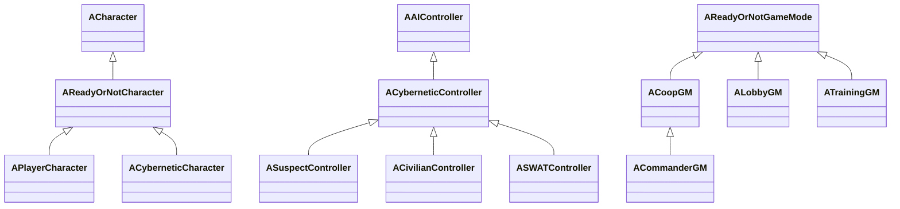

# Bản đồ source: biết cần mở file nào

Bạn không cần nhớ mọi class để học một dự án lớn. Bạn cần biết câu hỏi của mình thuộc miền nào và cách đi từ tên miền tới actor/component/data tương ứng. Hãy giữ ba bản đồ khác nhau: **module biên dịch**, **đối tượng runtime** và **luồng gameplay**. Chúng liên quan nhưng không trùng nhau.

## Lớp ngoài cùng: project, module và engine

`ReadyOrNot.uproject:6` khai báo các module, gồm `ReadyOrNot` runtime và `ReadyOrNotEditorModule` editor. `Source/ReadyOrNot/ReadyOrNot.cpp:5` đăng ký primary game module. Build rules trong `Source/ReadyOrNot/ReadyOrNot.Build.cs` liệt kê dependency; đó là contract biên dịch/link, không phải sơ đồ ai gọi ai trong gameplay.

Engine local có `Engine/Build/Build.version` ghi 5.3.2 và licensee version. Engine custom có thể có thay đổi ngoài con số này. Do đó không nên tự đổi sang Launcher Engine cùng tên phiên bản hoặc “nâng cấp cho mới” khi đang nghiên cứu baseline. EngineAssociation GUID trong uproject không giải thích được nội dung sửa custom.

| Vùng source | Trách nhiệm thường gặp | Điểm vào thực tế |
|---|---|---|
| `GameModes/`, các `ReadyOrNotGame*` | Vòng nhiệm vụ, luật mode, state phiên | `ACoopGM::CheckWinConditions` |
| `Characters/`, `ReadyOrNotCharacter.*` | Player, cơ thể AI, controller | `APlayerCharacter`, `ACyberneticCharacter` |
| `Actors/` | Item, cửa, đối tượng world | `ADoor`, base item/weapon |
| `Components/` | Inventory, health, morale, tương tác | `UInventoryComponent`, `UCharacterHealthComponent` |
| `AI/`, `Senses/` | Chọn action, data AI, perception | `AIActionDecisionEvaluator`, custom sight |
| `Info/Activities/`, `Info/SWATManager.*` | Thực thi công việc và phối hợp đội | `UTeamStackUpActivity`, `USWATManager` |
| `Objectives/`, scoring manager/component | Mục tiêu và điểm | `AObjective`, `AScoringManager` |
| `Animation/`, `AnimInputs/` | Pose, notify, data trình diễn | Theo notify từ hành động đang nghiên cứu |
| `Data/`, `lib/DataSingleton.*` | Schema và điểm truy cập dữ liệu | `UAIData`, LevelData |
| `Commander/`, `Metagame/` | Profile và tiến trình | `UCommanderProfile`, `ACommanderGM` |
| `HUD/`, `Gamepad/` | Giao diện và đường nhập | Command widget/controller |
| `Navigation/`, `Octree/` | Truy vấn không gian và di chuyển | Nav filters và cover |
| `Testing/`, `Debug/` | Công cụ khảo sát và profiling | Gauntlet controller |

Các thư mục là tổ chức source trong một module lớn; không tự biến thành module độc lập chỉ vì có folder riêng. Đừng đánh giá kiến trúc bằng số thư mục.

## Kế thừa chỉ là một phần của mô hình

Sơ đồ rút gọn được đối chiếu declaration: `ReadyOrNotCharacter.h:98`, `Characters/PlayerCharacter.h:216`, `Characters/CyberneticCharacter.h:29`, `Characters/CyberneticController.h:94`, ba controller ở `Characters/AI/*Controller.h:9`, `GameModes/CoopGM.h:11`, `Commander/CommanderGM.h:32`, `GameModes/LobbyGM.h:13`, `GameModes/TrainingGM.h:17`.

Kế thừa giải thích API dùng chung; component và data giải thích biến thể. Hai pawn cùng class có thể khác loadout, animation data, archetype và config map. Muốn hiểu một actor trong level, hãy ghi cả class C++, Blueprint con, defaults/instance override và owner/controller.

## Các dependency cho thấy chuyên môn cần học

Build.cs có `AIModule`, `NavigationSystem`, `DynamicCoverSystem` cho AI và không gian; `FMODStudio` cho audio; `CustomAnimNode` cho animation; `OnlineSubsystem`/Steam và session modules cho network; `CommonUI`/UMG cho UI; `ObjectPooler` cho vòng đời hiệu ứng/đối tượng; editor branch thêm UnrealEd và EditorScriptingUtilities. Các tên module này là bằng chứng dependency, không chứng minh mọi tính năng của plugin đang được dùng.

Thay vì học tất cả plugin, chọn một đường đi cụ thể: ví dụ heal → inventory holster → animation table → notify → state update. Khi gặp một dependency chưa hiểu, học đủ để giải thích chỗ giao tiếp đó rồi quay lại feature.

## Bài tập định hướng trong 30–60 phút

Chọn hành động “thu vật chứng”. Viết một trang có entry input, target class, component guard, nơi commit, nơi score, UI feedback và reset. Dùng `rg -n` tìm symbol thay vì mở toàn repo bằng mắt. Ghi một câu “tôi chưa biết” cho mỗi bước chưa tới được asset/runtime.

**Tiêu chí đạt:** từ một bug report cụ thể, bạn xác định được ba điểm đặt breakpoint đầu tiên và vì sao. **Chưa xác minh:** toàn bộ call graph, every plugin dependency, engine diff với upstream. Một bản đồ có ích luôn giữ phần chưa đọc rõ ràng, thay vì tô mọi folder là đã hiểu.
