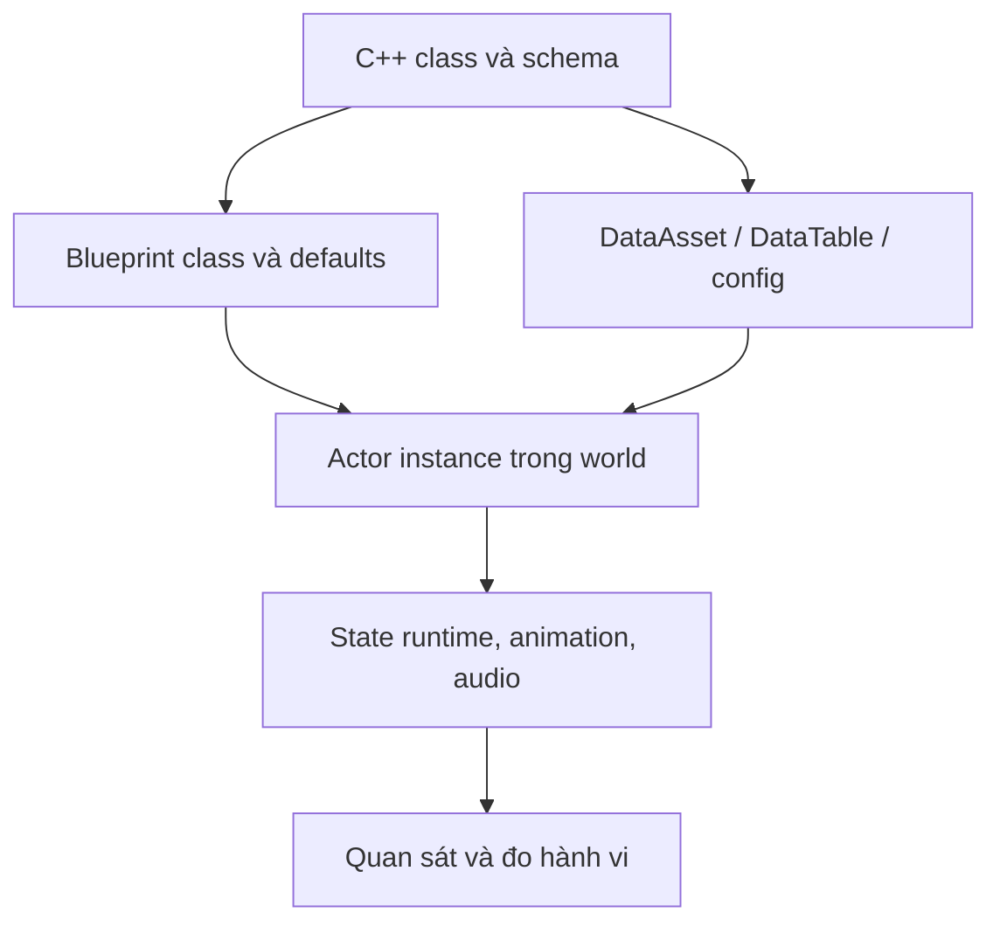

# Từ C++ tới Blueprint, asset và level đang chạy

Source code mô tả khả năng và luật; asset thường quyết định cấu hình cụ thể của trải nghiệm. Trong Unreal, đọc C++ mà không mở Blueprint/default/DataAsset tương ứng giống như đọc công thức nhưng chưa biết đầu vào. Ngược lại, chỉ nhìn asset cũng không cho biết thứ tự cập nhật hay quyền ghi state.

## Một feature có ít nhất bốn lớp dữ liệu

Ví dụ AI: C++ controller có bộ phản ứng; `UAIData` chọn archetype, weapon, character/controller class và mode override; level chọn nơi spawn và dữ liệu mission; config map cung cấp tuning. Không có một file duy nhất chứa toàn bộ “AI của map”.

Ví dụ objective: GameState đọc `LevelData.Objectives`, tải soft class, đọc default object để kiểm tra mode, spawn objective và gắn event. Nếu class objective tồn tại nhưng map không tham chiếu nó, bạn chưa có bằng chứng objective đó chạy trong mission đang khảo sát.

## Bằng chứng nối source với asset

| Vị trí | Cầu nối |
|---|---|
| `Config/DefaultEngine.ini:38`, `GameSingletonClassName` | Singleton dữ liệu cấu hình bằng Blueprint path |
| `Config/DefaultEngine.ini:646`, `GameInstanceClass` | GameInstance thực tế là Blueprint con |
| `Source/ReadyOrNot/lib/DataSingleton.cpp:9`, `UDataSingleton::Get` | Điểm truy cập singleton trong C++ |
| `Source/ReadyOrNot/ReadyOrNotLevelScript.h:94`, `LevelData` | Level script mang dữ liệu map |
| `Source/ReadyOrNot/ReadyOrNotLevelScript.cpp:191` | Lookup map details theo tên map |
| `Source/ReadyOrNot/ReadyOrNotGameState.cpp:785`, `CreateLevelObjectives` | Soft class → default object → actor objective |
| `Source/ReadyOrNot/Data/AIData.h:253`, `Archetype` | Data nối tới archetype AI |
| Cùng file `:275`, `AIWeaponSelection`; `:307`, `CharacterClass`; `:315`, `ControllerClass` | Một cấu hình AI gồm nhiều loại dependency |
| `Source/ReadyOrNot/AI/AIAction.h:53`, Blueprint event hooks | Custom action có phần thực thi asset |

Số dòng là điểm vào; sau đó phải đọc symbol và dùng Reference Viewer/Find References trong Editor để nối sang asset. File `.uasset` nhị phân không thể được kết luận nội dung chỉ bằng tên file hoặc chuỗi tìm thấy trong raw bytes.

## Manifest học tập cho một actor thật

Mỗi actor được nghiên cứu nên có một phiếu:

| Trường | Nội dung cần ghi |
|---|---|
| Identity | Object path, class C++, Blueprint parent chain |
| Defaults | Những property ảnh hưởng gameplay/feel |
| Dependencies | Mesh/skeleton, anim blueprint/montage, physics, material, audio, VFX, table |
| Runtime owner | Ai spawn, ai possess, ai attach, ai destroy |
| Overrides | Instance property, map config, mode override |
| Evidence | Screenshot Details, log path và scenario đã chạy |
| Gaps | Asset thiếu, chưa load, chưa quan sát được |

Với súng, dependency còn gồm socket/attachment, muzzle, sight, camera, ammo và ballistic data. Dùng manifest của quyển Gun Gameplay để đi sâu; chương này giải thích phương pháp chung.

## Học asset lifecycle bằng một phép thử nhỏ

Duplicate một fixture vào vùng học tập riêng. Tạo map nhỏ bằng asset gốc tham chiếu local; dùng child Blueprint hoặc instance override cho một thông số dễ thấy. Chạy PIE, stop, chạy lại, đổi map rồi quay lại. Quan sát constructor/default, construction script, BeginPlay và EndPlay khác nhau thế nào. Một actor có thể được tạo nhiều lần trong editor trước khi game bắt đầu; code dựa vào world/runtime không phải lúc nào dùng được trong constructor.

Đọc thêm `UReadyOrNotAIConfig::Get` ở `ReadyOrNotAIConfig.cpp:7`: source có kiểm tra không gọi trong constructor. Đây là một dấu hiệu cụ thể về thời điểm hệ thống world/GameInstance đã sẵn sàng.

## Chọn mode cho level thử phải có chủ ý

`ATrainingGM` là class riêng kế thừa base GameMode. `TrainingGM.cpp:28` trong BeginPlay hủy scoring manager và TOC manager; `:46` trong Tick có thao tác đánh dấu AI đã report. Nếu dùng mode này để thử cảm giác súng, hãy ghi rõ điều kiện đó. Không dùng kết quả từ training để chứng minh report/score/ROE của mission COOP giống nhau.

**Bài tập:** lập manifest cho một player pawn và một door Blueprint, mở mọi dependency trực tiếp trong Editor, chạy fixture và ghi dependency còn thiếu. **Tiêu chí đạt:** người khác có thể mở đúng actor và tái hiện cùng defaults; chuyển map/reset không để timer hoặc actor dư; mọi claim có nhãn source/asset/runtime phù hợp.

**Chưa xác minh:** toàn bộ asset graph, cooker, FMOD banks, redirector và optional content của mọi map. Chỉ copy mesh/animation sang project trắng thường không đủ bảo toàn game feel; dependency và code thực thi mới làm chúng hoạt động cùng nhau.
