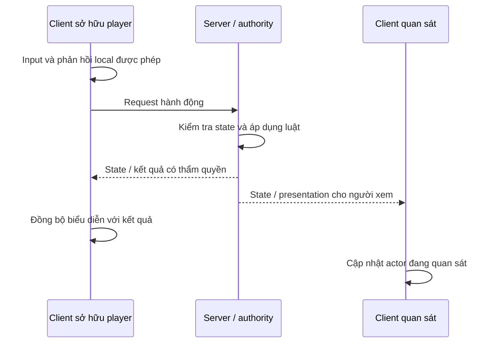

# Multiplayer: ai được thay đổi sự thật của game?

Một feature chạy đẹp ở standalone có thể thất bại khi có hai người chơi vì mỗi máy đang giữ một cách hiểu khác nhau về state. Học multiplayer sớm không có nghĩa triển khai matchmaking ngay. Nó có nghĩa mỗi biến quan trọng đều có câu trả lời: **ai ghi, ai đọc, ai dự đoán, ai phản hồi, và người đến sau lấy state ở đâu?**

## Ba loại thông tin cần tách

| Loại | Ví dụ | Cách suy nghĩ |
|---|---|---|
| State bền trong phiên | Door locked, objective complete, equipped item | Người tham gia cần nhận được trạng thái hiện tại |
| Request | Player muốn equip/interact/fire | Có thể bị từ chối vì state đã đổi |
| Presentation event | Âm thanh, animation, camera response | Người xem khác cần biểu diễn phù hợp; không tự cấp quyền gameplay |

RPC truyền lời gọi, replicated property truyền state. Hai cơ chế không thay thế nhau hoàn toàn. Nếu một client bỏ lỡ âm thanh mở cửa, nó vẫn phải thấy cửa đang mở nhờ state. Nếu chỉ multicast một hiệu ứng rồi không lưu state, late join khó dựng đúng world.

## Bằng chứng từ project

`AReadyOrNotGameState::GetLifetimeReplicatedProps` đăng ký `MatchState`, mission name/description/objectives, thời gian, score-related settings và nhiều dữ liệu phiên khác. `UInventoryComponent` replicate `InventoryItems`, `SpawnedGear`, `LastEquippedLoadout`, `LatestItemChangeRequest`. `APlayerCharacter` có conditional replication như owner-only hoặc skip-owner cho một số field. Điều đó cho thấy hệ thống phân biệt người điều khiển và người quan sát, không đơn giản phát mọi dữ liệu cho tất cả theo cùng cách.

Sơ đồ là mẫu đọc. Không tự giả định mọi RPC trong source đều kiểm tra đầy đủ điều kiện; cần mở implementation và caller của feature cụ thể.

## Ma trận ownership để dùng khi dựng lại

| State | Chủ quyết định đề xuất cho prototype | Consumer |
|---|---|---|
| Match phase, mission outcome | GameMode phía authority | GameState, HUD, save |
| Health, arrest completion, evidence secure | Logic gameplay có thẩm quyền trên actor/component | Anim/UI/scoring |
| Trang menu đang mở | Controller/widget local | Người dùng local |
| Camera recoil first person | Presentation của owner, theo event gameplay | Camera local |
| Item đang equip | Inventory có thẩm quyền + quá trình phản hồi local | Owner và observer |
| Kế hoạch/path của AI | Controller phía authority | Movement/pose và debug |
| Profile lưu trên máy | Profile/save owner được thiết kế rõ | Hub/progression |

Đây là đề xuất contract khi tái tạo, không tuyên bố project gốc có đúng một writer tuyệt đối cho tất cả state. Project hiện có nhiều đường `_Implementation`, predicted/local và multicast; cần khảo sát riêng khi sửa.

## Các điểm đọc cụ thể

| Vị trí | Câu hỏi |
|---|---|
| `Source/ReadyOrNot/ReadyOrNotGameState.cpp:56`, `GetLifetimeReplicatedProps` | Client cần nhìn thấy dữ liệu nhiệm vụ nào? |
| `Source/ReadyOrNot/ReadyOrNotGameState.cpp:1131`, `OnRep_MatchState` | Khi phase tới client thì callback gì chạy? |
| `Source/ReadyOrNot/Components/InventoryComponent.cpp:36`, replication | State item nào được gửi? |
| Cùng file `:698`, `OnRep_ItemChangeRequest`; `:906`, server change item | Tách request và observer update ra sao? |
| `Source/ReadyOrNot/Characters/PlayerCharacter.cpp:294`, replication | Owner và observer nhận gì khác nhau? |
| `Source/ReadyOrNot/Actors/Door.cpp:944`, replication | Độ mở/khóa và các biến cần đối chiếu |
| `Source/ReadyOrNot/Objectives/Objective.cpp:25`, replication | ObjectiveStatus được gửi ra sao? |
| `Source/ReadyOrNot/ReadyOrNotGameMode.cpp:1968`, `ProcessServerTravel`; `:2010`, `PostSeamlessTravel` | State nào phải sống qua travel? |

## Test tối thiểu với hai người chơi

Cho listen server và một client vào cùng fixture. Đổi súng, mở cửa, bắt target và thu evidence. Quan sát từ cả hai phía. Sau đó kiểm tra target hủy giữa hành động, spam input, reset mission và travel. Dùng latency mô phỏng trong môi trường test nếu đã có công cụ phù hợp; ghi điều kiện thay vì chỉ viết “network pass”.

**Tiêu chí đạt:** một hành động cho một kết quả gameplay; owner không bị kẹt sau request bị từ chối; observer thấy đúng item/tư thế; score không tăng hai lần; state cuối vẫn đúng khi presentation bị trễ. Mỗi log nên có net role, actor identity và action/request id.

**Chưa xác minh:** prediction, reconciliation, host migration và reconnect end-to-end. Source có các field/hàm liên quan migration không đủ chứng minh khả năng phục hồi phiên. Không cần giải quyết toàn bộ online services để học authority với hai client local.
