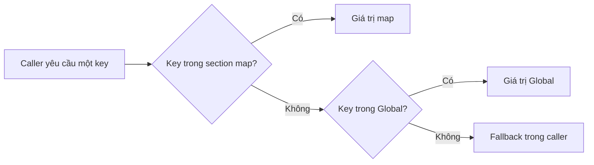

# Save, config, mode và phiên bản: vì sao cùng code có thể chơi khác?

“Tôi đã đặt cùng thông số trong C++ nhưng cảm giác vẫn khác” thường là dấu hiệu còn lớp dữ liệu khác. Constructor, Blueprint defaults, map config, save loadout, mode, compile flag và runtime state đều có thể làm thay đổi đầu vào. Muốn học có hệ thống, hãy ghi nguồn của mỗi giá trị trước khi chỉnh nó.

## AI config trong snapshot có thứ tự ưu tiên rõ

`UReadyOrNotAIConfig::GetConfigFileName` trả `AILevelData.ini`; section chính là tên map đã bỏ streaming prefix; fallback section là `Global`. `UGameplayConfig::GetKey` kiểm tra key trong section map, rồi Global; nếu cả hai không có thì dùng fallback truyền từ caller.

Như vậy số nằm trong `GetReactionTime(..., 0.25f)` không tự là số runtime. Khi viết docs tuning, hãy ghi cả key, section hiệu lực, fallback và giá trị đọc được khi chạy. Đây cũng giải thích vì sao chuyển sang một lab map có tên mới có thể thay đổi hành vi AI: section map không còn trùng, hệ thống rơi về Global.

## Save không phải actor sống lâu

`UCommanderProfile::SaveProfile` ghi ngày lưu, trạng thái mod/checksum qua GameInstance rồi `SaveGameToSlot`. `LoadProfile` nạp object và gắn Slot; `CreateProfile` gắn campaign và Ironman flag. `UMetaGameProfile` và `UReadyOrNotProfile` có đường save riêng. Học cách phân biệt **dữ liệu bền vững** với **con trỏ actor chỉ sống trong world** trước khi làm progression.

Với project tự dựng, lưu identity và giá trị có nghĩa: mission đã hoàn thành, loadout choice, settings, trạng thái đội nếu thiết kế yêu cầu. Không nên coi địa chỉ actor hiện tại là một định danh save. Khi schema đổi, cần version/migration và cách xử lý save cũ có kiểm soát. Đây là đề xuất thiết kế; chương chưa kiểm chứng toàn bộ migration của source gốc.

## Compile flag có thể vô hiệu hóa cả một feature

Ví dụ cụ thể là `RON_NO_SPRINT` và `RON_NO_JUMP`. Tên input, hàm và asset vẫn có thể tồn tại nhưng phần code được biên dịch khác. Build.cs còn có nhánh target platform, Shipping/non-Shipping và Editor. Cùng một project, build Editor và build Shipping có thể không có cùng công cụ debug/dependency.

Mode cũng thay luật: `ATrainingGM` không phải `ACoopGM`; nó hủy scoring/TOC manager trong BeginPlay. Commander kế thừa Coop và thêm progression. Không gộp results của ba mode rồi gọi là cùng baseline gameplay.

## Bản ghi baseline tối thiểu

| Nhóm | Cần ghi |
|---|---|
| Source | Commit nếu có, danh sách sửa local, hash file quan trọng khi cần |
| Engine | Đường executable, Build.version, target/configuration |
| Project | Uproject, enabled plugin liên quan, map và GameMode thật |
| Data | Pawn/weapon Blueprint, loadout, attachments, asset data |
| Config | Key có hiệu lực, section map/global, user settings override |
| Runtime | Net mode, seed, frame rate, input settings, health/stance |
| Save | Slot thử nghiệm, schema/profile type, thời điểm bắt đầu |

Bảng này giúp bạn trả lời liệu một thay đổi cảm giác đến từ code hay chỉ từ một loadout/save/settings khác. Khi thử nghiệm save, dùng slot học tập riêng, không ghi đè profile chính để có “môi trường sạch”.

## Nguồn kiểm chứng

| File và symbol | Dòng |
|---|---|
| `Source/ReadyOrNot/ReadyOrNotAIConfig.cpp`, `GetConfigFileName` / `GetConfigSectionName` / `GetFallbackConfigSectionName` | `17`, `22`, `30` |
| `Source/ReadyOrNot/GameplayConfig.h`, `GetKey` | `59` |
| `Source/ReadyOrNot/ReadyOrNotGameInstance.cpp`, tạo AIConfig và ReloadConfig | `1531` |
| `Source/ReadyOrNot/Commander/CommanderProfile.cpp`, `SaveProfile` / `LoadProfile` / `CreateProfile` | `25`, `42`, `62` |
| `Source/ReadyOrNot/Commander/MetaGameProfile.cpp`, `SaveProfile` / `LoadProfile` | `36`, `41` |
| `Source/ReadyOrNot/Metagame/Profile.cpp`, `SaveProfile` | `14` |
| `Source/ReadyOrNot/ReadyOrNot.h`, movement compile flags | `290`–`292` |

## Bài tập

Chọn một AI key đã tìm được caller, ghi giá trị trong map section/Global/fallback và đọc giá trị hiệu lực ở runtime. Sau đó chọn một loadout, lưu vào slot thử, đổi map, đóng/mở game và kiểm tra loadout trở lại. Đừng sửa ba lớp config cùng lúc.

**Tiêu chí đạt:** giải thích được chính xác nguồn giá trị; khác tên map không âm thầm bị hiểu là cùng tuning; save không tồn tại được xử lý rõ; test không chạm profile chính. **Chưa xác minh:** mọi config override platform/user, save compatibility giữa các bản build, cloud save và hành vi online.
