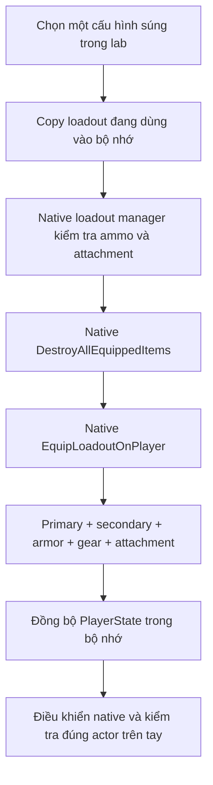

# Thử đầy đủ Gun Gameplay native trong Gun Lab

Gun Gameplay là trải nghiệm của cả người chơi, loadout, súng, animation, camera, âm thanh và môi trường nhận phát bắn. Spawn một Blueprint súng và thấy đạn giảm chỉ xác nhận một phần nhỏ. Trang này giải thích các hệ thống phải đi cùng nhau, cách thao tác trong lab và cách phân biệt chức năng có mặt với trải nghiệm đã được kiểm tra thực tế.

Phạm vi là **snapshot ReadyOrNot và custom UE 5.3.2 tại máy học tập**. Các hệ thống dưới đây dùng code và asset đang có trong project. Không suy ra snapshot này giống mọi bản Ready or Not đã phát hành.

## Bắt đầu một phiên thử

Nếu Editor đang mở, mở map `/Game/ReadyOrNot/Level/Study/ReadyOrNot_GunLab` rồi Play với player của game. Nếu chưa mở, chạy từ thư mục `ReadyOrNot-Docs`:

```powershell
.\lab\scripts\Run-GunLab.ps1 -Mode Editor
```

Launcher dùng `D:\Zone9Dev_RON\Engine\Binaries\Win64\UnrealEditor.exe` cùng `ReadyOrNot.uproject`. Chờ pawn, loadout và animation rút súng hoàn tất. Loadout khởi đầu chọn SR-16; không cần dựng nhân vật hay logic bắn mới.

| Điều khiển của lab | Mục đích |
|---|---|
| `F1` | Mở/đóng hướng dẫn; bảng đọc binding gameplay hiện tại từ `PlayerInput` |
| `F5` / `F6` | Chọn cấu hình catalog trước/sau; đây là thay trang bị tại bàn thử |
| `F7` | Cấp lại đạn hữu hạn bằng hàm native của vũ khí |
| `F8` | Trở lại vạch bắn |
| `ronlab select 40` | Ví dụ chọn đúng SR-16 bằng console; số bắt đầu từ 1 |
| `ronlab status` | Ghi state/readiness hiện tại để đối chiếu trong log/receipt |
| `ronlab_targets reset` | Tạo lại fixture nhân vật qua `AAISpawn::DoSpawn` gốc |

Chọn **SR-16 #40 → MP5A2 #26 → 870mcs #1 → G19 #54 → TAC700 #43 → Beanbag Shotgun #48** để học những họ cơ chế chính trước khi duyệt toàn catalog. Số chọn lấy từ [selection_order.json](../lab/manifests/selection_order.json); các variant trùng tên vẫn có class path khác nhau. Dùng `1`/`2` khi muốn đổi súng đang mang mà giữ ammo, thay vì F5/F6.

## Vì sao bản lab ban đầu chưa đủ

Bản đầu dùng đường development equip: spawn lớp súng → thêm inventory → cấp magazine → đưa vào tay. Đường này giữ fire, ADS và reload của súng, nhưng không thay thế toàn bộ thao tác chọn loadout của game. Súng thử không được gán vào `SpawnedGear.Primary`/`Secondary`; cấu hình loadout, lựa chọn đạn và các slot attachment của súng đó không được áp đầy đủ. Đổi về súng bằng phím native, dùng trạm tiếp đạn và mở giao diện loadout vì thế có thể làm người chơi trở lại cấu hình khác.

Đường mới cho súng primary/secondary đủ điều kiện của loadout native:



Đây là cùng thứ tự cleanup/equip mà `RequestNewLoadout` dùng khi thay loadout trong game. Chọn một mục catalog mới là thay loadout tại bàn trang bị; việc này có thể cấp lại đạn. **Đổi primary/secondary bằng phím `1`/`2` là thao tác khác:** hai súng đã có trong inventory được giữ lại, cùng số đạn hiện có của chúng.

### Catalog có asset không đồng nghĩa menu game có súng hoàn chỉnh

Lab kiểm tra bằng chính `ReadyOrNotLoadoutManager`, theo thứ tự:

1. Weapon phải có danh sách `AmmunitionTypes` được tác giả gán.
2. `GetUsableAmmoTypes()` phải tìm được ammo row hợp lệ trong bảng đạn và cho phép người chơi dùng.
3. Weapon phải có mặt trong danh sách **Primary hoặc Secondary thực tế của menu native**, với `bShowInLoadout` phù hợp. Danh sách này dùng `CategoryFlags` và bộ lọc loadout; trường legacy `ItemCategories` hoặc tên có chữ `Primary` không đủ.
4. Native sanitizer phải giữ đúng class đã chọn, attachment tương thích và số slot đạn nằm trong sức chứa của armor.

Nếu đạt, receipt ghi `selection_route=native_loadout`. Nếu không, asset vẫn có thể được xem bằng đường `catalog_asset` khi spawn/equip được, nhưng không ghi đè primary/secondary của loadout thật. Tên thư mục suspect/test chỉ gợi ý mục đích: quyết định đi theo dữ liệu native, không suy từ tên. Lớp Abstract không thể spawn được ghi nhận riêng.

Hai trường hợp đã tìm thấy trong snapshot:

| Asset trong catalog | Nội dung thực tế | Cách thử đúng |
|---|---|---|
| `Primary_S590_Beanbag_V2` — #35 | Không có ammo type được gán; không thuộc menu Primary/Secondary hợp lệ | Xem như nội dung chưa đủ. Để thử beanbag đã có dữ liệu, chọn `Primary_W870LL` — #48, ammo `12gaBeanbag` |
| `WeaponsSuspect/Secondary_Flaregun` — #94 | Không có ammo type được gán; `SpawnProjectileCount=0` trong asset | Không tự thêm flare ammo/projectile để biến asset này thành súng sử dụng được |

Lượt audit `20261008-024316` phát hiện lỗi nối lab: đưa asset không có ammo qua `SetActivePrimary/Secondary` làm native manager xóa các slot đạn và đặt count bằng 0. Chọn súng hợp lệ tiếp theo chỉ sửa các row **đang tồn tại**, nên count 0 tiếp tục lan sang nhiều súng sau đó. Đây không phải bằng chứng SR-16 hoặc những súng kế tiếp thiếu đạn trong asset.

Bản sửa chặn asset không đủ điều kiện trước đường native loadout. Khi tạo loadout mới cho súng hợp lệ, count rỗng được khôi phục từ số slot mặc định của armor hoặc default loadout gốc; các row chỉ lấy từ ammo hợp lệ do weapon khai báo. Sau đó native sanitizer kiểm tra lại sức chứa. Nếu vẫn không có slot cho súng được chọn, lab từ chối trước khi hủy trang bị cũ. Không có đạn vô hạn hay ammo type tự đặt. Đổi `1`/`2` không chạy bước cấp lại này. Receipt bổ sung `selection_route_reason`, hai `native_*_ammo_slot_count` và số ammo type để kiểm tra trực tiếp; kết quả audit sau sửa nằm ở [mục kết quả hiện tại](#ket-qua-kiem-tra-hien-tai).

## Những hệ thống tạo thành cảm giác bắn

| Hệ thống native | Vai trò trong trải nghiệm | Điều kiện để nhìn thấy nó |
|---|---|---|
| PlayerCharacter, PlayerController, PlayerState | Nhận input; sở hữu pawn, lựa chọn loadout và trạng thái người chơi | Pawn/controller phải là lớp của ReadyOrNot, không thay bằng FPS template |
| Inventory và loadout | Primary/secondary, thiết bị, rút/cất súng, slot đạn, armor và trang bị | Dùng native loadout; thử cả phím đổi slot và bàn loadout |
| Weapon Blueprint/CDO | Mesh, animation data, sound data, fire mode, cadence và giới hạn tương thích | Đúng lớp/variant; không chỉ nhìn tên hiển thị |
| Fire selector và bộ điều khiển bắn | Semi, burst hoặc auto theo từng súng; ngừng bắn; dry fire | Chọn súng có mode cần thử, chạm `X` và theo dõi mode thực tế |
| Magazine, chamber, ammo type | Đạn hiện có, magazine dự trữ, loại đạn, trạng thái sau reload | Bắn khi còn đạn và khi cạn; giữ nguyên loại đạn khi so sánh |
| Reload và mag check | Nhịp thao tác, giữ/thả magazine, empty reload, kiểm tra đạn và hủy thao tác | Phân biệt chạm, nhấn đúp và giữ `R` |
| ADS, sights và attachment | Góc nhìn, vị trí ngắm, scope, canted/secondary sight và modifier của phụ kiện | Lắp attachment đúng socket; thử súng có dữ liệu sight tương ứng |
| Recoil, free aim, sway và camera | Chuyển động thân súng, hướng ngắm, hồi tâm, quán tính khi di chuyển | So bắn từng phát/giữ cò, hipfire/ADS, đứng/đi/ngồi |
| FP/TP animation, IK và blocking | Tay cầm súng, chuyển pose, chuyển vũ khí, timing sự kiện ammo | Animation instance và weapon animation data phải hoạt động; xem toàn bộ chuỗi chuyển động |
| Muzzle, shell, tracer, hit effect | Phản hồi nhìn thấy ở đầu nòng, vỏ đạn và nơi va chạm | Renderer thật, đúng dữ liệu VFX và vật liệu nhận hit |
| Âm thanh native | Gunshot, cơ cấu súng, reload, dry fire, impact và không gian | Audio engine/bank/event phải sẵn sàng; một receipt không thể chứng minh đã nghe đúng |
| Trace/projectile, penetration và damage | Đạn đi đâu, vật liệu có chặn/xuyên hay không, phản ứng vật bị bắn | Mục tiêu và physical material đúng; geometry không thay thế nhân vật có health/armor |
| Movement, low ready và weapon collision | Tốc độ/tư thế làm đổi handling; súng hạ hoặc ép khi gần vật cản | Có cover và khoảng cách sát tường để kích hoạt trace |
| Replication/authority | Sự nhất quán fire, hit, reload và equip giữa người chơi/server | Cần bài thử nhiều client riêng; standalone chỉ kiểm tra một trường hợp |

Đọc sâu tương ứng trong [bản đồ hệ thống súng](../03-Gun-Gameplay/01-Ban-do-he-thong-va-du-lieu.md), [recoil/ADS/camera](../03-Gun-Gameplay/06-Recoil-ADS-camera.md), [animation/audio/VFX](../03-Gun-Gameplay/07-Animation-audio-VFX.md) và [network authority](../03-Gun-Gameplay/09-Network-authority.md).

## Điều khiển cần biết trước khi đánh giá

Các phím dưới đây lấy từ `Config/DefaultInput.ini` của snapshot. Tùy chọn cá nhân có thể ghi đè; hãy xem bảng trợ giúp trong lab hoặc phần Controls của game nếu phím thực tế khác. Lab không thay sensitivity, FOV hay binding native của người chơi.

| Thao tác | Phím mặc định | Điều cần quan sát |
|---|---|---|
| Bắn | Chuột trái | Semi: một phát mỗi lần nhấn; auto/burst phụ thuộc mode của súng |
| ADS / secondary use | Chuột phải | Sight alignment, FOV, thời gian vào/ra ngắm và chuyển động tay |
| Đổi fire mode | **Chạm nhanh `X` rồi thả** | Đọc current mode và các mode có sẵn của chính súng đang cầm |
| Reload giữ magazine theo nhánh tactical native | Chạm `R` | Timer native gọi `TacticalReload`; quan sát magazine và ammo sau khi animation hoàn tất |
| Reload theo nhánh `Reload` native | Nhấn đúp `R` | So với tactical reload; nhánh animation/giữ hoặc thả magazine do loại súng quyết định |
| Kiểm tra magazine | Giữ `R` | Nhánh hold gọi `MagCheck`, không xem đây là reload |
| Primary / secondary | `1` / `2` | Rút/cất súng native; ammo của súng cất phải được giữ |
| Grenade / tactical device / long tactical | `3` / `4` / `5` | Chỉ hoạt động khi loadout có món thuộc nhóm đó |
| Cúi/ngồi | Giữ `Ctrl` trái | Hạ tư thế, đổi pose/camera và đường ngắm qua cover |
| Nghiêng trái/phải | Giữ `Q` / `E` | Camera/thân súng và giới hạn sát vật cản |
| Free lean | Giữ `Alt` trái cùng hướng di chuyển | Đổi vị trí nghiêng theo axis native |
| Free look | Giữ `CapsLock` | Tách hướng nhìn; thả phím để trở lại hướng ngắm. Binding này nhận cả nhấn và thả |
| Đi chậm | Giữ `Shift` trái | Binding `Walk` trong build này; không tự xem là sprint |
| Low ready | `Space` để toggle; `Delete` là action giữ | Súng hạ và trở lại tư thế sẵn sàng |
| Canted aim | `O` | Dùng chuyển pose ngắm nghiêng có sẵn |
| Secondary sight | `P` | Chỉ có tác dụng khi sight/attachment hỗ trợ |
| Đèn/laser | `L` | Phải có phụ kiện tương ứng trong loadout |
| Đèn/laser vũ khí | Nút chuột bên `ThumbMouseButton2` | Action legacy tên `ToggleUnderbarrel` gọi đường bật/tắt light/laser; cần phụ kiện tương ứng |
| Đổi loại đạn mang theo | `I` | Chọn loại kế tiếp trong magazine đang mang và lập tức yêu cầu tactical reload; không đổi ngay viên đang trong chamber |
| Melee bằng vũ khí | `B` | Animation và va chạm native, điều kiện blocking của súng |
| Tương tác station | `F` | Nhìn đúng prompt của loadout/tiếp đạn/cửa |

Trong source, chạm `R` dùng timer khoảng 0,25 giây, còn nhánh giữ được xử lý khi thời gian giữ vượt khoảng 0,2 giây. Thời gian thực tế phụ thuộc tick/input; không dùng hai con số này làm bài đo cảm giác theo mili giây. Nếu đang reload, nhấn có thể yêu cầu hủy thao tác hiện tại; xem [reload và interruption](../03-Gun-Gameplay/08-Reload-interruption.md).

Giữ `X` không phải bằng chứng bật safety: `SafeMode()` ở snapshot này phát sự kiện UI nhưng lời gọi đổi trạng thái safety đã bị comment. Để thử mode bắn, dùng thao tác chạm nhanh, đọc state của weapon và thực sự bắn.

**Không có prone được triển khai như một điều khiển người chơi trong snapshot đã đọc.** `RON_NO_SPRINT` đang bật; `Sprint()` chuyển sang `FastWalk()` và `IsSprinting()` trả false. Không bổ sung prone/sprint mới để làm lab giống một FPS khác. Những từ xuất hiện trong sơ đồ tham khảo phải được đối chiếu với source đang chạy.

Lượt input probe `20261008-013023` đo **đi đứng 240 cm/s, giữ Shift 96 cm/s, đi ngồi 120 cm/s** với cùng SR-16 trong lab. Cờ `holding_fast_walk=true` được đặt khi giữ Shift, nhưng tên hàm `FastWalk` không mô tả tốc độ tương đối ở snapshot này. `PlayerCharacter.cpp:1593` đặt multiplier thành `0.4` khi cờ đó bật; `:1621` nhân vào `MaxWalkSpeed`, nên khi giữ các yếu tố khác giống nhau, `240 × 0.4 = 96`. `:1622` áp thêm `SpeedModifier_Crouch` cho tư thế ngồi. Không đổi multiplier để làm Shift thành chạy nhanh; đây là kết quả của logic native đang học. Loadout, thương tích, stun và các modifier khác có thể làm tốc độ ở lượt thử khác thay đổi.

Để tự cảm nhận: chọn một đoạn trống, giữ `W` cho tốc độ ổn định, giữ thêm `Shift`, rồi thả riêng `Shift` trong khi vẫn đi. So quãng đường và chuyển động tay/camera dưới cùng loadout. Lặp với `Ctrl` để tách ảnh hưởng của tư thế khỏi ảnh hưởng của phím đi chậm.

### Semi, burst, auto phải thử trên đúng súng

| Blueprint native | Mode khai báo trong CDO đã quét | Bài thử phù hợp |
|---|---|---|
| `Primary_SR16` — SR-16 | Single, Auto | Chạm `X` để so một phát/lần nhấn với giữ cò liên tục |
| `Primary_MP510` — MP5/10MM | Single, Burst, Auto | Lặp chạm `X`, xác nhận từng mode và số phát sau một lần nhấn |
| `Primary_MP5A2` | Single, Burst, Auto | So recoil của chuỗi burst với chuỗi auto cùng tư thế |
| `Primary_MP5A3` | Single, Auto | Không kết luận burst hỏng vì variant này không khai báo burst |
| `Secondary_G19_V2` | Single | Dùng thử handgun, slide/chamber và reload; không kỳ vọng auto |
| `Primary_870mcs` | Single | Dùng thử pump/shell/shotgun reload; không kỳ vọng selector tạo auto |

Đây là dữ liệu asset, chưa phải kết quả đo runtime. Receipt và overlay cần ghi `CurrentFireMode` cùng `AvailableFireModes`; tên súng trên HUD không đủ để phân biệt variant. Tìm Lab # bằng [catalog có tìm kiếm](../06-Catalogs/README.md); thứ tự mảng metadata không nhất thiết bằng số chọn trong map.

### Pepperball MLO: bắn được không đồng nghĩa có đủ nội dung reload

`Primary_Pepperball_MLO` — **Lab #33** trong manifest hiện tại — dùng `/Game/Blueprints/Animation/Revised/AnimData/Mainline/BP_Pepper_MLO_AnimData`. Đọc tagged properties và import table của asset này cho thấy có montage draw, holster, fire và mag-check, nhưng **không có các trường montage Reload, ReloadEmpty, Tactical_Reload hoặc Tactical_ReloadEmpty được gán**. Không tìm thấy animation reload trong các thư mục `Peppergun_MLO` của snapshot. Đây là khoảng trống nội dung đang có; dữ liệu này chưa đủ để kết luận tác giả cố ý không cho reload hay đó là phần chưa hoàn thiện.

Lượt action probe lịch sử `20261007-115320` ghi MLO bắn từ 200 xuống 199 viên, có 4 magazine và `CanReload=true`, nhưng yêu cầu reload vẫn để lại 199 viên. `ABaseMagazineWeapon::CanReload()` chỉ kiểm tra số magazine lớn hơn một rồi gọi base; nó không kiểm tra đủ montage. Nhánh `OnWeaponReload()` cần animation và notify gốc để gọi `Server_NextMagazine()`. Vì thế `CanReload=true` và việc đã gửi lệnh reload không được dùng làm bằng chứng reload hoàn tất. Đường native loadout mới cũng không tự tạo những montage bị thiếu.

Để đối chiếu cơ chế hopper, chọn **TAC700 — Lab #43**, bằng `ronlab select 43`. Đây là Blueprint native riêng `/Game/Blueprints/Items/WeaponsRevised/Primary_TAC700`, dùng `BP_TAC700_M_AnimData` trong cùng thư mục Mainline. Asset này đã gán các montage reload/empty/tactical của TAC700, gồm cả FP và TP. Bài thử: bắn vài phát, ghi số viên, chạm/nhấn đúp `R`, chờ animation hoàn tất rồi so ammo và magazine. Có asset chưa chứng minh notify/hopper đã chạy; đối chiếu kết quả từng khẩu ở [mục kết quả hiện tại](#ket-qua-kiem-tra-hien-tai). Không ghép animation TAC700 lên MLO hoặc tạo timer nạp đạn thay thế để biến một bài kiểm tra chưa đạt thành pass.

Lần theo mã gốc ở `Ready Or Not/Source/ReadyOrNot`: `Actors/BaseMagazineWeapon.cpp:1153` (`CanReload`), `:1462` (`OnWeaponReload`), `:1569` (`OnWeaponTacticalReload`), `Animation/Notifies/AnimNotify_NextMag.cpp:6` (notify chuyển magazine) và `Actors/Items/PepperballGun.cpp:37` (chuyển đạn dự trữ vào hopper). `PepperballGun.cpp:25` ghi đè `SetMagazineCount()` chỉ để đặt lại hopper; cần phân biệt thao tác cấp đạn này với trải nghiệm reload bằng animation.

Khi cần tiếp tục thử phát bắn MLO sau khi cạn, `F7` là thao tác **cấp lại đạn của lab**. Ghi riêng thao tác đó trong kết quả; ammo tăng sau F7 không được tính là reload MLO đã phục hồi.

M32A1 #69 có khoảng trống reload riêng: `BP_M32A1_AnimData` không gán montage reload thường, empty, tactical hoặc crouch, và không có import montage reload. Trong 36 asset animation M32A1 của snapshot không tìm thấy asset reload. Native `AGrenadeLauncher` kế thừa đường reload của `BaseMagazineWeapon`, cần montage/notify để gọi `Server_NextMagazine`. Lượt có renderer `20261008-040637` đo **6 → 5 → 5** viên. Không ghép reload M320 vào M32 để che khoảng trống này. Ba biến thể M320 có animation reload riêng và đã đo **1 → 0 → 1**; việc launcher không dùng bảng ammo giống rifle tự nó không phải bằng chứng thiếu nội dung.

### Shotgun của suspect và giới hạn chuyển súng

M37 #85, SawnOff #91 và Trenchgun #92 thuộc catalog ngoài loadout người chơi. AnimData của chúng chỉ gán `Reload_Level_01/02/03` cho TP, thiếu `Reload_Start/Loop/End` của chuỗi reload người chơi. `Shotgun.cpp:388–396` vẫn đặt cờ reloading sau yêu cầu montage; `:218–219` dùng cờ đó để chặn animation. Nếu không có montage/notify hoàn tất, phiên thử có thể không cho đổi sang khẩu tiếp theo. Dừng Play rồi bắt đầu phiên mới để tiếp tục học asset khác; không xem những cấu hình AI này là súng player hoàn chỉnh.

Batch `20261008-033759` ghi đủ action đến M37 rồi thiếu phần còn lại. Source harness cho thấy `ContinueProbeBatch` có thể bỏ qua các mục khi điều kiện trước khi equip bị chặn; runner đã từ chối coi batch đó là đủ. Các phiên tiếp tục dùng world mới và ghi rõ provenance trong [bảng runtime](./runtime-results.md). Receipt cũ chưa đo trực tiếp cờ blocking; đường source/asset trên giải thích một nguyên nhân phù hợp, không thay thế giá trị telemetry còn thiếu. Không tự xóa cờ reload hay thêm timer nạp đạn để làm các asset này vượt qua bài thử.

## Crosshair và các lớp phản hồi HUD

Lab sử dụng **widget `CrosshairOverlay` có sẵn của project** được tạo bởi `APlayerCharacter::ToggleCrosshairOverlay()`. Asset gốc dùng ảnh `CrosshairDebug` kích thước 1920×1080; kiểm tra renderer cho thấy đồ hình debug đỏ che phần lớn màn hình, không phù hợp để ngắm trong lab. Khi khởi tạo, adapter đổi riêng brush `Image_0` sang texture native `/Game/ReadyOrNot/UI/HUD_Revised/HUD_Reticle` và đặt widget 8×8 ở tâm viewport. Thay đổi chỉ áp trong bộ nhớ của phiên chạy; asset gốc không bị ghi đè.

Dùng `ronlab crosshair` để bật/tắt điểm định hướng này; nó có thể vẫn xuất hiện khi ADS. Guide và điểm này được ẩn trong giao diện loadout rồi khôi phục trạng thái khi quay lại. Đây là cách trình bày dành cho bài thử, dùng widget và hình ảnh hiện có, chưa phải xác nhận reticle mặc định của bản retail. Nó không sửa hướng bắn, độ tản, aim assist hoặc damage và không bảo đảm vị trí va chạm của viên đạn. So hipfire, ADS, canted và free look trong cả hai trạng thái. Sight trên súng, hướng camera, hướng nòng và impact là các quan sát khác nhau; chúng có thể lệch trong phạm vi free aim, animation, recoil hoặc weapon collision. Kích thước/vị trí cuối cùng phải kiểm tra bằng renderer; receipt `present=true` chỉ chứng minh widget đang hiện.

HUD và bảng trợ giúp cần cho biết súng trên tay, current fire mode, các mode khả dụng và ammo. Phím bị nhận nhưng weapon không có mode/attachment tương ứng là một điều kiện hợp lệ, không phải lý do tạo cơ chế mới trong harness.

## Cấu hình loadout, phụ kiện và đạn

### Dùng bàn loadout nguyên bản

1. Dừng bắn và chờ animation kết thúc.
2. Đến station loadout, nhìn prompt rồi bấm `F`; có thể dùng `ronlab loadout`.
3. Giao diện native mở scene premission planning của game. Chọn primary, secondary, phụ kiện, ammo, armor và thiết bị bằng các mục gốc.
4. Đóng giao diện, chờ native draw hoàn tất. Kiểm tra lại tên súng, fire mode, optics/đèn/laser trên súng và hai slot `1`/`2`.
5. Tới cùng lane để so trước/sau chỉ với một thay đổi mỗi lượt.

**Giao diện loadout nguyên bản lưu lựa chọn vào preset/profile theo hành vi của game khi thoát.** Khi mở, native `LoadLoadout()` còn có thể lưu nếu bước sanitize sửa dữ liệu đã đọc. Các lệnh cấu hình nhanh bên dưới không gọi hàm lưu preset; chúng cập nhật loadout của phiên hiện tại. Bài input QA mặc định không mở giao diện loadout; tùy chọn `Test-NativeExperience.ps1 -InspectLoadoutUI` mới thực hiện mở và chụp UI nguyên bản.

Runner của bài QA mở UI tạo backup riêng cho `Saved/SaveGames/MetaGameProfile.sav`, rồi khôi phục đúng bytes hoặc tình trạng chưa có file trước lượt chạy trong `finally`. Kiểm tra `Saved/GunLab/profile_preservation.json`: cần `status=restored`, trạng thái tồn tại khớp và SHA-256 trước/sau khôi phục trùng nhau. Backup và receipt riêng của từng lượt nằm trong `Saved/Codex/ProfileBackups`. Cơ chế này dành cho audit tự động; người chơi dùng bàn loadout trực tiếp vẫn lưu lựa chọn như game. Lượt kiểm tra UI lịch sử `20261008-015533` đã ghi profile khi shutdown trước khi cơ chế bảo toàn này được thêm; không có backup trước lượt đó để chứng minh nội dung profile cũ được giữ nguyên.

### Thử nhanh bằng native API, chỉ trong phiên

Nhấn `~` (Tilde) để mở console Unreal rồi nhập lệnh và Enter. Config này còn khai báo `F11`, `F12` và Caret; binding cá nhân có thể thay đổi. Các lệnh hiển thị dưới đây dùng số ví dụ, cần đọc danh sách của chính súng đang cầm trước khi chọn:

```text
ronlab attachments optics
ronlab attachment optics 2
ronlab attachment optics 0
ronlab attachments muzzle
ronlab attachments illuminator
ronlab ammo
ronlab ammo 2
ronlab primary
ronlab secondary
ronlab status
```

`attachments TYPE` liệt kê lựa chọn do chính weapon khai báo; đọc tên và số từ output/overlay. `attachment TYPE N` dùng chỉ số bắt đầu từ 1; số 0 gỡ slot đó bằng native removal. Các TYPE là `optics`, `muzzle`, `underbarrel`, `overbarrel`, `stock`, `grip`, `illuminator`, `ammunition`. Số 2 chỉ là ví dụ; mỗi weapon có danh sách riêng.

Native `CanAddAttachment` vẫn kiểm tra danh sách tương thích và socket. Harness không ép một scope lên khẩu súng không hỗ trợ. Khi đổi sang súng khác, phụ kiện của slot cũ chỉ được giữ khi tương thích với CDO/sockets của súng mới. Các component/modifier còn lại thuộc hệ thống game.

`ammo` liệt kê các ammo row được asset đánh dấu dùng được bởi người chơi. `ammo N` là thao tác **cấp** magazine với lựa chọn đó cho thử nghiệm, không phải animation chuyển ammo. Để kiểm tra cơ chế reload/chamber, quay lại điều khiển `R`/`I` và không dùng cấp đạn giữa chuỗi thử.

`F7` cấp đạn thủ công và giữ loại đạn của loadout hiện tại. Trạm tiếp đạn native áp loadout từ PlayerState theo logic của nó. Ghi rõ đã dùng thao tác nào; không tính trạm tiếp đạn hoặc F7 là reload thành công.

## Lộ trình thử thực tế

Trong 20–30 phút đầu, làm các bài 1–8 với SR-16 và MP5A2 để quen input, fire mode, reload và recoil. Sau đó thử từng station và họ súng; toàn bộ bảng dưới đây cần nhiều phiên hơn nếu muốn ghi hình, đổi phụ kiện và so từng loại đạn.

Giữ cùng độ phân giải, FPS, FOV, sensitivity, khoảng cách, tư thế, loại đạn và phụ kiện để so sánh. Trước mỗi nhóm, ghi class path và runtime state bằng `ronlab status`. Đừng dựa vào số magazine là bằng chứng mọi loại súng dùng băng đạn giống nhau: shotgun, Taser, launcher và Pepperball có subclass riêng.

### Các station của bản mở rộng

Script nâng cấp bố trí các fixture dưới đây bằng actor/asset của project. Danh sách bố trí không thay thế một receipt chứng minh chúng đã hoạt động trong bản map đang mở.

| Station/fixture | Hệ thống gốc được đưa vào | Bài thử và giới hạn |
|---|---|---|
| Bàn loadout | `ALoadoutPortal`, scene premission planning và widget loadout gốc | Chọn bộ trang bị, ammo và attachment; thao tác UI lưu lựa chọn theo game |
| Trạm tiếp đạn | `BP_AmmoRefillBox_01` | Áp loadout runtime từ PlayerState; không tính là animation reload |
| Lane giấy 5/10/25/50/100m | Mesh mục tiêu giấy native; fixture training/hostage native riêng ở lane gần | Quan sát impact/grouping; chỉ actor training có delegate/hành vi tương ứng mới được dùng kiểm tra event chấm điểm |
| Các panel vật liệu | Drywall 2cm, plywood 5cm, steel 2cm, concrete strong 20cm, plate glass 2cm, aluminium 2cm với physical material native | Có giấy phía sau để quan sát hit xuyên; ghi ammo, độ dày và runtime hit. Không gán một tỷ lệ xuyên chỉ từ tên vật liệu |
| Hai cửa khóa | `BP_Door_New`, cấu hình `Default_Wood` và `Hotel_Steel_01` | Thử tương tác/cản nòng/breaching bằng hệ thống cửa gốc; xác nhận state thay đổi thực tế |
| Khu CQB tối có mái | Geometry cự ly gần cùng room/portal/audio volume native | Lean, low ready, weapon collision, đèn/laser và âm thanh indoor; chưa đủ để kết luận spatial audio đúng |
| Fixture nhân vật native | `AAISpawn` với archetype tĩnh, cấu hình body/armor cho bài thử tương ứng | Hit, stun, health, armor, ragdoll/less-lethal cần xác nhận runtime riêng |
| Kính procedural có sẵn trong project | Blueprint ThirdParty ProceduralGlass; adapter mỏng chuyển native point damage vào `OnGlassHit` gốc | Quan sát việc handler gốc cắt mesh, tạo mảnh/physics/sound. Đếm hit và tăng số component mảnh riêng; nhận hit chưa đủ chứng minh kính đã vỡ |
| Kính production legacy | `BP_BreakableGlass` của level Valley, actor `ABreakableGlass`, tách khỏi fixture procedural và panel physical material | Snapshot thiếu nhánh Apex chunks hoạt động; không dùng kết quả procedural để tuyên bố kính production đã phục hồi đầy đủ |

Archetype tĩnh của target có thể giới hạn quyết định chiến đấu/đầu hàng; nó phục vụ bài thử phản ứng cơ thể và hiệu ứng vũ khí. Đừng xem fixture này là một encounter suspect đầy đủ. Tên `TrainingTarget` hay mesh popup cũng không tự chứng minh có scoring: snapshot gốc comment các subscription damage trong `ATrainingTarget::BeginPlay` khi chuyển UE5.3; bản sửa compatibility nối lại delegate point/radial damage với handler có sẵn. Cần quan sát event handler thực sự chạy, không chỉ dựa vào actor đã spawn. Bản fixture không tạo một thuật toán damage/score thay thế.

| Bài thử | Thao tác thực tế | Trải nghiệm cần quan sát | Điều kiện chấp nhận |
|---|---|---|---|
| 1. Nhận diện loadout | SR-16: ghi ammo, bắn vài phát rồi `1`→`2`→`1` | Draw/holster, đúng hai súng, ammo và attachment được giữ | Held class khớp slot native; trở lại đúng số đạn đã ghi, không tự refill |
| 2. Một phát 10m | Đứng yên, hipfire một phát; lặp bằng ADS trên giấy và training target | Gunshot, muzzle, shell, giật thân súng/camera, impact và hồi tâm | Ammo/fire event đổi cùng phát bắn; training success event kiểm tra riêng, không suy từ decal |
| 3. Semi/auto | SR-16: chạm `X`, giữ cò rồi thả trong từng mode | Cadence, recoil tích lũy, ngừng bắn, fire mode display | Single chỉ một phát khi giữ; Auto nhiều phát và dừng khi nhả |
| 4. Burst | MP5A2 #26 hoặc MP5/10MM #25: chạm `X` tới Burst | Chuỗi burst, số phát và khả năng nhấn tiếp | State là Burst; MP5A2 tiêu 3 viên mỗi burst theo dữ liệu của nó, không áp số này cho mọi class |
| 5. Tactical reload | SR-16 còn đạn: ghi ammo/magazine, chạm `R`, chờ xong | Magazine/tay, chamber và ammo cuối | Ammo tăng theo nhánh native; đạn đã lên nòng có thể làm số cuối lớn hơn capacity một viên |
| 6. Empty reload và dry fire | Bắn hết đạn, nhấn thêm cò rồi chạm `R` | Dry fire, bolt/slide/pump, animation khi cạn | Không có phát đạn sống khi ammo 0; reload phải tăng ammo sau notify và hết trạng thái reloading |
| 7. Speed reload | Với cùng súng còn đạn, nhấn đúp `R` | So thời gian/animation và magazine bị loại với bài 5 | Đúng nhánh `Reload`, giảm reserve theo luật của subclass; không dùng F7 giữa bài |
| 8. Mag check và interruption | Giữ `R`; sau đó thử yêu cầu bắn/ADS/đổi súng ở các thời điểm của reload | Kiểm tra đạn, gate, hủy hoặc trì hoãn input | Mag check có montage và không tự nạp đạn; action bị chặn trong cửa sổ native là kết quả cần ghi |
| 9. ADS và sights | Hipfire↔ADS, `O`, `P` với optic có kính phụ; bật/tắt crosshair lab | Alignment, FOV, canted pose, secondary sight | So sight trên súng với impact; `P` chỉ cần đổi khi attachment hỗ trợ |
| 10. Recoil và camera | Bắn một phát/chuỗi cùng tư thế, rồi lặp khi ADS; đối chiếu M16A4 #18 | Giật weapon, camera, hồi tâm và animation authored | Phân biệt native recoil/oscillator với camera sequence; track được gán chưa chứng minh đã phát |
| 11. Di chuyển và tư thế | `W`, thêm/thả `Shift`, `Ctrl`, `Q/E`, `Alt`+hướng, `CapsLock`, low ready | Tốc độ, lean/free lean/free look, sway, bob, pose chuyển tiếp | Input native có hiệu lực; Shift là đi chậm ở snapshot này; không kỳ vọng prone/sprint |
| 12. Sát cover/tường | Tiến chậm về cover rồi lùi, thử súng dài và handgun | Weapon collision, pose khi bị chắn và khả năng bắn | Thay đổi do trace/collision native; không chỉ mesh xuyên hình học |
| 13. Optic và muzzle | Baseline rồi lắp/gỡ một attachment tương thích | Sight, socket, muzzle/VFX/audio và modifier liên quan | Component đúng class/socket; chỉ đổi một phụ kiện mỗi lần để so |
| 14. Đèn/laser trong CQB | Lắp phụ kiện phù hợp; thử `L` và nút chuột bên theo loại | Trạng thái sáng, tia/spot trên vật cản, đổi pose khi ADS | State bật/tắt và hình ảnh đổi; không phải mọi đèn nằm trong danh sách `illuminator` |
| 15. Loại đạn và tiếp tế | Liệt kê `ronlab ammo`, chọn một row; mang nhiều loại rồi nhấn `I` và quan sát tactical reload được yêu cầu; tách lượt F7/trạm ammo | Row đạn hiện dùng, magazine/chamber, finite reserve | Loại đạn hợp lệ giữ qua 1/2; thao tác tiếp tế không được ghi thành reload bằng animation |
| 16. Va chạm và xuyên vật liệu | Bắn từng panel, xem mặt trước và giấy phía sau | Decal, particle, impact sound và hit sau vật cản | Ghi ammo/physical material/độ dày; có hoặc không hit sau panel đều phải đo, không suy từ tên vật liệu |
| 17. Kính | Bắn fixture procedural, so trước/sau; xem riêng kính legacy | Handler nhận hit, mesh cắt, mảnh vỡ/physics/sound | Hit event tăng **và** bằng chứng fragment tăng; không gộp thành parity với kính Apex production |
| 18. Khoảng cách | Bắn nhóm phát ở 5/10/25/50/100m với cùng cấu hình | Grouping, impact và hành vi đạn theo khoảng cách | Ghi vạch/tọa độ; không dùng độ giật camera làm phép đo đường đạn |
| 19. Body và armor | Reset fixture nhân vật; so target cấu hình body/armor với cùng ammo | Health, hit reaction, vị trí trúng và armor | Live fire giảm health theo actor gốc; không gọi damage trực tiếp để tạo pass. Wound/suppression cần đo riêng |
| 20. Less-lethal | Beanbag #48, TAC700 #43 hoặc Taser hợp lệ trên fixture phù hợp | Stun, hit reaction, payload và hồi phục | Ghi class/health/state; archetype tĩnh không chứng nhận AI đầu hàng hay encounter hoàn chỉnh |
| 21. Cửa và breaching | Thử cửa gỗ/thép khóa bằng tương tác và thiết bị hỗ trợ | Khóa/mở, va chạm, breaching và khả năng đi qua | State cửa thực sự đổi. Một phát súng trên mesh chưa chứng minh toàn bộ breach được hỗ trợ |
| 22. Melee | Dùng `B` ở cự ly phù hợp với target, rồi thử khi action đang bị khóa | Animation báng súng, va chạm và gate native | Chỉ ghi hit/damage nếu actor và native handler thật sự nhận; không suy từ animation vung súng |
| 23. Các họ vũ khí | 870/G19/Taser/Pepperball/launcher: lặp fire, empty, reload riêng | Pump/shell, slide, cartridge, hopper và payload | Dùng tiêu chí của subclass. MLO thiếu montage reload được ghi là content gap, không sửa bằng timer |
| 24. Giao diện loadout | Mở station, chọn một cấu hình, thoát bình thường, thử lại 1/2 và attachment | Scene/character preview, các tab, cấu hình áp vào pawn | Screenshot chỉ chứng minh đã mở; chọn và Back/save cần thao tác riêng. UI native lưu preset theo game |
| 25. Âm thanh và cảm giác | Tự thao tác với renderer/audio thật; so ngoài trời/khu CQB | Độ trễ cảm nhận, cadence, spatial audio, đồng bộ animation/camera | Có người nghe/nhìn/thao tác; một receipt hoặc cờ không có `-nosound` không chứng nhận âm thanh đúng |
| 26. Multiplayer — bài riêng | Khi có phiên nhiều client, quan sát người bắn và người xem/server | Replication fire/hit/equip/reload, FP so TP và độ trễ | Standalone không chứng nhận nhánh này; cần receipt/video của nhiều vai trò trong cùng phiên |

Với recoil, thay một biến mỗi lượt: hipfire so ADS, optic mặc định so optic lắp thêm, đứng so di chuyển. Với damage/penetration, đọc [ballistics](../03-Gun-Gameplay/04-Ballistics-penetration.md) và [damage/armor](../03-Gun-Gameplay/05-Damage-armour-reaction.md) trước khi đặt kỳ vọng. Source có các nhánh trace/projectile khác nhau; không gọi mọi cấu hình là đạn vật lý mô phỏng giống nhau.

## Ghi bằng chứng và trạng thái xác nhận

Receipt bổ sung slot primary/secondary, class pawn/controller/PlayerState, armor/gear, số inventory, route và lý do chọn, số slot đạn, ammo type hợp lệ, attachment classes, ammo row, fire mode, FP mesh/animation instance, camera và widget crosshair. Những trường này giải thích hệ thống nào đã nối vào lab, nhưng giá trị `present=true` không có nghĩa animation đẹp, âm thanh đầy đủ hoặc cảm giác đúng.

| Mức kiểm tra | Được phép kết luận | Không được kết luận chỉ từ mức này |
|---|---|---|
| Đọc source/asset | Có API, binding, class và dữ liệu cấu hình tương ứng | Input và presentation đã hoạt động trong phiên hiện tại |
| Build thành công | Plugin compile/link với snapshot này | Mọi branch runtime đã chạy |
| Native readiness/equip receipt | Actor/slot/ownership/component/state thực sự tồn tại | Đã thấy impact, đã nghe gunshot hoặc cảm giác tương đồng retail |
| Input/runtime exercise | Action và state đo được thay đổi theo bài thử | Animation/audio đúng hoàn toàn nếu bài thử không quan sát chúng |
| Renderer và audio thực tế | Những ảnh/chuyển động/âm thanh đã trực tiếp kiểm tra | Toàn bộ 102 cấu hình hoặc tất cả tình huống mạng đều đạt |
| So sánh cảm giác | Kết quả người chơi ghi dưới cùng điều kiện so sánh | Parity tuyệt đối giữa các version chưa xác định |

### Kết quả kiểm tra hiện tại

Các kết quả ngày **08/10/2026** dưới đây dùng cùng plugin `6DCA3FA54BFC…`, gameplay DLL, map và camera mapping. [Build receipt](../lab/manifests/build_receipt.json) và [bảng từng vũ khí](./runtime-results.md) lưu hash đầy đủ. Độ phủ catalog là **102 equip / 101 action**, gồm bốn phiên runtime riêng, có khởi tạo lại world; lớp nền M320 Abstract được loại khỏi action. Không gọi đây là một lượt chuyển 101 súng liên tục hay 101 trải nghiệm hoàn chỉnh.

| Phạm vi | Kết quả thực đo và giới hạn |
|---|---|
| Duyệt toàn catalog | Equip run `20261008-033324`: 80 equip thường, 21 instant fallback có ghi rõ, 1 Abstract. 40 cấu hình loadout native, 61 asset catalog. Các slot native giữ 4/4 sau prototype #35; những súng native tiếp theo không còn bị kéo ammo về 0 |
| Action toàn catalog | Đủ 101 action từ bốn phiên, mỗi hàng có nguồn riêng. Headless ghi ADS ở 101 mục, tiêu đạn ở 100 mục, tăng đạn sau reload ở 63 mục. Tiêu đạn không chứng minh projectile/damage; Flaregun vẫn thiếu ammo authored và có SpawnProjectileCount=0 |
| 40 cấu hình loadout người chơi | 40/40 ADS và tiêu đạn. 34 mục tăng đạn sau reload trong headless; sáu shotgun còn lại đều tăng đạn khi đối chứng có renderer. Đây là quan sát qua các bài thử đã chỉ định, không phải mọi loại ammo/attachment/tình huống đều được thử |
| Đối chứng có renderer | Run `20261008-040637`: 16/16 tiêu đạn, 13/16 tăng đạn sau reload; 12 mục tăng ở Capture dù chưa tăng ở headless. MLO, M32 và M37 vẫn chưa tăng, phù hợp những khoảng trống animation đã kiểm tra. TAC700 đo 200 → 199 → 200; M24 đo 8 → 7 → 8 |
| Input và trải nghiệm chính | Run `20261008-040132`: [verifier](../lab/manifests/experience_verification.json) có **38 passed, 0 failed, 0 missing**. Có selector Single/Burst/Auto của MP5A2, ADS/canted, recoil, các nhánh R, đổi slot giữ ammo, attachment, light và locomotion. Tốc độ đứng/Shift/ngồi là 240/96/120 cm/s |
| Camera và mục tiêu nhận đạn | Native M16 sequence thực sự phát; pose rotation tối đa 1,744122°, playback 2,975469 giây trước các lớp gain/blend. Live fire giảm health fixture 320 → 75; event training tăng 0 → 4; kính procedural nhận hit và tăng component mảnh 1 → 3 |
| Presentation/UI | [Hai ảnh được kiểm tra trực tiếp](../lab/manifests/visual_receipt.json): tâm ngắm ở giữa, F1 tiếng Việt đọc được, native loadout/character preview hiện và overlay lab ẩn đúng. Profile được khôi phục nguyên bytes. Ảnh không chứng minh đã chọn/Back/save hay nghe âm thanh đúng |
| Những bài còn cần thử thủ công | Mọi tổ hợp weapon/ammo/attachment, penetration theo vật liệu/độ dày, cửa/breaching, armor/less-lethal, âm thanh và cảm giác theo thời gian; multiplayer chưa được kiểm chứng. Dùng 26 bài ở trên, ghi từng trường hợp là observed/failed/not tested |

Lịch sử giúp giải thích thay đổi, không chứng nhận build mới:

| Run ID UTC | Phạm vi kết luận của lượt đó |
|---|---|
| `20261008-013023` | 30 điều kiện state đạt, 6 nhóm thiếu telemetry; tổng `incomplete`. SR-16 fire/reload, slot giữ ammo, MP5A2 Single/Burst/Auto và tốc độ 240/96/120 cm/s đã đo |
| `20261008-023322` | Verifier có 38 passed, 0 failed, 0 missing cho chuỗi input được thiết kế; có camera/đèn/training/kính. Đây là một tập bài thử, không phải 102 súng đều đã fire/reload đạt |
| `20261008-024316` | Equip audit rộng phát hiện ammo/slot count bị kéo về 0 sau prototype. Ownership/equip thành công không đủ để coi weapon dùng được; bản sửa điều kiện loadout được thực hiện sau lượt này |

Các receipt ngày 07/10/2026 trên [trang Gun Lab](./README.md) là baseline lịch sử của đường equip trước. Asset/UI hiện diện, input được nhận và outcome hoàn tất là ba mức bằng chứng khác nhau.

Chạy verifier độc lập sau một lượt Unreal:

```powershell
node .\lab\scripts\verify_native_experience.mjs "D:\Zone9Dev_RON\Ready Or Not\Saved\GunLab\experience_receipt.json" --output "D:\Zone9Dev_RON\Ready Or Not\Saved\GunLab\experience_verification.json"
```

Verifier kiểm tra giá trị thực tế thay vì chỉ tìm tên các bước. Mặc định, thiếu dữ liệu hoặc điều kiện không đạt đều trả exit code khác 0; báo cáo tách `missing` và `failed`. `--allow-missing` chỉ dùng đọc một receipt cũ chưa có đủ instrumentation và vẫn giữ trạng thái tổng `incomplete`; tùy chọn này không biến mục thiếu thành pass, cũng không bỏ qua điều kiện thất bại. File output có SHA-256 của receipt đầu vào để đối chiếu đúng lượt.

Mẫu ghi một ca:

```text
Build/DLL hash và map:
Class path + current/available fire modes:
Route: native_loadout / catalog_asset
Ammo row + primary/secondary + attachment classes:
Phím đã nhấn và thời gian giữ:
FOV/FPS/sensitivity/tư thế/khoảng cách:
Quan sát input/state:
Quan sát animation/camera/VFX:
Quan sát âm thanh/impact:
Kết quả: observed / failed / not tested
Receipt/log/video hoặc ghi chú thao tác:
```

## Lần theo source gốc

Đường dẫn dưới đây tính từ `Ready Or Not/Source/ReadyOrNot`; source gốc ở máy học tập, không được chép vào website.

| Muốn hiểu gì | File và điểm vào |
|---|---|
| Loadout ban đầu khi có controller | `Characters/PlayerCharacter.cpp:2377` — `PossessedBy`, `bSpawnLoadout`, PlayerState |
| Áp cả bộ trang bị | `lib/BpGameplayHelperLib.cpp:1163` — `EquipLoadoutOnPlayer`; attachment primary/secondary tại 1307 và 1364 |
| Đổi loadout tại runtime | `ReadyOrNotGameMode.cpp:3047` — `RequestNewLoadout`; `Components/InventoryComponent.cpp:722` — cleanup |
| Đồng bộ loadout trong bộ nhớ | `Actors/Gameplay/ReadyOrNotPlayerState.cpp:451` — `Server_SetLoadout_Implementation` |
| Weapon nào thật sự nằm trong menu | `Info/LoadoutManager.cpp:93`, 180 — load/filter và sort theo `CategoryFlags`; `lib/ReadyOrNotLoadoutManager.cpp:856` — `GetItemsByLoadoutCategory` |
| Kiểm tra ammo hợp lệ và vì sao count có thể về 0 | `lib/ReadyOrNotLoadoutManager.cpp:56` — `GetUsableAmmoTypes`; 84 và 123 — `SetActivePrimary`, `SetActiveSecondary` |
| Giới hạn mang đạn và số slot mặc định | `lib/BpGameplayHelperLib.cpp:1552`, 1730 — `SanitizeLoadout`, `SanitizeSlots`; `Actors/SWATArmour.h` — default primary/secondary slots |
| Tương thích và tạo component attachment | `Actors/BaseWeapon.cpp:655` — `AddAttachment`; 844 — `CanAddAttachment` |
| UI loadout, scene và lưu lựa chọn | `Actors/Triggers/LoadoutPortal.cpp:93` — `LoadLoadout`; `HUD/Widgets/Loadout/V2/Loadout_V2.cpp:487` — `ExitLoadout` |
| Input và nhánh reload | `Characters/PlayerCharacter.cpp:399`, 1417, 6271, 6332, 6392 |
| Tap/hold fire selector | `Characters/PlayerCharacter.cpp:6084`, 6115; state đổi qua `NextFireMode` |
| Đổi loại đạn và tự yêu cầu tactical reload | `Characters/PlayerCharacter.cpp:6195` — `IncrementAmmoType`, `TacticalReload` |
| Nút chuột bên bật đèn/laser | `Characters/PlayerCharacter.cpp:5905`, 9708 — `ToggleUnderbarrel`, `Multicast_ToggleLaserLight` |
| Native crosshair development overlay | `Characters/PlayerCharacter.cpp:8696` — `ToggleCrosshairOverlay` |
| Ranh giới sprint của snapshot | `ReadyOrNot.h:291`; `Characters/PlayerCharacter.cpp:7272`, 7417 |
| Vì sao giữ Shift chậm hơn đi đứng | `Characters/PlayerCharacter.cpp:1593`, 1621–1622, 7330 — cờ `bHoldingFastWalk` và multiplier 0,4 |

Sau khi thao tác thành thạo, tiếp tục [lộ trình tái tạo và hiệu chuẩn](../03-Gun-Gameplay/10-Tai-tao-va-hieu-chuan.md): tách một hệ thống để học, giữ các biến còn lại cố định, rồi đo lại trong cùng bài thử.
