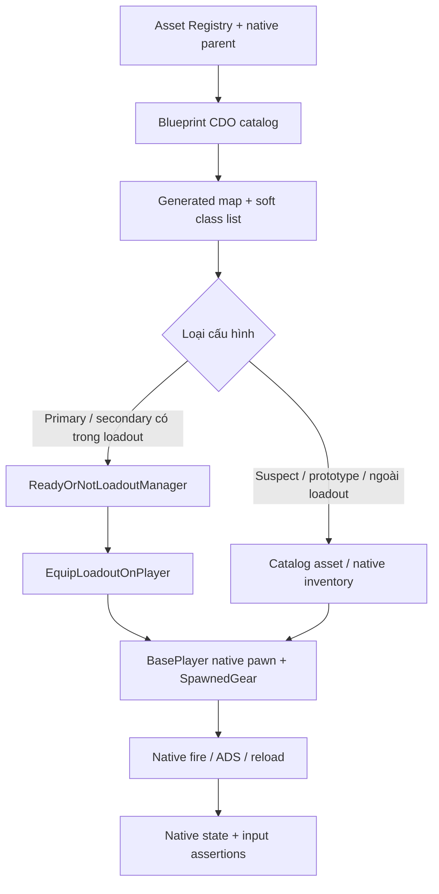

# Dựng, mở và kiểm tra lab

Điều kiện: bản project ReadyOrNot hợp lệ, custom engine đi kèm đã build, PythonScriptPlugin và EditorScriptingUtilities bật, Node.js 22+ để dùng cùng toolchain của repo tài liệu. Các script dùng đường dẫn tương đối với workspace chứa `Engine`, `Ready Or Not` và `ReadyOrNot-Docs`.

Để nâng cấp map đã tạo, đọc [bài thử native đầy đủ](./native-systems-and-test-guide.md). `generate_gun_lab.py` là generator bản đầu; `upgrade_gun_lab.py` thêm fixture native vào đúng map đó, sao lưu trước khi cập nhật và chỉ thay actor do lab sở hữu. Không chạy generator bản đầu lên một map đã có.

```powershell
Set-Location 'D:\Zone9Dev_RON\ReadyOrNot-Docs'
# Đóng editor trước khi cập nhật DLL plugin. Script tự tạo map nếu chưa có.
.\lab\scripts\Upgrade-NativeGunLab.ps1
.\lab\scripts\Run-GunLab.ps1 -Mode Editor
```

Upgrade tìm `node` trên PATH; có thể chỉ định executable bằng `-CameraNode` hoặc biến môi trường `RON_GUNLAB_CAMERA_NODE`. Python của Unreal chỉ điều khiển API/asset; Node chạy riêng phần toán chuyển camera và đối chiếu các pose do UE native đánh giá. Asset camera được lưu theo fingerprint công cụ. Chạy lại sẽ đọc và kiểm chứng asset cùng phiên bản; một lần chuyển đổi thất bại giữ nguyên mapping hợp lệ trước đó và ghi chẩn đoán riêng trong Saved.

Build script deploy plugin từ `lab/plugin/ReadyOrNotGunLab` vào project. `EnabledByDefault` giúp sử dụng plugin mà không sửa `.uproject`. Trong snapshot đã kiểm tra, MSVC 14.36.32532 và Windows SDK 10.0.22621.0 phù hợp với custom UE 5.3.2. Có thể truyền phiên bản khác bằng tham số nếu máy đã xác minh toolchain tương ứng.

Sau khi `Build.bat` thành công và DLL tồn tại, script tự cập nhật `lab/manifests/build_receipt.json` với SHA-256 của DLL, engine version và các phiên bản toolchain được yêu cầu. Các cờ yêu cầu không thay thế dòng báo compiler thực tế trong log UnrealBuildTool. Nếu DLL đổi, chạy lại audit/probe trước khi dùng collector; không sửa hash thủ công để hợp thức hóa kết quả cũ.

Các bước migration bổ sung của bản nâng cấp nằm trong `repair_native_gunplay_port.mjs` (khôi phục spalling, delegate training target và chặn UI loadout gọi equip khi world đang teardown; có guard và backup), `extract_legacy_camera_tracks.mjs` và `recover_legacy_camera_sequences.py` (đọc camera đã được tác giả thiết kế, chuyển sang asset UE5 cục bộ). Dữ liệu curve và asset mới chỉ ở project local; không commit chúng vào repo Docs. Chỉ mapping camera đã xác minh transform semantics mới được runtime sử dụng. Script cũng tạo bản sao Blueprint kính procedural trong Study/GlassRecovery, nối lại đúng ba dây event bị ngắt và kiểm tra compile; asset kính gốc giữ nguyên.

Generator không ghi đè map đã tồn tại. Khi muốn tạo lại, sao lưu map sinh trước đó và xử lý đúng asset trong Content Browser, rồi chạy lại generator. Không xóa các thư mục Content khác để làm sạch lab.

## Kiểm tra có lưu chứng cứ

```powershell
Set-Location 'D:\Zone9Dev_RON\ReadyOrNot-Docs'
.\lab\scripts\Run-GunLab.ps1 -Mode Audit
# Probe riêng một mục: gọi native ADS, bắn, dừng bắn và reload.
.\lab\scripts\Run-GunLab.ps1 -Mode Probe -WeaponIndex 1
# Renderer thật, screenshot + native action probe cho một mục.
.\lab\scripts\Run-GunLab.ps1 -Mode Capture -WeaponIndex 1
# Nhiều họ súng trong cùng một process, giữ receipt từng mục.
.\lab\scripts\Run-GunLab.ps1 -Mode Capture -WeaponIndices 1,54,67,33,75,40
# Chuỗi input native: mode, locomotion, ADS, reload, attachment và damage.
.\lab\scripts\Test-NativeExperience.ps1
# Thêm kiểm tra mở scene/widget loadout gốc và chụp ảnh.
# Runner sao lưu và phục hồi chính xác MetaGameProfile.sav sau phiên kiểm tra.
.\lab\scripts\Test-NativeExperience.ps1 -InspectLoadoutUI
```

Kết quả cục bộ ở `Ready Or Not/Saved/GunLab/`:

| File | Nội dung |
|---|---|
| `native_inspection.json` | Registry, lớp Blueprint, giá trị CDO và native game-mode references |
| `generation_receipt.json` | Map save thành công, actor count, lane distances, số lớp |
| `equip_audit_receipt.json` | Kết quả đầy đủ của lần audit equip mới nhất |
| `action_probe_receipt.json` | Kết quả ADS/fire/reload; có thể là tổng hợp nhiều phiên với `source_runs` do Complete runner ghi rõ |
| `rendered_confirmation_receipt.json` | Batch đối chứng có dựng hình; giữ riêng, không thay kết quả probe toàn catalog |
| `experience_receipt.json` | Quan sát từng bước input native; cần đánh giá từng field, không chỉ complete=true |
| `experience_verification.json` | Assertion theo kết quả thực tế; tách passed, failed và missing |
| `profile_preservation.json` | Với InspectLoadoutUI: hash profile trước/sau và kết quả phục hồi; file save/backup giữ cục bộ |
| `native_upgrade_receipt.json` | Fixture, AI row, vật liệu, cửa và audio volume đã thêm |
| `legacy-camera-recovery-map.json` | Mapping camera local đã qua kiểm tra migration |
| `equip_audit_<UTC>.json`, `action_probe_<UTC>.json` | Lịch sử từng lần chạy, không ghi đè giữa các loại kiểm tra |
| `runtime_receipt.json` | Bản tiện dụng của kết quả mới nhất; không dùng thay lịch sử |
| `inspect.log`, `generate.log`, `audit.log` | Unreal logs; kiểm tra Error, missing import, Blueprint compile error |

Chạy `-nullrhi -nosound` chỉ kiểm tra runtime logic headless. Thông số đó cố ý không xác nhận render và audio. Mở editor bình thường để thử camera, animation, âm thanh và impact.

`Capture` dùng renderer thật với cửa sổ offscreen, lưu `Saved/GunLab/Range.png`; vẫn tắt âm thanh nên không phải audio QA. Script yêu cầu 1600×900 nhưng config người chơi có thể ghi đè; ảnh batch đã kiểm tra thực tế là 1680×1050. Capture chờ cả probe kết thúc, shader jobs và asset compilation về 0; nếu vẫn chưa xong sau 900 giây runtime thì ghi `render_assets_timeout`. Xem pixel của file được tạo, không suy ra giao diện chỉ từ exit code.

`Probe` có thao tác bắn thực sự trong thế giới game. Receipt ghi ammo trước/sau khi gọi `PrimaryUse` và sau `Reload`. Ammo giảm chứng minh đường gọi đã tiêu đạn; nó chưa chứng minh projectile trúng mục tiêu, animation đúng khung hình hay âm thanh nghe đúng. Trong phiên chơi có thể gõ `ronlab probe` cho súng đang cầm. Lệnh này đưa pawn về firing line để phép thử có vị trí khởi đầu rõ ràng.

Batch ở ví dụ chọn 870mcs, G19 V2, Taser V2, Pepperball, M320 Flash và SR16; đối chiếu [selection order](../lab/manifests/selection_order.json) khi catalog thay đổi. Mỗi mục ghi `native_can_reload_before_request`, `native_reload_requested` và `native_reload_replenished` riêng. Probe dài khoảng 12 giây, yêu cầu reload ở giây thứ 3. [Lượt sáu cấu hình lịch sử](../lab/manifests/history/20261007/action_probe_receipt.json) ghi Pepperball MLO có bốn magazine và CanReload trả true nhưng ammo không tăng trong khoảng 9 giây sau yêu cầu reload; năm cấu hình còn lại tăng ammo. Phân tích bổ sung tìm thấy montage reload còn thiếu ở MLO; xem [giới hạn nội dung và cách đối chiếu TAC700](./native-systems-and-test-guide.md). Không suy ra kết quả chỉ từ việc gọi hàm native.

Runner kiểm tra receipt mới thuộc đúng mode, đủ từng index được yêu cầu, không có timeout/interruption, và có ảnh mới khi dùng Capture. Nếu Unreal chỉ chạy khẩu đầu hoặc thoát trước khi hoàn tất, script báo lỗi thay vì chấp nhận exit code 0. Ammo/aiming/reload không đổi vẫn được giữ như kết quả quan sát; cần đọc các field trước khi kết luận gameplay đạt yêu cầu.

Để đo toàn bộ catalog hiện tại, chạy equip audit rồi action probe cho 101 lớp cụ thể. Lab #74 là lớp nền `Launcher_M320` có cờ Abstract; các biến thể M320 cụ thể vẫn nằm trong batch. Đối chiếu lại selection order nếu catalog thay đổi:

```powershell
.\lab\scripts\Run-GunLab.ps1 -Mode Audit
.\lab\scripts\Complete-GunLabProbe.ps1
.\lab\scripts\Test-NativeExperience.ps1 -InspectLoadoutUI
# Đối chứng shotgun, pepperball, M32 và M24; giữ receipt 101 mục.
.\lab\scripts\Confirm-RenderedGunLab.ps1
node lab/scripts/collect_results.mjs
node lab/scripts/report_gunlab_results.mjs
```

[Bảng kết quả theo từng vũ khí](./runtime-results.md) tách cấu hình loadout native, asset catalog và nội dung còn thiếu. Có đủ hàng đo không có nghĩa mọi hàng đều bắn hoặc reload thành công.

Một số shotgun của suspect thiếu chuỗi reload dành cho player và có thể để native state chặn đổi súng. Runner một phiên sẽ báo thiếu mục. `Complete-GunLabProbe.ps1` giữ kết quả từng phiên, khởi tạo world mới để thử các mục còn thiếu và chỉ công bố tổng hợp khi đủ action đã yêu cầu. Nó kiểm tra class/index, ownership, fingerprint của hai DLL/map/camera trước và sau mỗi phiên; dừng khi có lỗi rõ ràng, process thất bại hoặc không thêm được kết quả. Mỗi hàng tổng hợp có `source_run_id_utc`, kèm danh sách phiên và hash; **không xem đây là một chuỗi chuyển súng liên tục**. Các native receipt gốc giữ nguyên ở Saved.

Để tiếp tục từ một native receipt dở dang còn khớp các đầu vào hiện tại, truyền đường dẫn bằng `-ResumeReceipt`; `-ValidateOnly` kiểm tra receipt và liệt kê mục thiếu mà không mở Unreal. Receipt cung cấp từ ngoài không lưu process exit code, nên trường đó giữ null; chỉ các phiên runner tự mở mới ghi exit code thực đo. Giới hạn mặc định là tám phiên mới. Không dùng một receipt tổng hợp làm đầu vào resume và không thay giá trị reload/fire để hoàn thành độ phủ.

`Confirm-RenderedGunLab.ps1` chạy Capture cho nhóm shotgun/pepperball/M32/M24 được chỉ định bằng `-WeaponIndices`, lưu receipt riêng rồi phục hồi và kiểm tra hash receipt probe trước đó ngay cả khi Capture thất bại. Native item mesh dùng `OnlyTickPoseWhenRendered`; vì vậy reload phụ thuộc animation cần đối chiếu với renderer trước khi kết luận thiếu gameplay. Đối chứng này vẫn tắt âm thanh và chỉ chụp trạng thái cuối batch; không thay cho bài thử cảm giác bắn bằng tay.

`node lab/scripts/collect_results.mjs` sao chép receipt dạng metadata sang repo, kiểm tra DLL plugin và gameplay hiện tại khớp `build_receipt.json`, từ chối receipt cũ hơn hai DLL, map hoặc mapping camera và gắn SHA-256 của các đầu vào đã kiểm tra. Screenshot, game log, profile, map và asset vẫn ở project cục bộ.

## Đường đi của harness



Súng bị thiếu lớp, animation data hoặc skeletal mesh được ghi rõ trong receipt. Các bản suspect, prototype, biến thể skin và less-lethal vẫn giữ provenance trong catalog; không tự gộp tên rồi kết luận tất cả có bộ animation first-person đầy đủ.

Một số asset suspect không có `Holster.Body_FP`. Native transition thông thường khi rời súng đó không gọi callback hoàn tất. Harness chỉ trong trường hợp này dùng nhánh `bInstant` có sẵn của inventory, không dùng `bForce`, và ghi **`equipped_instant_fallback`** trên overlay/receipt. Kết quả này không xác nhận outgoing holster bình thường; đường fire/ADS/reload tiếp theo vẫn thuộc súng native. Không gộp nó vào số mục vượt qua normal transition. Nếu transition khác timeout, harness dọn đúng súng lab chưa được cầm và giữ súng native đang cầm; không tự sửa animation asset.

Audit và action probe loại trừ nhau. Trong probe, lab chặn đổi súng/refill/reset của harness; nếu người dùng đổi vũ khí bằng inventory native thì probe bị đánh dấu interrupted. Đây là điều kiện để tránh gán ammo của một khẩu cho tên khẩu khác hoặc tính refill thủ công thành reload thành công.
