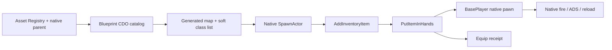

# Dựng, mở và kiểm tra lab

Điều kiện: bản project ReadyOrNot hợp lệ, custom engine đi kèm đã build, PythonScriptPlugin và EditorScriptingUtilities bật. Các script dùng đường dẫn tương đối với workspace chứa `Engine`, `Ready Or Not` và `ReadyOrNot-Docs`.

```powershell
Set-Location 'D:\Zone9Dev_RON\ReadyOrNot-Docs'
# Đóng editor trước khi cập nhật DLL plugin.
.\lab\scripts\Build-GunLab.ps1
.\lab\scripts\Run-GunLab.ps1 -Mode Generate
.\lab\scripts\Run-GunLab.ps1 -Mode Editor
```

Build script deploy plugin từ `lab/plugin/ReadyOrNotGunLab` vào project. `EnabledByDefault` giúp sử dụng plugin mà không sửa `.uproject`. Trong snapshot đã kiểm tra, MSVC 14.36.32532 và Windows SDK 10.0.22621.0 phù hợp với custom UE 5.3.2. Có thể truyền phiên bản khác bằng tham số nếu máy đã xác minh toolchain tương ứng.

Sau khi `Build.bat` thành công và DLL tồn tại, script tự cập nhật `lab/manifests/build_receipt.json` với SHA-256 của DLL, engine version và các phiên bản toolchain được yêu cầu. Các cờ yêu cầu không thay thế dòng báo compiler thực tế trong log UnrealBuildTool. Nếu DLL đổi, chạy lại audit/probe trước khi dùng collector; không sửa hash thủ công để hợp thức hóa kết quả cũ.

Generator không ghi đè map đã tồn tại. Khi muốn tạo lại, sao lưu map sinh trước đó và xử lý đúng asset trong Content Browser, rồi chạy lại generator. Không xóa các thư mục Content khác để làm sạch lab.

## Kiểm tra có lưu chứng cứ

```powershell
Set-Location 'D:\Zone9Dev_RON\ReadyOrNot-Docs'
.\lab\scripts\Run-GunLab.ps1 -Mode Audit
# Probe riêng một mục: gọi native ADS, bắn, dừng bắn và reload.
.\lab\scripts\Run-GunLab.ps1 -Mode Probe -WeaponIndex 1
# Renderer thật, screenshot + native action probe cho một mục.
.\lab\scripts\Run-GunLab.ps1 -Mode Capture -WeaponIndex 1
# Nhiều họ súng trong cùng một process, giữ receipt từng mục.
.\lab\scripts\Run-GunLab.ps1 -Mode Capture -WeaponIndices 1,54,67,33,75,40
```

Kết quả cục bộ ở `Ready Or Not/Saved/GunLab/`:

| File | Nội dung |
|---|---|
| `native_inspection.json` | Registry, lớp Blueprint, giá trị CDO và native game-mode references |
| `generation_receipt.json` | Map save thành công, actor count, lane distances, số lớp |
| `equip_audit_receipt.json` | Kết quả đầy đủ của lần audit equip mới nhất |
| `action_probe_receipt.json` | Kết quả probe ADS/fire/reload mới nhất, tách khỏi audit |
| `equip_audit_<UTC>.json`, `action_probe_<UTC>.json` | Lịch sử từng lần chạy, không ghi đè giữa các loại kiểm tra |
| `runtime_receipt.json` | Bản tiện dụng của kết quả mới nhất; không dùng thay lịch sử |
| `inspect.log`, `generate.log`, `audit.log` | Unreal logs; kiểm tra Error, missing import, Blueprint compile error |

Chạy `-nullrhi -nosound` chỉ kiểm tra runtime logic headless. Thông số đó cố ý không xác nhận render và audio. Mở editor bình thường để thử camera, animation, âm thanh và impact.

`Capture` dùng renderer thật với cửa sổ offscreen, lưu `Saved/GunLab/Range.png`; vẫn tắt âm thanh nên không phải audio QA. Script yêu cầu 1600×900 nhưng config người chơi có thể ghi đè; ảnh batch đã kiểm tra thực tế là 1680×1050. Capture chờ cả probe kết thúc, shader jobs và asset compilation về 0; nếu vẫn chưa xong sau 900 giây runtime thì ghi `render_assets_timeout`. Xem pixel của file được tạo, không suy ra giao diện chỉ từ exit code.

`Probe` có thao tác bắn thực sự trong thế giới game. Receipt ghi ammo trước/sau khi gọi `PrimaryUse` và sau `Reload`. Ammo giảm chứng minh đường gọi đã tiêu đạn; nó chưa chứng minh projectile trúng mục tiêu, animation đúng khung hình hay âm thanh nghe đúng. Trong phiên chơi có thể gõ `ronlab probe` cho súng đang cầm. Lệnh này đưa pawn về firing line để phép thử có vị trí khởi đầu rõ ràng.

Batch ở ví dụ chọn 870mcs, G19 V2, Taser V2, Pepperball, M320 Flash và SR16; đối chiếu [selection order](../lab/manifests/selection_order.json) khi catalog thay đổi. Mỗi mục ghi `native_can_reload_before_request`, `native_reload_requested` và `native_reload_replenished` riêng. Probe dài khoảng 12 giây, yêu cầu reload ở giây thứ 3. Trong [lần chạy đã lưu](../lab/manifests/action_probe_receipt.json), Pepperball có bốn magazine và CanReload trả true nhưng ammo không tăng trong khoảng 9 giây sau yêu cầu reload; nguyên nhân chưa xác định. Năm cấu hình còn lại tăng ammo. Không suy ra kết quả chỉ từ việc gọi hàm native.

Runner kiểm tra receipt mới thuộc đúng mode, đủ từng index được yêu cầu, không có timeout/interruption, và có ảnh mới khi dùng Capture. Nếu Unreal chỉ chạy khẩu đầu hoặc thoát trước khi hoàn tất, script báo lỗi thay vì chấp nhận exit code 0. Ammo/aiming/reload không đổi vẫn được giữ như kết quả quan sát; cần đọc các field trước khi kết luận gameplay đạt yêu cầu.

`node lab/scripts/collect_results.mjs` sao chép receipt dạng metadata sang repo, kiểm tra DLL hiện tại khớp `build_receipt.json`, từ chối receipt cũ hơn DLL và gắn SHA-256 của binary đã kiểm tra. Screenshot, game log, map và asset vẫn ở project cục bộ.

## Đường đi của harness



Súng bị thiếu lớp, animation data hoặc skeletal mesh được ghi rõ trong receipt. Các bản suspect, prototype, biến thể skin và less-lethal vẫn giữ provenance trong catalog; không tự gộp tên rồi kết luận tất cả có bộ animation first-person đầy đủ.

Một số asset suspect không có `Holster.Body_FP`. Native transition thông thường khi rời súng đó không gọi callback hoàn tất. Harness chỉ trong trường hợp này dùng nhánh `bInstant` có sẵn của inventory, không dùng `bForce`, và ghi **`equipped_instant_fallback`** trên overlay/receipt. Kết quả này không xác nhận outgoing holster bình thường; đường fire/ADS/reload tiếp theo vẫn thuộc súng native. Không gộp nó vào số mục vượt qua normal transition. Nếu transition khác timeout, harness dọn đúng súng lab chưa được cầm và giữ súng native đang cầm; không tự sửa animation asset.

Audit và action probe loại trừ nhau. Trong probe, lab chặn đổi súng/refill/reset của harness; nếu người dùng đổi vũ khí bằng inventory native thì probe bị đánh dấu interrupted. Đây là điều kiện để tránh gán ammo của một khẩu cho tên khẩu khác hoặc tính refill thủ công thành reload thành công.
